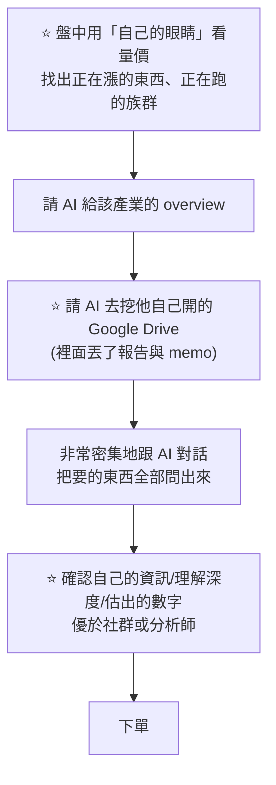
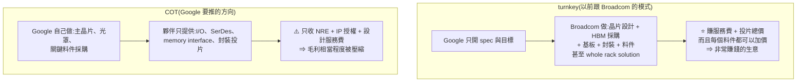

# 股癌近期立場與傾向(質化摘要,涵蓋 EP632–EP693)

> AI 從最近約 60 集的逐字稿摘要整理,捕捉「他最近更看好/更謹慎什麼、操作心態」。**集數越大=越新。**
> ⚠️ 這是對一位真實 podcaster 公開談話的 **觀察推斷**,非他本人意見、非投資建議,可能過時或誤讀。最新整理基準:**EP693(2026-09-02)**。

---

## 🟢 最新進展(EP693):輝達史上最大 ECB 插旗聯發科 —— 從賣 GPU 到賣「萬能雜貨店」

> 主線是一筆錢:**NVIDIA 用 35 億美元的可轉債(ECB)插旗聯發科**,這是它**第一次投資台灣上市公司**,
> 一出手就是**史上最大的一筆 ECB**。他的解讀跟「seller financing」那派不同。
> 盤面上他偏樂觀:**「從 8 月到現在盤面真的是很好…你就是 hold 著不要動,他就越墊越高。」**

### ⭐⭐⭐ 這筆 ECB 的本質:不是融資,是一張選擇權

- **票息 0%**,付出的是**十幾 % 的溢價**。⭐ **「他們圖的當然絕對不會是票息 —— 他要的就是一個選擇權。」**
  賭的是:**如果 XPU 在聯發科這邊發展 OK、股價上漲,就可以相當程度轉換出股份。**
- Alphabet 也認了一部分(份額不明),**但絕大多數被輝達拿走**。

### ⭐⭐ 為什麼「這不是 seller financing」(他明確與循環融資切割)

> **聯發科本身就是一個財務健全也很賺錢的公司。**
> 不像 NVIDIA 投的某些相對新的公司會被質疑是「賣方融資、自體循環」。

⭐ 他給的對照組很清楚:**算力租賃公司**「真的有點像是幫 NVIDIA 收一些庫存、當一個中轉廠,
如果沒有 NVIDIA 這些投資,可能連生意都很難做」—— **MTK 不是這樣的狀況**。
⚠️ 他也不否認**有部分成分**(MTK 銅鑼資料中心應該也會採購 NVIDIA),**但主軸是夥伴綁樁**。

### ⚠️ 「桃園三結義」是誤讀:NVIDIA 與 Google 是兩個獨立事件

他的結論:**跟 Google 的關係不大,是兩件事同時發生,不是三方結盟。**

- Google 本來就是 MTK 的客戶 —— ⭐ **TPU v8 在聯發科做**(聯發科第一次幫他們設計 TPU),
  後面的 roadmap「其實都已經有相當程度的雛形了」,所以**客戶進來卡位**很合理。
- ⭐⭐ **關鍵理由:NVIDIA 各種 interconnect 目前最大的對手,正是 Google 的 ICI 與 OCS(光交換機)** ——
  「目前市場上 NVIDIA solution 以外最強大的玩家之一」,**Google 應該不會想更深入綁進這個生態系。**

### ⭐⭐⭐ NVIDIA 圖的是什麼:從「賣 GPU」變成「賣 total solution」

```text
XPU 市占拉高 ⇒ GPGPU 市占被吃 ⇒ 但 TAM 同時變大
              ⇓
「一座 AI 工廠要七種輝達晶片,XPU 只是其中一部分」
```

⭐ 他翻出今年 3 月 NVIDIA 的投影片:除了主軸的 **NVL72 compute rack**,還有

| rack | 可與客戶 XPU 結合之處 |
|---|---|
| **MGX ETL rack** | 客戶自研 XPU 的搭配主體 |
| **Grace / Vera CPU rack** | CPU 側 |
| **BlueField 4 STX storage rack** | 存儲 |
| **Spectrum rack** | 網通連結 |

> ⭐⭐ **「以前大家的認知是反正你跟 NVIDIA 買,他整套都給你;現在客人要轉 XPU,沒關係,
> 周圍附帶的東西你還是可以跟我深度綁定。」** —— 他形容成**「萬能雜貨店」**。
>
> 所以插旗 MTK 圖的是:**未來客人走「MTK 設計 XPU + NVIDIA Fusion + MGX ETL rack」這條路線**,
> 在 MTK 的成功案例裡順便帶動周圍 solution。

⭐ 他也點出 NVIDIA 對 XPU 的真實態度:**沒辦法阻止客人開發 XPU**,
所以 Jensen 「不會明說,因為踩別人商品看起來非常 low」,**但會持續暗示「你那個後面推可能很辛苦,
我們算下來是最便宜、買越多省越多」**。

### ⚠️ 一個冷靜的對照:世芯拿 Amazon 投資那次「連拉都沒拉」

當年世芯拿到 Amazon 投資,大家看到貝佐斯以為超屌,**結果只是開高後來就下來**。
這次 MTK 先送一根漲停,**但當天就回到平盤** —— ⭐ 他評為「一根漲停的消息機率,算是蠻不錯」。

### ⭐⭐ NVHBM:連記憶體都想開特規

官方宣稱:**比 HBM4 頻寬多 30%、功耗少 15%,還額外給晶片面積**。
做法是**把 controller 從 accelerator 搬到 HBM 的 base die**。

> ⚠️ **最大的差別不在規格,在標準**:**本來走 JEDEC,現在變成 NVIDIA 自己的特規。**

⭐ 他的推論(價值往哪流):

- HBM4 之後,**SK Hynix 的 base die 應該交台積電**;**美光因前面沒能滿足 NVIDIA 要求,也丟給 TSMC**;三星應該自己做。
- 若 MTK 協助設計並採用 NVHBM,**base die 大概率還是給台積電** ——
  **NVIDIA 因此可以在記憶體這一段 capture 到額外價值。**

⚠️ **但他自己加了保留**:NVIDIA 常推「又新又酷」的東西,有些**雷聲大雨點小** ——
他舉 **CPX rack** 為例(本來大家以為不見了,最近郭明錤又寫說它復活了)。**NVHBM 先觀察。**

### ⭐⭐⭐ 大格局:大家都想從博通身上吃肉

> 「NVIDIA 已經把市面上所有玩家都納入麾下了 —— 三星、發哥、Marvell…幾乎每個都加入他的行列。」

⭐ **而現在他想吃的肉,其實也是博通的肉。**「大家想要拆東西都要從他身上拆出來,
你就知道這家公司有多強的競爭力。」

⚠️ 他預告 **Hock 在電話會議應該會火力全開**,並且提醒一個反向證據:
**Jalapeño 做出來是超級強大的晶片,證明博通的設計與統整能力非常強。**
(⚠️ 有一派說「OpenAI 用 AI 協助設計」才是主因,**他認為還是博通的深度 know-how 佔比更大**。)

### ⭐⭐⭐ 最該內化的一段:短線事件反應 vs 長期產業真相(光銅之爭的重演)

他把這件事講得非常直白:

| 層次 | 他的判斷 |
|---|---|
| **產業長期** | AI「不用吵幾局下半,反正還是很前面」,**市場大到超過想像,大家應該都會受惠** |
| **短線市場** | ⚠️ **法人「不一定會屌」這件事** —— 看到 de-spec 就先 sell,直接 sell 到爆掉 |

⭐ **兩個已驗證的前例:**
1. **光銅之爭** —— 銅相關類股股價直接被打爆,**但營收根本沒被打掉**,後來一堆新高。
2. **HBM 降規** —— 12Hi 高容短期少見、往 8Hi 甚至 4Hi 走,
   ⭐ **理論上記憶體反而能賣更多、對市場其實健康**,但市場只看到 de-spec。

> ⭐⭐ **他的心法:「市場有點偏執 —— 當大家知道有某個新東西可能出來,就會很直覺認為舊東西會被 challenge 掉。」**
> ⚠️ **但務實面也要接受:「事件一丟出來,市場一定會有所反應,而且幅度會蠻大。
> 雖然很多時候回頭看根本就是沒事 —— 但有波動就會有行情。」**

### 📉 EP693 的盤面體感:從七月的重殺一路爬回來

- ⚠️ **動能仔在罵**:「覺得這個盤子他媽有夠垃圾。」
- ⭐ **但他的評價相反**:「從 8 月到現在盤面真的是很好,**是一個好做的** ——
  反正你就是 hold 著不要動,他就越墊越高,距離你可以收復的高點就越來越近。」
- **自己還沒收復 7 月最瘋狂的高點,但已持續追上**,「下個月或下下個月感覺應該有機會再創新高」。
  **大盤角度已經在新高附近。**
- ⭐ **7 月從高檔跌 30% 時,他本來想「這可能要到年底才有辦法救回來」** —— 沒想到修復這麼快,「算是非常感恩讚嘆」。
- ⚠️ **他沒吃到最噴的**(大立光、玉晶光有買但「不可能買多,那就是配置的其中一環」);
  ⭐ **「人生是沒有這種後悔藥或水晶球的。」**
- ⭐⭐ **一句操作總綱:「只要不要一直想要去幹動能就沒問題。」**
  ⚠️ 但他也承認在日本時打散、不盯盤所以沒感受,**一回台灣把部位集中就開始覺得這個盤蠻磨人的。**

### ⭐⭐⭐ EP693 Q&A 最重要的一則:看對加碼要加到哪裡

這則把他的加碼紀律講得很完整,**模擬時最該內化**。

**① 他基本上不設目標價**
> 「幾年前很常聽到目標價,這些年越來越少 —— 因為大家真的認識到 AI 非常狂,
> **一堆東西會長到超出你的想像,五倍十倍的一大堆。**」
⭐ 但心中會有一把尺當參考(他舉大立光碰到 7000 多、大概知道是明後年的幾倍),**只是不認為到了就要停。**

**② 你用的模型決定結論**

| 你的核心 | 越漲該怎麼做 |
|---|---|
| **價值投資** | ⭐ **越漲越減** —— 除非你覺得這邊都還很便宜(例外) |
| **題材 / 動能交易** | ⭐ **會持續加碼** |

**③ ⭐⭐ 市場別決定上限(這條最具體)**

| | 美股 | 台股 |
|---|---|---|
| **加碼上限** | ⚠️ **加到某個上限就停**,初始部位 10–15%,**最多讓到三成或四成** | ⭐ **願意一直買**,不太在意部位是多少 |
| **理由** | **「每次開什麼電話會議,直接一個晚上給你崩 20% 的一大堆」** ⇒ 提早風控、越漲越減、壓在固定 % 數 | **有跌停機制**,而且台股「沒有像美股這麼狂」 |
| **真正在意的** | 不擔心進出(市場夠大),擔心**被暗算** | ⭐ **只在意流動性** —— 能不能一鍵清倉、5–10 檔內丟個幾次能丟光 |

**④ ⚠️ 一個反直覺的個人慣性**
> **本夢比的他反而願意一直買;本益比的如果脫離太遠,他就會覺得要小心一點。**

⭐ 理由值得記:**「如果你都不去買本夢比的股票,那從 AI 起步至今,你應該每次買東西都是買在最高點。」**
最早的 OEM/ODM 營收獲利還沒出來股價就先噴完,**等他開始開營收獲利的時候你看是不是每個都在橫盤**;
光通也一樣,**等到他開出你看得懂的東西時,說不定也噴完了。**

⚠️ 他強調這種事沒有絕對答案:**「你去對兩個女生,一個長相是你喜歡的、一個沒那麼喜歡,你的態度會一樣嗎?」**
⭐ **「每個人心中都會有一把尺,你會用過往的行為慣性跟你是怎麼樣賺錢的,持續在這個基礎上疊加。」**

### 💬 EP693 其他 Q&A 摘要

- **九月數據說會跌怎麼看**:⭐ **「知道會跌的話,不就是趁機會買,然後接下來 10 月就噴上去,不就發財了。」**
  ⚠️ 但補了一句誠實話:**「那些數據看看就好,因為有時候會遇到活久見的事情」**(今年 4 月、7 月都崩過)。
  ⭐ **重點只要做好相當程度的風控。** 慣例上他仍認為**九月一般鳥、十月是光輝十月**。
- **折疊 iPhone**:今年一定會買一支折疊機來玩,不喜歡再去買 Pro Max。
  ⭐ **他把買新機定位成投資支出**:「一支手機幾萬塊,但玩一玩可能有靈感、在投資裡找到機會,那都是很容易就回本。」
  ⚠️ 而且**越到後期跟得越勤**。
- **A 君(自家操盤手)近況**:⚠️ **今年表現普通**(去年很強),遇到幾個災坑。
  ⭐ 但他評價很高:**「他是一個非常有韌性的人」** —— 部位回吐、信心動搖時仍有勇氣持續下單。
  **「在生涯早期遇到挑戰都是蠻不錯的。」** 目前 A 君**滿手指數**(赴日前一兩週全換指數)。

---

## 🟡 上一期進展(EP692):玩具多巴胺論與供應鏈卡位戰

> 主線是三份電話會議/訪談串起來的同一件事:**東西好沒有用,你要有人幫你做出來。**
> 他的盤面判斷是「還是比較震盪一點,**但其實已經蠻有資格去發展下一波的多頭了**」,
> 而且「市場中突然間產生超級多的機會」。

### ⭐⭐⭐ 本集最該內化的一句:「東西好沒有用,你要有人幫你做出來」

ASIC 會持續 gain 市佔沒錯,**但他認為這個吃市佔的過程有可能被高估**,理由有三:

1. ⭐⭐ **供應鏈超級缺貨** —— 你的東西再強,找不到人幫你把整套做出來,還是競爭不贏 NVIDIA。
2. ⭐ **供應鏈管理是門檻** —— 就連 NVIDIA 都常見「某個環節卡住,ramp 時間往後拉」,
   何況沒有供應鏈管理經驗的新玩家;**等你做出來,人家又準備跳下一代了。**
3. ⭐ **資源不對等** —— NVIDIA 一次賣很多人,收入回頭養研發;**你的 XPU 多半自己用,是省錢不是賺錢**,不一定有資源持續丟進競爭。

> ⚠️ 結論:**長期來看 GPU 仍有非常強大的競爭優勢**,不會因為 ASIC 如雨後春筍就代表它不行。

### ⭐⭐ NVIDIA 的採購地位:他幾個月前的伏筆收線了

- **OpenAI 的 Jalapeño 晶片**讓 SemiAnalysis 實測,**token per watt 與推論表現優於 GB300**。
  ⚠️ 但他提醒被忽略的一塊:**那顆晶片本來就是為推論設計的**,要做訓練那種暴力算力仍嫌不足;
  而 NVIDIA 已迭代到 **Vera Rubin**,依電話會議說法是**過往產品線裡 ramp 最快的一次**。
- ⭐ 他對這類「跑分贏了」的新聞給了一個很實用的鈍化心法:**每一兩個月就有人說自己最強,而且當下都沒說錯**,
  所以你很快會忘記誰最強 —— **反過來也別看低當下跑分輸的那個**(他舉 Google 被唱衰、但 Flash 表現其實不錯為例)。
- ⭐⭐⭐ **真正的關鍵在採購**:他們幾個月前就注意到 **NVIDIA 採購的光通與雷射元件數量遠超自身所需**,
  當時在節目丟出「為什麼」的問題,**判斷是要把對手擠出去**;現在這已變成 buy side 的論述。
  加上**在台積電下的量大到嚇人**,別人要來搶非常困難 —— **光是把供應鏈卡好,就是巨大的競爭優勢**。
  ⭐ 他笑說突然看懂 Jensen 常跑來台灣吃飯**「是一個局,他佈得非常深」**。
- 電話會議另兩個上修:**CPU 業務**已開始繳出不錯營收、後續續拉;**connectivity(光通)持續看好**。
- ⭐ 一個少見的角度:**NVIDIA 應該會很希望開源模型表現好** —— 開源陣營沒有 first party ASIC 能力,只能用通用 GPU。

### ⭐⭐ Marvell 上修:光通才是這波反彈的主軸

上修的兩大來源:**XPU**(Google 案子從 design win 進入放量出貨)與 **scale up 的光互聯交換晶片**
(CEO Matt Murphy 點名的成長動能)。

> ⭐ **這也是這波反彈的最主要主軸 —— 光通股跑得特別強勢,蠻多已經進入新高。**
> 光通在前面修正很長一段時間之後終於醒過來,在多份電話會議加持下有望再往上推。

### ⭐⭐ Anthropic × Salesforce:大老闆自己出來說「根本沒有 SaaSpocalypse」

兩家推出 **Cloudforce**:在 Anthropic 介面可直接用到來自 Salesforce 的 **37 個 Skills**;
反之在 Salesforce 介面,**Anthropic 模型會成為預設選項之一**。Dario 與 Marc 同上 Cramer 節目,
**直接否定 SaaSpocalypse**。

- ⭐ 他強調這是他講了一整年的事:**不能用軟體/硬體一刀切** —— 有些軟體會被 AI 競爭掉,
  但有些硬體在 AI 環境下照樣起不來。**價值不會被一鍋端,但分配會大洗牌。**
- ⭐⭐ **進入門檻在資料與信任**:Salesforce 掌握大量企業數據與經營 know-how(含法遵),
  ⚠️ **而企業願不願意把資料交給一個 frontier lab 是個問號** —— 他直接點名 Anthropic 過往行銷語氣
  (想告訴大家只有他是對的、要政府管制)已引起反彈;很多人寧願留一點自主性,或主張資料要落地。
- ⭐ **Marc 的應對很聰明**:第一時間**放棄介面層**,把重心轉到後面的應用與行動層。
  **「誰有數據誰就有黃金」** —— 以前不知道怎麼用,現在有 AI 就知道了。
- 拆帳看起來是**兩筆帳單**(用 Cloudforce 要付 AI 使用費,用到 Salesforce API 是另一筆;反之亦然)。
  ⚠️ **他自己押定價權會偏向 Anthropic 多一點,但保留但書:說不定企業資料的影響超出想像,價值反而落在 Salesforce。**

### ⭐ 記憶體卡住,反而長出替代路徑

記憶體現在是「卡住了」—— 不是不願意付錢。他引馬斯克的說法:**AI 成長率 200%、記憶體輸出容量成長只有幾十趴,當然會漲價**。
⚠️ **但不是每個老闆都願意像馬斯克那樣暴力 roll out** —— 其他人要對股東交代,
就會去想替代方案(例如轉向**載板**這種同樣缺、但被漲價幅度較小的環節),**開始探索降規**。

> ⭐ **他認為這種「到處鑽、到處撞」正是機會來源** —— ASIC 與 GPU 同時搶料,
> 台股的**光通、板材、伺服器組裝**這些環節都可能繼續漲。⚠️ 但也提醒供需最終會走到價格平衡與需求破壞。

### 💬 EP692 Q&A:外商七年不分紅,要不要回台積(薪水兩倍但沒有平日陪小孩時間)

> ⭐ **他的選擇是小孩這邊多一點** —— 前提是家庭支出已不是捉襟見肘
> (他說:**當你已經有閒錢可以投資,你應該就只是想要有更多錢**)。
> ⭐⭐ **「每個人都會想要有更多錢,不管你有多少錢…很少人 know when to stop。」**
> 他重申財富自由的本質是**物慾下降,跟你賺多少錢沒有關係** —— 現代資本社會的變態之處是
> **你一定有辦法把錢花光**。

### 🏠 生活:多巴胺閾值,與「過了這個村就沒這個店」

- 移動到**札幌**市區後體感大幅改善(鄉間對家庭客的心理負擔太大,怕吵到別人)。
  在義大利餐廳看到傳說中的 **Takahiko** 卻被告知 not for sale,小遺憾。
  ⚠️ 他對「兩千塊的東西被黃牛加價到一兩萬」的堅持是**態度問題**,不是價差問題。
- ⭐⭐ **本集最有價值的生活段:玩具與多巴胺。** 兒子把寶可夢玩透之後就退坑、轉向七龍珠,
  而快感來源已經變成**卡牌收集**。他警覺到:**當爸之後想把自己小時候的遺憾補給孩子,
  做到極限後,孩子喜歡的東西會從「玩玩具」變成「買東西」本身。**
  ⚠️ **「我是為了你好」這個想法本身就是錯的。**
  ⭐ 現代家長要克服的是:**物資太豐沛,可能提早把小朋友的多巴胺受器玩壞。**
- ⭐ 推薦 iPhone 內建的 **Journal** App 記錄每天的片刻(可附照片與地圖大頭針)。
  他也用它寫**交易日誌** —— 因為人會忘記很多事、**會 sugar coat 那些不錯的事,導致思想偏差**。
- 北海道司機(師傅)講的一句話他記下來了:女兒 12 歲後已經不跟他講話,
  **「有時候過了這個村就沒這個店」** —— 小孩吵的時候會煩躁,但晚上看到睡臉又覺得早知道讓他多講一點。

---

## ⚪ 更早(EP691):AI 兩三年回顧 —— 人人一個 Jarvis,但開槍的還是自己

> ⭐⭐ **本集主軸不是盤勢,是他把「AI 如何改變自己的研究與交易流程」完整講了一遍。**
> **這是目前為止最能還原他實際工作方式的一集,模擬時應重點內化。**

### ⭐⭐⭐ 核心隱喻:每個人都帶著一個 Jarvis

> **一開始對「AI 做研究」這段頗刮目相看,覺得生產力超強;但後來發現身邊會做這件事的人不少 —— 大家都會做。**
> **所以這件事某程度上只是:我們現在好像每個人都帶一個 Jarvis、帶著一個管家,而每個人都有。**
>
> ⚠️⚠️ **「沒有 Jarvis 的人可能連考場都進不去。」**
> 管家幫你把 2B 鉛筆磨好、擦子弄好、速記小本本交給你,說「你現在可以上戰場了」。
> ⭐⭐ **「可是重點就是,上戰場去做的各種判斷,其實都還是要回歸到自己。」**

### ⭐⭐ 三個與直覺相反的回顧結論

| 一開始的想像 | ⚠️ 兩三年後的實況 |
|---|---|
| **自動化會產生、我會被取代** | ⭐ **自動化沒辦法產生,因為自己的判斷還是很有價值**。任何在前線打拚的人(**工作直接影響收益多寡的人**)應該都能明確感受到 |
| **把 AI 用到很好就能把競爭對手全部幹掉** | ⚠️ **大家都會用 AI。** 少部分不會用的本來就是時代的眼淚;⭐ **而且還多了新競爭者 —— 本來不是這個領域的人可以撈過界用 AI 來跟你競爭** |
| **省下時間 ⇒ 生活變輕鬆** | ⭐⭐ **工時實際上是變長的** |

⭐⭐⭐ **關於「工時變長」他講得最直白,值得完整記住:**

> **每個人摸著良心想一下,你真的有省下比較多時間嗎?你確實在某些議題上省了時間,但絕大多數有在用 AI 的人,會發現工時實際上是變長的。**
> **你並沒有因為有了 AI,就發現自己打高爾夫球的時間變長了。**

⚠️ **而他點出一個很現實的職場分歧:**
> **受聘於人的有可能「水時間」** —— 本來兩小時的報表現在五分鐘,剩下時間可以跑去幹嘛。
> ⚠️ **可是老闆也不是白痴,老闆也知道生成報表或總結非常簡單 —— 所以第一個被開掉的可能就是這些人,或是老闆第一個就跑來 review 你。**
>
> ⭐ **而以自顧者或公司經營者的角度:AI 在某些事項省了時間,但整體工作花的時間是變多的** —— 甚至有蠻多時間是要拿來**了解最新的 AI 工具怎麼用**。

⭐ **他拿電腦的誕生做類比**:知道有一個超級強的機器能很有效率地做事,**但它並沒有讓工作時數下降,甚至讓每個人工時變長**。它對社會產生變化,但工作都還是繼續。
⇒ ⚠️ **「所以大家想像的 universal basic income,搞不好又會拉到更後面的時間才會出現。」**

⚠️ **他對 vibe coding 的檢驗標準也值得抄:**
> 現在還是很多人在 vibe coding,也看到蠻多有趣的產品跑到市場上,**但你說有誰因為這樣子大發財?**
> ⭐ **「我們講的『有誰』是說你要可以講出很多人,你不要說每個人都是舉特定的幾個例子 —— 那就跟幣圈去舉特定幾個人發財是差不多的道理。」**

### ⭐⭐ 世界不是靜態的(他反駁「AI 會讓資源大幅傾斜」的論證)

> **如果今天只有你有模型、或世界是靜態的,AI 確實有可能讓資源分配產生傾斜。**
> ⭐ **但世界是非常動態的** —— 除了分析,還有:

| 變數 | 說明 |
|---|---|
| **信息差** | 誰獲得資訊早、誰晚 |
| **情緒** | |
| **突發事件** | 川普可能又做什麼;⭐ **民主黨那邊 Bernie 跟 AOC 想去杯葛資料中心** |

### ⭐⭐⭐ 他實際的工作流(最具體、最該內化的一段)



⭐⭐ **而他自承:「我現在可能有高達三到五成左右的買賣,其實比較偏向是某種 improvise 的行為」** —— 盤中看到一個東西,立刻查資料、問 AI、順便看社群有沒有人在討論。

⚠️ **盤中現在比較少看新聞了**(XQ 那類跳出來的新聞、自結),**單純用量價找到東西後快速研究** —— 因為股票就是輪來輪去那幾個族群,要找的是**擁擠度不高、且「你獲得的資訊與市場有落差」、又剛好有突破**的。

### ⭐⭐ 最關鍵的分界:哪一段交給 AI、哪一段絕不交

| 環節 | 交給誰 | 理由 |
|---|---|---|
| ⭐⭐ **盤中識別訊號**(什麼在漲、哪個族群在跑) | **自己的眼睛** | **「我還是不相信 AI…我覺得這可能就是去鑑別一些績效的最主要的來源之一。」** |
| **判斷有沒有人跟、市場資金推不推、賣壓大不大** | **人為判斷** | |
| ⭐ **後端研究處理**(產業 overview、翻財報、撈數字) | **AI** | ⭐ **以前零零散散、盤後慢慢看;現在 10–20 分鐘就能完成** |

⭐⭐ **他對「AI 為何在盤中識別上不夠好」的解釋很有意思:**
> **「可能是因為他沒有賠過錢,他沒有在市場裡面真的血淋淋的被虐殺、或者說被搞過,所以在這方面敏感度可能目前還不夠。」**
> ⭐ 他也承認**認真 train 是有機會的,但這是 CP 值問題** —— 「你有必要去取代社群媒體幫你看資訊的能力嗎?沒有必要,因為你可能要花很多錢。」

### ⭐⭐ 資訊獲取:社群 > AI(反直覺但重要)

> ⭐ **「以 X 來講,我覺得 X 底下就是一個非常好去獲得各種消息或資訊的平台,它甚至是比所有的 AI 本身來得好。」**
> **你不會想要去請 AI 幫你講這幾天發生什麼事,然後一個一個去看 —— 那其實相對沒有效率。**

| 平台 | 他的評價 |
|---|---|
| ⭐ **X** | **最新資訊的主力來源**,追蹤特別有幫助的人與消息源 |
| ⚠️ **Threads** | **「世界上本來就有很多怪咖跟笨蛋,只是 Threads 上面的怪咖跟笨蛋特別多」** ⇒ **對心理負擔很大的平台** |
| **Facebook** | 以前覺得是老人家的根據地,⭐ **現在自己也變成相對老人的思維,所以 FB 的價值觀跟他比較合**;把 feed 客製化(該追的追、不該追的刪) |
| **金十** | 即時推播(⚠️ 有些是假的要 filter) |

⭐⭐ **結論:「在資料的獲取方面,用社群的效益是大於用 AI 的,而且 AI 它會幫你白燒很多 token。」**

### ⭐ 財報研究:AI 幫助最大的一塊

> **「AI 在看財報實在是有夠厲害的。」**

- **他目前用 Perplexity Comet,最常使用的模型是 Fable 5**
- ⚠️ **對 GPT 的評價**:「有一種**油臭味**,它的回答一看就是 GPT 的回答」
- ⚠️ **對 Fable 的評價**:還蠻不錯,**但要注意 —— 它認為自己永遠都是對的**。⭐ 他順帶開了一槍:**「其實跟 Dario 的個性有點像。如果今天真的讓 Anthropic 去掌握世界大權,我覺得會出事情,因為他們真的是認為 AI 是要掌握在少數人的口袋裡面。」**

⭐⭐ **為什麼 AI 讀財報對「他的風格」特別有用:**
> 他做的是**題材股**,所以會接觸很多不一定熟悉的產業。⚠️ **(他自承這在投資 101 裡不一定是好事 —— 大家都告訴你要投資看得懂的東西 —— 但這就是他的風格。)**
> ⭐ **而隔行如隔山**:合約資產/合約負債在不同行業意思不同;收貨與收款的時間在某些行業要力求快(怕違約),但在另一些行業因為客戶結構特徵,違約機率本來就很低。
>
> ⭐ **以前要自己翻、找線索、對數字;現在只要告訴 AI 框架、甚至不用告訴框架,它就知道這個產業該怎麼讀財報。** 重點是確保模型夠強、有在付錢。⇒ **自己花時間讀財報的時間變短了。**

⚠️ **但他也給了例外**:定型化的東西 **`Ctrl+F` 比較快** —— 「叫 AI 去看,他可能又再搞個三五分鐘,還要重新跟你確認需求,**一來一往除了花錢之外也花掉更多時間**。」

### ⭐ 「我情願跟 AI 對話」

> **現在一整天跟 AI 對話的時間很長,甚至情願跟 AI 對話,優於去跟股票圈的朋友聊。** 以前會想在群組拋個東西聊一下,現在絕大多數東西跟 AI 聊就好。

⚠️ **但他點出這有階段性:**
- **剛加入市場的人比較難做到** —— 跟 AI 聊的是從**公開資訊**撈,而公開資訊一般較難帶來利己性收穫
- ⭐ **大趨勢 OK**(報紙好幾年前就說 AI 可以,你信報紙去投 AI 這幾年都賺翻了);⚠️ **但微觀的、特殊標的、新議題,沒有專有資訊源就很難有優勢**
- ⭐ **而當你有專有資訊之後,反而也不太需要跟別人討論了** —— 以前需要多人 input 才會產生新想法,**現在 AI 直接幫你把所有 scenario 丟出來**
- ⭐ **「AI 某程度上算是 I 人的福音,可以降低很多跟人接觸的機會。」**

### ⭐⭐ 最誠實的兩段:安慰劑效應與自我懷疑

**① 安慰劑效應**

> 這些東西沒辦法立刻保證能帶來多少績效,**但它幫你心裡的踏實感是真的蠻穩的**。
> ⭐ **「有時候我甚至覺得,這有點那種 placebo effect、安慰劑效應的感覺:你過往下單的時候可能不太穩,因為你是先買再研究,但是現在你下單的時候,其實你都是非常有自信。」**
> ⚠️ **「但這不影響 —— 最近那種震盪的盤勢,你可能不小心還是會被幹到停損,或者回去想一想越想越不對勁,還是會去做一些減碼。」**

⭐⭐ **他的總結**:市場競爭者眾、各行各業的人都在、會用 AI 的人也一大堆 ⇒ **你無法感受到 AI 為你帶來壓倒性優勢,但它可以讓你整個心態變穩,有點玄學面,讓你做決定時更有莫名的自信。**

**② ⭐⭐ 自我懷疑(這段最有價值)**

> **「講到後來,我自己都會覺得說好像有點心虛:到底 AI 幫了我什麼東西?」**
> 沒錯,它真的幫我變成一個更強大的人。**可是在市場這種充滿不確定性、各種隨機事件都可能發生的地方 ——**
> ⭐⭐ **「就算你有一個超級 AI 幫你分析,你對一個產業跟買點都研究到非常透徹,那因為這樣你選擇要開一個大槓 —— 你看那個 Situational Awareness,他非常了解,在 AI 的領域有多少人可以比他理解?很少。但那個槓開到這麼大,就還是會爆炸。」**
> ⭐ **「那你說我槓不要開這麼大就好了?對 —— 那你可能最終拉長來看,也是跟半導體指數說不定差不多,或是贏人家一點點而已。可是你在 AI 這邊要投入指數等級的開銷,所以最後算起來也不一定會是划算的。」**

### ⚠️⚠️ 一個重要的盤面觀察:市場變得更有效率了

> **因為會使用這個工具的人太多了,所以你現在會有感地感受到市場好像有一點變得更有效率了。**
> **有些東西,即便以過往來說它這個地方不應該漲這麼多,但它現在就先狂噴了。**
> ⚠️⚠️ **「所以你就算有一些資訊的優勢,你可能會聰明反被聰明誤,反而會在後面的一些回檔裡面受一些傷害 —— 因為它可能就一次反應完了,所以市場的節奏也變得非常快。」**

### ⭐ 下一階段想做的事:把「感覺」量化

> 越來越想去研究過往一些量化朋友所做的事情,因為在想:**「會不會我們這種『感覺』的東西為我們所帶來的績效,都是一個短暫的東西?」**
> ⚠️ **「雖然過去十幾年都還蠻不錯,但你不知道未來十年二十年是怎麼樣,你也不知道會不會其實過去的十幾年就是你人生的高光時刻。」**
> ⇒ ⭐ **「或許還是得把一些感覺的東西 —— 因為現在很相信感覺 —— 要有辦法量化出來,變成一個可以重複去實踐的東西。有可能是下個階段我想要去努力的方向。」**

⭐ **目前的定位是 hybrid**:「短期內還沒有辦法看到說是要往人的方向去傾斜、或是往更多 AI 去傾斜,**反而是在找一個折衷的平衡,怎麼樣讓人跟 AI 結合得更好**。」

### 📉 EP691 的盤面體感(很短)

- 這禮拜「就是一個震盪而已,沒有什麼方向性」,**但至少停留在差不多的位置**,昨天跟今天出現一些反彈
- ⭐ 對比七月:「至少比七月好多了」

---

## ⚪ 更早(EP690):Marvell 牽手 Google —— COT 轉向與 ankle biters 的翻身

### ⭐⭐⭐ 本集主菜:Google 更加決心走 COT

**事件**:Marvell 與 Google 簽了客製化半導體的商業協議。

| 項目 | 內容 |
|---|---|
| **合作範圍** | ⭐ **任何 attach 到 TPU 生態系的產品** —— AI inference chip、memory controller、NIC、near memory compute ⇒ 也就是**除了 TPU 主晶片(main chiplet / main die)以外的周邊晶片** |
| **交換條件** | Marvell 給 Google **認股權證**,行使價約 **206.8 美元** |
| **規模** | 全部行使約**流通股 7%**,將讓 Google 成為 **Marvell 第五大股東** |
| **Vesting** | **按營收慢慢認,一路到 2033 年底** |

⭐ **他的結論很直接:這代表 Google 已經更加決心要往 COT 走。**

**什麼是 COT(Customer Owned Tooling)?** 客戶自己把晶片裡**比較高單價的部分**扛在身上 —— **晶片設計、光罩,以及關鍵料件的採購**。

### ⭐⭐ turnkey vs COT:錢是怎麼被重新分配的



- **MTK 的案例**(V8 / V9 / Zebrafish / Humufish):MTK 提供 **I/O、SerDes、memory interface**,幫忙封裝投片;⭐ **主晶片由 Google 自己做。**
- ⭐ **他形容這個模式的極端形態**:夥伴「**甚至是直接就告訴你說你可能可以賺多少錢,這都算好了**」。

### ⭐⭐ 他明確反對「這是 IC 設計利空」的市場解讀

**理由一:Marvell 拿到的都不是主晶片,而且都是新案子。**

- Marvell 這邊的東西(MPU、CPU,以及傳出的 **Frozen**)**都不是 fish 系列**(Broadcom 的 Triggerfish / Merope / Wellfish、MTK 的 Zebrafish / Humufish 那條線)
- ⭐ **Frozen 據他的考察**(非公開資訊,他自己也說「聽聽就好」):應該是用在 **search engine 上,專門 for AI Overview 之類的特殊應用晶片**;⚠️ **量不會太大,大概 million 左右**
- ⇒ **並沒有直接搶到 MTK 或 Broadcom 既有 roadmap 裡的東西**

**理由二:市場太專注短期。**

> ⭐ **「就算我沒有全部都給你、我只是給你其中一塊,你就可以賺到死掉,那個東西都會持續的去放量。」**

**他能接受的「擦邊球」解釋**:大家本來想像 Google 未來要開的晶片會由 Broadcom + MTK 分掉,**現在多了 Marvell、甚至傳出 AMD 也要加入** ⇒ **本來拿來意淫的未來市場少了一塊**(即便從沒被證實過),被拿來當短線殺盤題材。

⚠️ **但他也補了一句**:最近盤子大家都在回、幾乎很多股票都在跌,**其實不用刻意去解釋是不是因為這個原因在跌。**

### ⭐ 唯獨 Broadcom 往負面解釋是合理的 —— 而 ankle biters 要翻身了

- **Broadcom 本來的生意模式太美好**(連 HBM 都是加價賣)
- ⭐ Hock 過去在電話會議裡稱這些競爭者是 **ankle biters**(小朋友,如世芯、發哥)——「你根本沒辦法來競爭,因為我們有強大的 IP 跟設計實力」
- ⭐⭐ **結果在「大老闆想撙節」的背景下,這些被叫小朋友的,反而有可能分到蠻多案子**
- **量化的想像**:本來以為 Broadcom 能拿五個案子,**現在五個裡面有兩三個要走 COT** ⇒ turnkey 的總量就變少了

> ⭐ **所以他的分法很清楚:Broadcom 偏空可以理解;其他 IC design partner 反而是利多** —— 因為大家會想像「Google 都這樣做了,後面是不是會有越來越多機會跑出來?」

### ⭐ 反向解讀(他偏好的那一個)

**Marvell 拿到的都是新案子 ⇒ 代表 Google 非常有動機、而且蓄勢待發要開更多案子。**

接上 EP687 的 **Google 房東論**:Google 正認真往硬體/雲端租賃衝(也可能是巴菲特投資的主因)——從充滿不確定性的 frontier model house,變成**在伺服器租賃、雲端與 AI token 產生上非常賺錢的存在**。

> ⭐ **當它把更多資源丟到這邊,晶片可能越開越多、COT 方案越搞越多 ⇒ 其他設計夥伴其實都會受惠。**

### ⚠️ 但長期的議價權風險他也點出來了

**未來的玩法可能變成:Google 掌握絕大多數價值鏈環節,其他包給你,甚至直接告訴你能賺多少錢。**

> 類似台系供應鏈裡比較末端的零組件 —— **你能賺多少其實是客戶決定的**。就算你想漲價,客戶可以說我不給你漲,**除非你缺到爆炸敢去嗆聲**,不然會怕之後被修理。

⭐ **但他給了一個很重要的緩衝條件:**

> **如果晶片的生產需求仍然非常強勁,就不用擔心 design house 會被無條件壓榨 —— 因為你不做它的,搞不好還有很多選項,議價權還是在自己身上。**(類比:有廠商選擇不做蘋果、去做別人,一樣賺錢)

⭐ **另一個他認為 COT 不會走到極端的理由:產能。** 即便走 COT,Google **還是會跟設計夥伴保持密切關係,因為台積電的產能比較難拿** —— 像 Alchip 能拿到客戶,除了設計能力,**還因為卡到產能**。

### 📉 EP690 的盤面體感:還是黏,但失土持續收復

- **7 月底最深處時**,他本來預計**要等到第四季、甚至明年**才能收復失土(一瞬間回太多,從高點掉兩三成,不少朋友跌四五成)
- **結果現在蠻多人陸續在收復** ⇒ ⭐ **他吐槽「大家都偏貪心」**:本來以為年底才有機會,現在已經收復一半,**結果還嫌這個盤太慢**
- **自己的持股**:有些已經站上五日線,蓄勢待發
- ⚠️⚠️ **但這是專幹動能仔的盤**:今天鎖漲停,明天可能直接開低殺爆。**如果你沒有一直去追漲停或追強,其實還好** —— 以波段角度看,蠻多東西是慢慢墊上去的

⭐⭐ **與四五月的對比(很重要的體感校正):**

| | 四五月 | 現在 |
|---|---|---|
| **氣氛** | **非常 FOMO** —— 反正追漲就會賺錢 | ⚠️ **完全沒有 FOMO 的味道,大家都在互相算計** |
| **後果** | — | 今天追比較兇,明天就有機會被修理;**能拉出去的族群相對少** |

> ⭐ **但他仍認為這個盤算健康**:基本面有看到數字的東西**真的會漲給你看**,只是**沒有延續性** —— 漲一漲然後休息、跌一下然後再漲,**最後是慢慢墊高**。這樣的盤面可以接受。

### ⭐⭐ EP690 Q&A 最實用的一則:「不會賣」的低能解法

**提問者的困境很典型**:自承很會買(用體感加線圖,AI 回測準確率 **72%**、PF **1.6**),**但對什麼時候賣沒有感覺 —— 有時候沒賣就抱過一座山,又回到買點。**

⭐ **他的解法極簡,而且他自己就說「就這麼低能」:**

> **「你就是用十日線出場就好。」** 試看看每次達到十日線就出,再去揣摩要出三成還是五成,繼續回測或在接下來的交易試。
>
> ⭐ **「其實我覺得光是用十日線或是月線去做出場,應該就不會再面臨抱過一座山、又回吐三成的窘境。」**

### ⚠️ EP690 少見的坦白:基本面派的人,鄰居都是看線的

他自己主張**基本面是核心**(因為他知道身邊蠻多基本面做得好的人真的很賺錢)。**但接著講了一段很誠實的話:**

- 他有一個群組,**群友好幾個是台北那種超級貴的頂尖豪宅的鄰居**
- ⭐⭐ **這些人的共通特色是:基本面都不是他們的主軸** —— 抓量、抓動能、看圖
- ⭐ **他甚至自嘲:「是不是有入錯行了?我們那邊研究產業那邊幹三小?」**
- **他試著去學他們的方法**,覺得蠻好玩,**融入一點他們的打法真的蠻順**
- ⚠️ **但不會整個切換掉** —— 因為技能一開始就點在基本面,已經有自己的模式了

---

## ⚪ 更早(EP688–689):800V 白皮書的四階段受惠鏈 + 房間裡的大象 + 交易三分法

### ⭐⭐⭐ EP689 最有結構的框架:把市場拆成三種 Trade

這是近期**最值得直接拿來用的判讀工具**,他用它來回答「多頭若還在,下一個主流族群是誰」。

| Trade | 本質 | 現在的領頭指標 | 他的判讀規則 |
|---|---|---|---|
| **Components Trade** | 缺貨漲價 | ⭐ **記憶體** | 記憶體是**最缺且展望最明確**的東西,**如果連它的 PE 乘數都拉不上去,其他 components 憑什麼說服市場給更高乘數?** ⇒ 記憶體要持續強勢,components 才會動 |
| **Bottleneck Trade** | 瓶頸卡在哪就買哪(現在焦點在**後段封裝 / OSAT / 測試**) | 封測股價能不能推上去 | **如果封裝段推不上去,瓶頸交易就暫時休息了 —— 因為還有什麼比這更缺?** |
| **Value Add** | 晶片迭代、軟體更新**真的為客戶創造價值**,近似無形資產 | — | 不是秤斤論兩。⭐ 他吐槽拆解 iPhone 算零件成本的人:**「那你那麼厲害你也去組一台。」** |

⭐⭐ **他給的定調規則**:這波回檔之後,**不管哪個 sector、哪一種 trade,誰先攻破回檔前的高點,誰就是下一個主流族群。** 目前看起來比較兇的**偏向 Value Add**,以及他自己去找的一些「相對有價值的東西做 parking」;但同時他也買了一些高 PE 的東西,因為**看得出族群性已經跑出來、市場有做出初步選擇**。

**Bottleneck Trade 為什麼會被解決得很快**(他列的手段,順帶解釋了一些市場行為):
1. 直接接受漲價,或用高價把產能整包下來 —— 因為 **time to compute 很重要**,大家都想快點上線。
2. **NVIDIA 買設備直接放到封測廠**:讓供應商自己擴產他們不敢、覺得風險太大;**我買設備去放、利潤談好,你做不做?那就一定做了。**
3. ⭐ **多下單不一定是自己要用**:他判斷 NVIDIA 之前多下光通元件,**目的是讓競爭者買不到東西而出局。**

### ⚡ EP688 主菜:NVIDIA 800V DC 白皮書 —— 四階段受惠鏈

⭐ 這是把 EP686 已提過的 800V **大幅深化**的一集(圈內在瘋傳這份白皮書)。

**為什麼非得從 54V 走到 800V(不是炒股題材,是物理瓶頸)**:

- rack 功耗從「100 多 kW、快 200 kW 的怪物」走向 **330kW、570kW**。
- ⭐ **54V 在 350–400kW/rack 遇到的瓶頸不是電源轉換效率,是「低壓大電流的物理尺寸」**:busbar 截面越來越大、cable 重量與彎曲半徑要變大、connector 尺寸與插拔力有問題,**留給運算與冷卻的空間被吃掉。**
- **電流對比:54V 約 6.1kA;800V 約 0.4kA。** 電壓拉上去,要改的東西就變少了。
- **第二瓶頸:power shelf 與轉換空間。** 硬推 54V 就要更多並聯 PSU、更大 busbar、更多 power shelf 與 connector、更複雜的均流控制 —— 而 server 是全世界最寸土寸金的地方,這些都在吃 GPU / NVSwitch / 記憶體的位置。**800V side card 把部分 AC-DC 轉換拉到 compute rack 外面,機櫃內運算空間就變大。**
- **第三瓶頸:冷卻直接惡化。** 四五百 kW 以上,GPU 必須液冷、power shelf 要液冷、連 busbar 與 connector 都要液冷,**power rack 自己也變成熱源。**

**四階段受惠鏈**(⭐ 他明確標了時間軸與「已被反映 vs 還沒」):

| 階段 | 時間 | 架構 | 受惠環節 | 他的評價 |
|---|---|---|---|---|
| **一** | **2026–2027(現在進行式)** | **power rack** | AC→800V PSU、800V→54V shelf、電容、連接器、**BBU** | ⚠️ **市場已相當程度反映過**(power whip / power rack 前面吵過了)⇒ 偏向「**估值打底**」,不是能上修 PE 的加成 |
| **二** | 中期 | **power center** | 集中式整流器、**SiC**、IGBT | ⭐ **IGBT 電話會議說「還好、不是市場上缺的」;但 SiC 特別是 GaN,有公司派人出來承認「超乎自己想像」** —— 本來認為不會缺,現在慢慢變成主流 |
| **三** | **2028–2030** | DC UPS、busway、tap box、SSCB | 大型電源廠、UPS 廠 | 「這個還早」 |
| **四** | **2030 以後**(或新建 data center 特殊規劃) | **DC power block** | SST、BESS、DC switchboard、超大安培 bus duct、設施級控制 | 系統整合、儲能、**重電**是主要受惠對象 |

- **BBU 的關鍵爭論**:過去共識是**選配**;但當伺服器效能與功耗越堆越高,**走到相對後期有可能變成標配**。

⭐⭐ **他讀白皮書的方法論(可直接複用)**:
1. **自己先把內容拆成「未來一到兩年會發生的」vs「moon shot」。** 白皮書給的是長展望,回頭看輪廓大致對,但內部一定有很多細部修正 —— 理論上最好的規劃,現實中因為 data center 已經蓋了、電力設備已經裝了,**你只能用既有設備去改,不是打掉重來。**
2. ⭐ **一定要考慮良率與價格**(多數人初步不會考慮):**「有些解方真的很好,但是他太貴。」** 商業最終回到價格 —— **即便一個方法看起來脫褲子放屁、還要繞一手,但它便宜又穩定,大家可能就選它。**
3. ⭐ **對「滲透率只有 5%」的反駁**:海外研調說 800V 可能遞延、未來一年滲透率只有 5%。**他的意見是「5% 就算很好了,因為我們甚至會去買那種兩三年後都還看不到的東西」** ⇒ 明年就有 5% 的東西完全可以看。

> ⭐ **他點出這波 power 的時機學**:白皮書出現的時間剛好 —— **power 廠在過去幾個月是「爹不疼娘不愛」**(前面吵過、大家都買過,再叫我買就會犯「知識的詛咒」),剛好在很多股票修正完、大家在找市場還有什麼可以看的時候丟出來,**結合散熱股拉出去,新故事正在醞釀。**
>
> 並附帶一句對 7 月的複盤:**崩跌時很多人告訴你「零組件沒了、漲價沒了」,回魂後才發現蠻多是自己嚇自己,然後把東西砍在最低檔。**

### 🐘 EP689:房間裡的大象 —— 水下的三兆與爆炸的預警訊號

**事件**:《華爾街日報》報導大科技的 AI 支出**比帳面看到的多 3 兆美元在水下** —— 表外的未開始租約與採購承諾,**把真實槓桿率藏起來了**。

- ⭐ 他點出這種報導的**解讀會隨盤面轉向**:以前多半會被當**利多**(原來丟這麼多錢,供應鏈衝啊);**現在搭配回檔就變成鬼故事。**
- 跟**黃仁勳做的供應商融資**是類似的東西 —— **場外的槓桿與融資持續疊加。**
- **他的定性:這已經是「房間裡的大象」。什麼時候發作、什麼時候對市場造成破壞,沒有人知道。但他猜「不會這麼快」** —— 要煮一陣子才會爆,爆的時候會造成巨大衝擊。
- ⭐⭐ **他給的具體預警訊號(很實用)**:
  > **當你看到 AI 的債務與投資被層層打包成各種理財商品,連地方大媽都能買到「資料中心發的債券、利率多少、保證回本」這種東西在市場上大量流竄時,離爆炸就不遠了。**
- ⚠️ **但他同時反對現在就恐慌**:AI 的變現還算明確(**Anthropic 已經證明自己能賺錢,一兩年前很少人敢想像這麼快**)。而且 —— **「哪一次的多頭最後面沒有變成泡泡跟泡沫?一定都會。」** 問題是你不知道泡泡會吹多大,**想完美閃掉每一個泡泡,結果就是沒參與到資產增長。**

### ⭐⭐ EP689:什麼時候該休息(他罕見講得最具體的一次風控)

| 判準 | 他的做法 |
|---|---|
| **看回吐程度** | 7 月他**一次回了三成**。**但因為今年上半年賺太多**,回三成後仍是「連年多頭之後很難想像的報酬」,所以**願意續留場內等** |
| ⭐ **績效用「年度」結算** | 假設走到 2027、當年只賺 20–30%,而這 20–30% 被一次回檔全打掉 ⇒ **他會考慮先去休息**,即便市場與基本面指標都還正向 |
| **類比投信風控** | PM 當月回檔數字太大就**強迫綁手** —— 他自己也做這種基礎風控 |

- ⭐ **「股價一定先跑」**:每次都是股價已經腰斬,我們才知道 shit hit the fan。但也不必太緊張 —— 正常多頭本來就會有回檔。
- ⚠️⚠️ **他明講「提早離場」極難,不要信行銷話術**:
  > 回到六月,你問自己敢不敢把手上的東西丟掉?非常困難。**沒有人在看 YTD,大家都在看 MTD、甚至 WTD** —— 身邊朋友每天 3%、5% 在漲,你怎麼可能想離場?
  >
  > ⭐ **「一般來講,你就是要做到最後一刻,甚至去吃到一小波的大怒神之後再出場,我覺得這個是很合理的。」** 不要太相信外面行銷的「賣在高點、買在最低點」。
- ⭐ **他為什麼能談笑風生**:7 月回三成**等於 2022 級別的回檔**,但**今年上半年太好,所以只是獲利回吐**;2022 是從年初就一路賠錢,體感完全不同、策略也會跟著調整。
  - **數學提醒**:回檔三成後要回本**不是漲三成**(0.7 × 1.3 = 0.91,還沒到 1)。
  - 他本來預期**第四季**才能收復失土,**結果八月就收復一半,超出預期** ⇒ 心裡踏實,不會再去做額外擔心。

### ⚠️ EP689:2021 庫存教訓的既視感 —— 最該盯的預警訊號

- ⭐ **「產能過剩就是需求不夠」**(他自己吐槽這個詞講得太高大上):需求沒有不見,**它只是拉平了**;但已經蓋的廠、已經融的錢、已經買的設備都要進來,**到時候就有痛苦要承受。**
- **2022 年的修正回頭看**:一開始大家以為是烏俄戰爭(那可能只是 trigger),**最終是供應鏈的庫存調整** —— 因為 2021 年大家相信「手上握有越多庫存 = 你是大贏家」。
- ⭐⭐ **現在的既視感**:美國每家公司都在告訴你缺、缺、缺到爆炸。**如果 2021/2022 有教會我們什麼,那就是:當你注意到有些料的報價「穩住了」—— 它不一定要下跌,只是穩住還上不去 —— 這時候就要有警覺了。**
- **現階段的實況**:各種元件其實**都還是持續維持在漲價**。

### 📉 EP689:對這波回檔的解釋(他不太買單主流說法)

- **主流說法**:美債殖利率變高 ⇒ **利率像地心引力**,無風險就能拿到這樣的報酬,為什麼要去承擔科技股的風險 ⇒ 壓縮高乘數股票的評價。
- ⭐ **他覺得「硬套還 OK,但不太買單」的理由**:7 月跌很多沒錯,**但最近已經有蠻多股票回到前高、甚至直接攻新高,而且不是一兩支是蠻多支。** 前面反彈幾十趴,現在一天跌 3%、跌個兩三天,**真的還好。**
- ⚠️ **但他觀察到身邊很多人選擇大幅降資金** —— 7 月真的被嚇到一波,現在大家都很害怕。
- **記憶體的 de-stack 隱憂**:為了改善供應(12 high / 16 high 良率低、產出少),**不拼容量改用顆數拼容量,要的是頻寬** ⇒ 即便長多故事沒變,**有些人光聽到這段就不想要了**;或是看到「最缺的 components 都漲不動,那我幹嘛買沒那麼缺的」。

### 💾 EP688 Q&A:被動 / 功率元件的漲價已被財報證實

- **族群狀態**:噴過很多 → 跌很多 → 現在開始反彈。⚠️ **他吐槽股民心態**:噴的時候無條件相信後面會很好;跌下來就開始有論壇在問「所以是不是根本沒有漲價?」—— **絕大多數股民基本上是當成進賭場在玩。**
- ⭐ **產業面的硬證據**:這些族群**營收持續開新高**,而且**獲利的成長速度高於營收的成長速度** ⇒ 代表**價格條件與各項狀況都越來越好**。
- ⚠️ **但要分清楚 AI 與非 AI**:AI 領域需求持續轉強、可以一直狂漲;**車用 / PC / 消費電子比較偏向被排擠**,有些跟著漲但**漲到某個位置就會遇到價格破壞** —— 跟 AI 不一樣。
- **他自己的操作誠實話**:被動元件噴到後期時,他在節目上就說過「已經不知道在噴什麼」,但**當下也不會立刻丟**,一般是**等到開始回吐、被殺之後才慢慢獲利了結。**

### 🔌 EP688:SpaceX / Cerebras 的籌碼解禁 —— 流動性是好事

- ⭐ **反直覺的觀察**:大家以為解禁一開始外流就會打擊股價,**結果剛好相反 —— 解禁之後反而打底往上衝,下殺的賣壓出現在解禁「之前」。**
- **梯次效應**:SpaceX 拆成 **9–10 個梯次**,**第一次的衝擊最大**,後面隨著流動性放大、承接的人越來越多,**影響會越來越小、可視為隨機事件。**
- ⭐⭐ **他對流動性的正面詮釋(可推廣的觀點)**:
  > **放出更多流動性其實是好事。籌碼要有越來越多人持有,價格表現與整體運作才會比較合理,技術分析看起來才比較有道理。** 少部分人控盤的中小主力股,一個人就能決定走勢,**你不知道共識在哪、也比較難抓位置,進去可能就被玩。**
- **Cerebras**:wafer-scale 晶片(整片 wafer 大小),用 **SRAM** 拿到極高頻寬。
  - ⭐ **推論工作負載的拆分**:**prefill**(處理長 context,重**總吞吐量**)vs **decode**(逐 token 生成,重**記憶體頻寬與延遲**)。
  - **與 AMD 合作 disaggregated inference**:AMD Helios 處理 prompt 與長 context,**Cerebras WSE 做低延遲 decode** ⇒ 不再是一顆晶片包辦。
  - **供應鏈實況**:產能拉得非常快、投片數量越來越高,還要自建 data center。⚠️ 但**也有大量解禁股要釋出**,看點與 SpaceX 類似 —— **籌碼的影響非常大。**
- ⭐ **NVIDIA CPX 的教訓(很好的一般性提醒)**:CPX 後來雷聲大雨點小。**「在 AI 時代蠻多東西最後面就是會沉下去」** —— 有可能是時不我與,也可能是後面發展出更好的解方交叉替代。**這也讓股票變得很好玩:有些你篤定會發生的事情,最後就是轉個彎、然後沒有發生。**

---

## ⚪ 更早(EP686–687):從「收復失土」轉為「重新思考配置」+ Google 房東論

### ⭐⭐ EP686 最重要的轉向:**保本大於賺更多**

這是近期**最值得記住的心態轉變**,因為它動搖了他長年的核心信念。

- **起因**:被身邊前輩點名「風控可以再做得好一點」。他自己的朋友則認為他已經算穩(打得散、往台指/台積這種最穩的方向去,沒在搞權證或期貨)。
- **他的反思**:以前**獲得最多的資本報酬是最重要的目標**;但隨著進入不同的家庭階段、資產又爬到新的水位,他開始懂得**「有些人的思維是:保本大於賺更多的錢」**。
- **具體的取捨陳述**:
  > 寧願拉 5–10 年看,資本投報比另一個全押市場的人低,**但遇到 drawdown 時我賠得比他少、痛苦指數比他少**,不用因此縮衣節食、不用因為大盤不好就把家庭旅行改去差一點的地方。**因為你相對平滑化了。所以用一些上檔去換,就變成非常合理的事情。**
- ⭐ **他開始懂 Hedge Fund 與 all weather portfolio 為什麼存在**。老實講幾年前他不懂——那些基金費後(甚至不算費用)根本打不贏 S&P 或 0050,為什麼有人要買?現在懂了。
- **long short 配置**(2022 就分享過,這次重提):做多某個 IC design 就空另一個 IC design;做多 100% 搭配 **30%/50%/70%** 的空單,視盤面調整。目的是 **neutral 掉大盤 beta**——大盤崩時空單保護你,大盤漲時空單被嘎但**如果你的 investment thesis 正確,做多賺的會比做空被 beta 帶上去的多**。
- **預告**:「假如這個節目一直有存續的話,你可能會開始聽到我會講這些配置的東西」——甚至包含**股債配**(雖然現在沒人在討論、覺得配債很 low)。
- **他正在動搖的具體問題**:**「把所有東西全部丟科技股到底是對是錯?」** 以過去來講絕對是對(賺很多);但如果**四十幾歲再遇到一次像 7 月這樣、每天看著資產爆炸**,要不要扛就變成重大問題——**有些修正後的東西是不一定會再回來的**。

> ⚠️ **7 月被他定位成「警鐘」**:基本面完全沒改變,只是籌碼堆疊過高、槓桿太高就能這樣殺;**等基本面真的改變的那一天,一定會比這個大,幾乎可以篤定地說。** 這波受 X 的傷害,下一波真的狼來了(AI 不可能無限投入,一定有休息的那刻)可能是**幾個 X**。

### 🏛️ EP687 的主軸:Google 房東論 —— 算力是數位時代的鐵路與電網

**事件**:Demis Hassabis 交出 DeepMind CEO;Jeff Dean(據說員工編號 30)帶著一群人出去創 **Discovery Loop**。市場質疑 Google 是否已掉出前緣模型競爭行列。

**他的解讀(明確與市場主流不同)**:

| 市場的看法 | 他的看法 |
|---|---|
| Google 輸掉 AI 競賽、放棄 SOTA 模型 | **不認為 Google 會退出 frontier lab**,一定還會繼續推進 |
| 人事大搬風是利空 | **短期可視為「雲端陣營獲勝」**;DeepMind 從雙軌(Mountain View / 倫敦)收成單軌——接班人掛 **SVP 而非 CEO、直接向 Pichai 報告**,是拉回母公司掌控 |
| 算力租給別人代表自家軟體不行 | **算力就是數位時代的鐵路與電網**,是新時代的基礎設施 |

⭐ **關鍵是把「波克夏買 Google」串進來看**:

- 2025 Q3 買 **1,780 萬股**,而且**巴菲特親口說是他買的**,不是 Greg Abel 的決定;Abel 上任 CEO 後加碼到 **5,800 萬股**,再私募認購 **100 億美元**。
- **波克夏喜歡的是什麼?** BNSF(重資產、長約、寡佔)、BHE(管制報酬)。**他不可能去買 frontier AI lab 這種買權型資產,那太賭了。**
- **所以**:Google 把更多資源丟到 cloud ⇒ 它某個程度上變成 **AI 模型商的房東**。這正是波克夏看得懂、也願意重壓的東西。
- **Discovery Loop 的安排很巧妙**:Google 是**創始投資人兼其雲端夥伴**——「這件事在我的組織裡做不了,那我把你放出去,但我還是有投資你、你還是要用我的雲」⇒ **反而加深了它想推的方向:當基建供應商。**
- 引用聽眾留言:**玩《大富翁》初期買房買到快破產的,一般就是後期的贏家。** 現金流一個 Q 轉負,但後面轉正的速度可能衝得很快。

⚠️ **他也點出 downside**:一旦自居為基礎設施提供者,**P/E 乘數就不會這麼高** ⇒ 有機會 **re-rate 下修**(因為本來的高估值含有「夢」的成分)。

> **但他馬上補了一個反例警告不要太快下結論**:市場對「AI 投資最憨慢的 Apple」給了正向肯定——**嘴巴上大家都說 Apple 輸了,但錢往 Apple 跑,它 YTD 表現最好**,反而是 frontier labs 與大型 CSP 跑輸。所以不能直接推論市場一定會懲罰 Google。**要看後面是破底還是往上。**

**兩個延伸判斷**:

1. **frontier lab 競爭最恐怖的點在中國**:就算西方最後真的分出高下、一兩家贏,**中國那邊有一群不一定尊重制裁的人會瘋狂蒸餾/copy**,端出便宜不知道多少的服務(甚至補貼)。若沒辦法完全封禁,**很大一塊餅其實是被吃走的**。
2. **價值鏈分配可能跟想像不同**:過往認知是 infra → platform → software,而 software 最賺、一本萬利。**但 AI 時代把戰爭迷霧打開後,可能不是這樣。** frontier labs 現在毛利好可能只是初期現象——連 Dario Amodei 都親口說過,如果不繼續用暴力方式推進,**是有可能破產的**。
3. **Meta 在做一樣的事,只是表態沒這麼明確**:earnings call 說算力自用,但布局與拉貨都是為租賃——**想當 CoreWeave + AWS 的組合體**,靠廣告收入去養。**觀察訊號:TPU 若再上修、Meta 出現新採購指標 ⇒ 代表這條路線要 double down。**

### 📉 EP687:宙斯法則的崩壞(當前盤面體感)

- **處置股新制(兩分鐘一撮)上路後**:**掛假單的人超多**,想拐別人。
- **他對制度的通則**:每個制度出來都有受惠與受害者,而**絕大多數散戶站在相對受害的一方**——你不會因為改了制度就突然會賺錢,**能賺到錢的都是非常認真研究制度的人**。
- 假單對一般散戶影響其實還好(最多被騙幾檔);**真正要煩惱的是想在制度裡博弈獲利的人**。他對散戶的「證交所是不是在監聽我」有個很好的比喻:**「兩個巨人在互幹,你只是不小心站在旁邊被拳風震到——人家揮拳不是要揮你。」**
- ⭐⭐ **「宙斯法則已經不適用了」**(取自《奧德賽》的核心概念:大家要有共識、不可以互搞):
  > 開好的營收要幹嘛?**就是要上漲。** 你不要說開好的營收拿來出貨,那就變成大家互相算計了。
  - **實例**:某 AWS 概念股營收開超高(Trainium 開始放量),大家都知道會好、只是沒想到這麼好——**結果沒開漲停** ⇒ 一定一堆人早就知道、在互相搞。
  - **他朋友的行為**:昨天還跟他做基本面分析說買這支一定贏,今天問就已經賣掉了 ⇒ **「基本面隔日沖」**。他說如果昨天聽了進場,今天會很傻眼——**車長自己跳車。**
  - **判斷**:要等**大盤整個新高週**才會改善。在那之前盤面會像區間盤、大家互相凌遲。
- **但整體仍相對樂觀**:已有蠻多族群匯聚成形,理論上是可以做的盤,只是過程 bumpy。⚠️ **如果一直用超短線思維去看,可能會把自己困住**——最後車開走、手上部位沒了。

### 📊 EP686–687 的族群輪動判讀

- **美股錢明顯跑回軟體**:**Palantir 財報後直接射、Cloudflare 開完也噴**。這兩家都是市場公認「貴到不可思議」的股票,**但它們就算是軟體的第一棒**。美股資安股也類似——forward PER 相對貴,**但資金願意湧回**。可類推適用到巨頭(泛軟體股)。
- ⭐ **光通全部站起來,而且有跡可循**:光通是整個 supply chain 裡**第一個休息**的、散熱是第二個;**現在光通第一個轉強、散熱也跟著轉強** ⇒ 可能是一個 chain 這樣帶過去,**最後才輪到五六月最強的族群(被動元件、功率元件)再次醒來**。
- **五六月的漲價故事被財報證實了**:當時噴漲的被動元件、功率元件是漲價推升;崩跌時很多人質疑「根本沒漲價」,**但公司陸續開營收獲利證明真的有漲**。最近漲價反映到 ODM/OEM/EMS 端也持續看到。若國際原物料再上去,可能有新一波價格上調。
- **Power 是他點名的下一波關注重點**:市場 rumor 美系某大 AI player(非 CSP)下了很多訂單,因為其 data center 會**比同業提早往 800V 走** ⇒ power supply / 整體 power 方案規格提升 ⇒ 內含 components 與 BBU 的**用量與規格同步提升,ASP 可跑到數倍以上**。**光寶開完財報直接射** ⇒ 會不會 power related 公司都跟得動、最後連大哥 Delta 都跟得動?(Delta 線型走得爛爛的,但**訂單超滿,只是錢沒在這裡**——他強調不會因為線型爛就說人家是爛公司。)
- **光通的上游瓶頸是氧化銀基板**:市場上可能最缺的東西,**巧婦難為無米之炊**。台系美系公司對原物料掌控都算有信心,**但財務數字看得出還是有遇到缺料**——不然按市場頂面,數字應該開得更高。
- **台系光通嚴格說多是 Tier 2 / Tier 3 玩家**,但整體市場好會連帶受惠。

### ⚠️ EP686 的兩個新鬼故事處理(延續他的寬鬆解讀傾向)

| 消息 | 他的判斷 |
|---|---|
| **矽電容(Si-Cap)會取代高階 MLCC** | **不成立**。Si-Cap 是把鋁質電容埋進晶圓/載板,在高階、靠近板端的應用有它的空間;**但隨 data center 與 AI server 功率功耗越來越高,passive 是越用越多**,不存在「某個東西起來、另一個就要下去」。而且**很多廠商本身就是雙棲、兩個都能做**。對供需影響不大 |
| **12Hi 換 8Hi = 記憶體末日** | **不是**。代表的是**真的非常缺、大家想快點拿到**,所以才做這樣的調整 |

> **他對鬼故事的處理原則沒變**:絕大多數直接過濾掉(發現是假的);有些是真的,但因為**有心人士要導向某個論述所以講嚴重一點**,他就出來緩解。

### 🩸 EP686 的定調:7 月是籌碼屠殺,產業面沒有改變

- **產業面完全沒有看到任何轉弱跡象**,但中小指數可以疊掉三成、一堆個股跌五六成。
- **唯一的產業變化**是先前就提過的:Q3/Q4 記憶體報價會趨緩(但前面是漲 100% 那種超多)。**SanDisk 開 guidance 後大家終於懂**——guidance 低於部分人預期**是因為價格拉平,不代表需求受影響**。
- 他順帶自陳:當時講這件事在網路上被砲,**因為別人看不到你的東西**;但他們都會打原廠,**而且從沒改變 AI 多頭的敘事——好就是好,只是過去漲很多,後面漲幅會趨緩**。
- **結論**:過去這一段可以直接 wrap up 成**籌碼面造成的屠殺**。現在回歸平靜,重點是**在平靜的水面中找出哪個東西突然浮起來**。

---

## ⚪ 更早(EP685):絕世大反彈 —— 從「承受」轉為「收復失土」

- **淨值狀態**:最深時 drawdown 近三成,**EP685 已收復到 -16~17%**。
- ⭐ **「撿便宜的時間段真的很短」**:才 4 個交易日。強調**不可能全買在最低點**,合理的是**微笑曲線**——**平均成本落在 5 日線就算 OK**。
- ⭐ **不等第二隻腳**:2020 之後盤面明顯「加速」——A 轉直接下去、V 轉直接上去,**第二隻腳不一定出現或訊號極小**(關稅那波反彈後只小回兩三根,很多人跑去空結果被軋)。**所以他不會為了等第二隻腳而先賣掉。**
- **核心判準:貴的東西撐得住,市場就沒問題**。Palantir 財報好 + 市場願意給 2–3 成漲幅(多半嘎空)叫**「表態」**;高估值天花板若能被推上去,**代表其他人都還有上修空間**。
- **對三則鬼故事(HBM 降規、TPU 遞延、中國光通被 ban)一律寬鬆解讀**,貫穿原則:**「前面已經疊過的標的,對利空會比較寬鬆解讀。」**
- **「AI 幹掉軟體」論他持續站反對方**:承認 token 成本讓軟體從「一本萬利」變「一本很多利」、純套皮軟體會被淘汰,**但明確不認同馬斯克「未來軟體直接卷一個出來」**——沒考量成本、有隨機性,企業端有法遵需求不能接受。證據是資安股、Palantir、Cloudflare 都沒被幹掉。

---

## ⚪ 更早的骨幹(EP684):謎底揭曉 —— 這波是「降槓桿浩劫」,不是基本面壞掉

- **核心兇手:Leopold Aschenbrenner 的 Situational Awareness 基金爆倉被清算**(部位被 Citadel 整包接走),性質類同 2021 年 Bill Hwang 的 Archegos。
- **這不是韭菜基金**:2024 創立至今報酬 1000%+,即使這波 drawdown 約 67%,YTD 仍 +80%。**爆倉純粹是槓桿開太大 + 流動性,不是選股爛**;空單放軟體股卻被軋,**多空雙巴**才被掃出場。
- **不只他一個**:傳言多家大型 hedge fund 內部有數個 **Momentum Pod 也爆倉**(回檔 5–10% 就被清算),砍多倉 + 回補空倉**加劇跌勢**,也解釋了谷底時軟體股為何大反彈。
- **他自身**:Max Drawdown 約 **25–28%**,淨值退回 5 月初,**而且這已經是絕大多數部位早就換去台積電(戲稱「盛虧股」)+ 台指期的結果**。櫃買一個月跌完 2022 整年的幅度。
- **殺不出量的原因**:多數人只是「回吐」不是「斷頭」,**大家在互相虐待、互相耗**。

---

## 1. 近期最高熱度(他最近狂講的題材)

1. ⭐⭐⭐ **輝達插旗聯發科 —— 本期主軸(EP693)**:**35 億美元 ECB,NVIDIA 第一次投資台灣上市公司、史上最大一筆**。⭐ **本質是選擇權**(票息 0%、溢價十幾 %)—— 賭 XPU 在 MTK 發展 OK、股價上漲後轉換股份。⚠️ **他明確與 seller financing 切割**:MTK 財務健全又賺錢,不像算力租賃公司「沒有 NVIDIA 投資連生意都難做」。⭐⭐ **Google 也認但是獨立事件、不是三方結盟** —— 理由很硬:**NVIDIA interconnect 最大的對手正是 Google 的 ICI 與 OCS**,Google 不會想更深綁進這個生態系。⭐⭐⭐ **NVIDIA 真正圖的是從賣 GPU 變成賣 total solution**:「一座 AI 工廠要七種輝達晶片,XPU 只是其中一部分」——客人要自研 XPU 沒關係,**MGX ETL / Grace-Vera CPU / BlueField 4 STX storage / Spectrum 這些 rack 照樣綁定**,他形容成**「萬能雜貨店」**。
2. ⭐⭐ **大家都想從博通身上吃肉(EP693)**:NVIDIA 已把三星、發哥、Marvell 幾乎全納入麾下,**而它現在想吃的也是博通的肉**。⭐ 反向證據:**Jalapeño 這麼強,證明博通的設計與統整能力非常強**(⚠️ 有一派歸功於「OpenAI 用 AI 協助設計」,**他認為博通 know-how 佔比更大**)。⚠️ 等 Hock 電話會議回應才看得完整。
3. ⭐⭐ **NVHBM:連記憶體都想開特規(EP693,新題材)**:官稱**比 HBM4 頻寬多 30%、功耗少 15%、額外給晶片面積**,把 controller 從 accelerator 搬到 **HBM base die**。⚠️ **關鍵是從 JEDEC 規格變成 NVIDIA 特規** —— 若取得市占,**NVIDIA 可從記憶體廠或台積電身上再 capture 一段價值**(HBM4 後 SK Hynix 與美光的 base die 都往台積電走)。⚠️ 但他自己保留:**NVIDIA 常推的新東西有些雷聲大雨點小**(舉 CPX rack 為例,郭明錤最近才說它復活),**先觀察**。
4. ⭐⭐⭐ **供應鏈卡位戰(EP692)**:**「東西好沒有用,你要有人幫你做出來。」** ASIC 會持續 gain 市佔,**但吃市佔的速度可能被高估** —— ①供應鏈超級缺貨、②沒有供應鏈管理經驗會遞延(等你做出來人家已跳下一代)、③**你的 XPU 多半自己用是省錢,不像 NVIDIA 賣很多人可回頭養研發**。⭐⭐⭐ **關鍵伏筆收線:NVIDIA 採購的光通與雷射元件遠超自身所需,判斷是要把對手擠出去**,加上台積電下單量大到嚇人 —— **光是把供應鏈卡好就是巨大競爭優勢**。⚠️ 對「跑分贏了」的新聞他給了鈍化心法:**每一兩個月就有人說自己最強且當下都沒說錯,反過來也別看低當下輸的那個。**
5. ⭐⭐ **光通是這波反彈的主軸(EP692)**:Marvell 上修,兩大來源是 **XPU 放量**與 **scale up 光互聯交換晶片**;**光通股跑得特別強勢、蠻多已進新高**,在多份電話會議加持下有望再推。NVIDIA 電話會議在 connectivity 亦持續看好。
6. ⭐⭐ **沒有 SaaSpocalypse(EP692)**:Anthropic × Salesforce 推 Cloudforce,Dario 與 Marc 同上 Cramer 直接否定。⭐ 他講了一整年的事終於被大老闆說出口 —— **不能軟硬一刀切,價值不會被一鍋端,但分配會大洗牌**。⭐⭐ 門檻在**資料與信任**(企業願不願把資料交給 frontier lab 是問號);**Marc 第一時間放棄介面層、轉進行動層**,「誰有數據誰就有黃金」。⚠️ 他押定價權偏向 Anthropic,但保留但書。
7. ⭐⭐⭐ **AI 如何改變他的研究與交易流程(EP691)**:**人人一個 Jarvis,但開槍的還是自己**。⭐ **分工的分界很明確:盤中識別訊號靠自己的眼睛(他認為這是鑑別績效的最主要來源之一),後端研究處理交給 AI(以前盤後慢慢看,現在 10–20 分鐘完成)**。⚠️ 三個反直覺結論:**自動化沒有產生**、**大家都會用 AI 所以沒有壓倒性優勢**、⭐⭐ **工時實際上是變長的**。⚠️ **市場也因此變得更有效率 —— 該漲的先狂噴,有資訊優勢反而可能聰明反被聰明誤。**
8. ⭐⭐⭐ **Google 的 COT 轉向(EP690)**:Marvell 與 Google 簽客製化半導體協議(範圍是 **TPU 生態系的周邊晶片**,非主晶片;Google 拿認股權證、行使後約流通股 **7%**、成第五大股東、vesting 到 **2033 年底**)。⭐ **代表 Google 更決心走 COT** —— 把設計、光罩、關鍵料件採購拿回自己手上,夥伴只收 **NRE + IP 授權 + 設計服務費**。⚠️ **Broadcom 偏空可理解(turnkey 總量變少),但其他 IC design partner 反而是利多** —— Marvell 拿的**都是新案子**,代表 Google 蓄勢待發要開更多。⭐ **被 Hock 叫做 ankle biters 的「小朋友」,在大老闆撙節的背景下反而有機會分到蠻多案子。**
6. ⭐⭐ **交易三分法 —— 本期最有用的框架(EP689)**:**Components(缺貨漲價,看記憶體領頭)/ Bottleneck(瓶頸,現在在後段封測)/ Value Add(真的創造價值,近似無形資產)**。判讀規則:**回檔後誰先攻破回檔前高點,誰就是下一個主流族群**;目前偏向 Value Add。⚠️ **記憶體 PE 拉不上去,其他 components 就沒戲;封測推不上去,瓶頸交易就休息。**
7. ⭐ **800V DC 四階段受惠鏈(EP688,把 EP686 大幅深化)**:①**2026–27 power rack**(PSU/shelf/電容/連接器/**BBU**)—— ⚠️ 已被反映、屬估值打底;②中期 **power center**(集中式整流器、**SiC/GaN**,IGBT 說不缺但 **GaN 有公司承認缺到超乎想像**);③**2028–30** DC UPS/busway/tap box/SSCB;④**2030+** DC power block(SST/BESS/重電)。**驅動力是物理瓶頸不是題材**:rack 走向 330–570kW,54V 約 6.1kA vs 800V 約 0.4kA。
8. ⭐ **房間裡的大象:水下的三兆(EP689)**:WSJ 報導大科技表外租約與採購承諾藏起真實槓桿。**他判斷不會這麼快爆**,但給了預警訊號 —— **當 AI 債務被層層打包成理財商品、地方大媽都能買到「資料中心債券保證回本」時,離爆炸就不遠了。**
9. **Google 房東論 / 算力即基建 —— 本期新主線(EP687)**:人事大搬風 + 波克夏重倉 ⇒ **算力是數位時代的鐵路與電網**;Google 變成 AI 模型商的房東。⚠️ 代價是估值乘數可能下修。**Meta 在做同樣的事(想當 CoreWeave + AWS 組合體),只是表態沒這麼明確。**
10. **軟體回春(EP686)**:Palantir、Cloudflare 財報後直接噴,資安股同理——**貴的東西資金願意湧回**,可類推到泛軟體的巨頭。
11. **光通 → 散熱 → 元件的輪動鏈(EP686)**:第一個休息的第一個站起來,**最後才輪到五六月最強的被動/功率元件**。上游瓶頸在**氧化銀基板**。
12. **Power / 800V(EP686,已被 EP688 白皮書取代為上面第 2 點)**:美系大 AI player 提早走 800V ⇒ components 與 BBU 規格與用量提升,**ASP 可達數倍**。光寶已射,看 power related 能否全面跟上、最後連 Delta 跟不跟得動。
13. **CPU 供應鏈(EP681、683)**:Agentic AI 讓 CPU 用量大增,**目前市場很大的瓶頸其實是 CPU**。「1:1」不是指 AI server rack 內部,而是要把 General Purpose server rack 的 CPU 一起加總。**CPU 換代 ⇒ socket 針腳數變多 ⇒ 結構性 ASP 提升。**
14. **記憶體(EP682、686、689、691)**:產業最缺,但 Q3/Q4 價格轉 **flat**;**SanDisk 的 guidance 已驗證** —— 低於預期是價格拉平,不是需求壞掉。⚠️ **EP689 新增隱憂:de-stack**(12/16 high 良率低 ⇒ 改用顆數拼容量、要的是頻寬)雖然不改長多故事,**但有些人光聽到就不想要了**。⭐ **EP691 再提:市場已在傳「12 Hi 變 8 Hi、甚至有人說會變 4 Hi」** —— 他把這類線索歸為「靠自己對股票與產業的敏感度篩出來的東西,比問 AI 更有效」。
15. **台積電 / NVIDIA 的視角轉變(EP683)**:從「最便宜的 AI 股、應該補漲」轉為 **「會不會它們才是公定價,其他人要繼續往下修?」**

---

## 2. 對主要個股/族群的近期傾向

| 標的 | 近期傾向 | 佐證 |
|---|---|---|
| **聯發科(2454)** | ⭐⭐⭐ **輝達史上最大 ECB 插旗**(35 億美元、票息 0%、溢價十幾 %)—— **本質是選擇權**,賭 XPU 成功後轉股。⚠️ **不是 seller financing**(財務健全、很賺錢);Google 為既有客戶(**TPU v8 在此設計**)但屬獨立事件。⚠️ 消息當天一根漲停、隔天回平盤 | **693** |
| **Broadcom(博通)** | ⚠️⚠️ **所有人都想從它身上吃肉** —— NVIDIA 已納入三星/發哥/Marvell,現在也在踩博通。⭐ **但 Jalapeño 的強度反證了它的設計統整能力**;等 Hock 電話會議回應 | EP690、**693** |
| **記憶體(NVHBM 角度)** | ⭐ **新變數:NVIDIA 自推 NVHBM 特規**(頻寬 +30%、功耗 −15%,controller 搬進 base die)⇒ ⚠️ **脫離 JEDEC**,價值可能被 NVIDIA 與台積電分走。⚠️ 他自己保留(NV 有前科:CPX rack) | **693** |
| **光通 / 光互聯** | ⭐⭐ **本波布局蠻多,且 EP692 已升級為「這波反彈的主軸」** —— 多檔進新高;Marvell 與 NVIDIA 兩份電話會議都在 connectivity 給出 bullish 訊號 | EP686、687、**692** |
| **NVIDIA** | ⭐⭐ **長期仍看好** —— 不因 ASIC 遍地開花就代表它不行;**護城河在採購地位與供應鏈卡位**,非只有晶片本身。Vera Rubin 是史上最快 ramp;CPU 業務開始繳出營收 | **692** |
| **記憶體** | ⚠️ **卡住了** —— 不是不願付錢而是拿不到;**開始有人探索降規或轉向載板等被漲價幅度較小的環節**,反而長出替代路徑與新機會 | EP689、691、**692** |
| **AI Power / 散熱** | ⭐ **本波都有布局**;800V 是下一波看點 | EP686、687 |
| **設備** | 本波**只買一點點** | EP687 |
| **PCB / 載板** | **覺得做過了、也很擁擠,比較沒有興趣** | EP687 |
| **老 AI** | 前面小做一波,**現在已把錢撤出來** | EP687 |
| **指數(台指/0050)** | 前面壓蠻大,**現在拿出來打中小** | EP687 |
| **Google** | ⭐ **明確幫它說話**(房東論);⚠️ 但承認估值乘數可能下修 | EP687、682 |
| **Meta** | 判讀為**同路線**(算力租賃 + 廣告養),看 TPU/採購訊號 | EP687 |
| **Palantir / Cloudflare / 資安股** | **軟體第一棒**,貴但資金願意湧回 | EP686、685 |
| **台積電(2330)** | 續作避風港「盛虧股」;視角轉為「可能是公定價」 | EP683 |
| **Delta(台達電)** | **訂單超滿、只是錢沒在這裡**;線型爛不代表爛公司 | EP686 |
| **被動元件 / 功率元件** | 漲價故事**已被財報證實**;等輪動最後一棒 | EP686 |
| **記憶體** | ⭐ **升格為 components 的領頭指標**:最缺、展望最明確,**它的 PE 拉不上去其他人就沒戲**;⚠️ de-stack 是新隱憂 | EP682、686、**689** |
| **Marvell** | ⭐ **與 Google 簽 COT 協議**;拿到的是 MPU / CPU / 傳出的 **Frozen**(用於 AI Overview 的特殊應用晶片,**量約 million 級**),**都不是 fish 系列主晶片、都是新案子** | **690** |
| **Broadcom** | ⚠️ **唯一適合往負面解讀的** —— 本來 turnkey 生意太美好(連 HBM 都加價賣),**五個案子裡可能有兩三個轉 COT** | **690** |
| **MTK / 世芯 / 其他 IC design** | ⭐ **他認為是利多不是利空**:Marvell 沒搶既有 roadmap;Google 要開更多案子 ⇒ 機會變多。**被叫 ankle biters 的反而要分到肉** | **690** |
| **Alchip(世芯)** | ⭐ 拿到客戶除了設計能力,**還因為卡到台積電產能** —— 這也是 COT 不會走到極端的原因 | **690** |
| **封測 / OSAT / 測試** | ⭐ **Bottleneck Trade 的觀察窗**:推不上去就代表瓶頸交易暫時休息 | **689** |
| **SiC / GaN** | ⭐ **GaN 有公司承認「缺到超乎自己想像」**(IGBT 則說還好、不缺)| **688** |
| **BBU** | 現階段是選配,**功耗越堆越高有機會走向標配** | **688** |
| **重電 / UPS / 儲能** | 800V 第三、四階段(**2028–2030 以後**)才輪到,「這個還早」 | **688** |
| **Cerebras** | 產能與投片拉很快、與 AMD 合作 disaggregated inference;⚠️ **大量解禁股待釋出** | **688** |
| **SpaceX** | ⭐ 解禁後反而打底往上,**賣壓出現在解禁之前**;分 9–10 梯次,第一次衝擊最大 | **688** |
| **被動 / 功率元件** | ⭐ **獲利成長速度 > 營收成長速度**,漲價已被財報證實;⚠️ 但**非 AI 端(車用/PC/消費)會遇到價格破壞** | **688** |

---

## 3. 正在退燒 / 他變謹慎的

- ⭐ **「全押科技股」這件事本身(EP686,重要)**:他開始認真懷疑滿倉科技股是否還對。過去絕對是對的,**但四十幾歲再扛一次 7 月那種,是重大問題**。
- ⭐ **對「追風者」式操作的警戒(EP686)**:修正過程中看起來特別強的族群(當時的矽晶圓、NVIDIA 某材料)最後**還是要下來**。**修正時不管你是誰都逃不掉,只是早跌晚跌而已。**
- ⭐ **超短線思維(EP687)**:宙斯法則崩壞的盤面下,**一直用超短線思維會把自己困住**——最後車開走、手上部位沒了。
- **交易慣性被四五月養壞(EP686 Q&A,極重要的自省)**:四五月買完隔天就漲停、還要連續好幾根才滿足 ⇒ **七月受傷最重的,反而是「當下換部位換最快的人」**,因為他們習慣追最強,結果沖進當時最強的避風港(矽晶圓等)**吃到更多跌幅**。**重點是 when to stop**——下次發現盤面 bumpy,先降部位、先趴一點指數,而不是滿倉砍掉滿倉換。
- **買 growth 還是 value 的兩難(EP686)**:光通絕對不便宜。過去幾年歷史告訴我們**應該繼續站在 growth 那邊(會成長的即便貴,可以更貴)**;**但動能之中一定要夾雜基本面認知**——知道現在買的是相對便宜的,才耐得住洗。
- **選股期限往前收(EP687)**:會挑**2026、2027 就能開出成績**的;要等 2028/2029 的一樣會漲,**但他不想買——前面被殺到有點 PTSD**,所以稍微往價值方向靠。
- **市場對升息的恐懼(EP686,放書籤)**:週五夜盤非農數據一開,不管失業率或非農**直接整個射出去** ⇒ **代表市場真的超級害怕升息**,但**他也不知道為什麼要怕成這樣**。這件事先放個書籤要注意。
- **Micro LED 用於 rack interconnect(EP686)**:不是誰的專利,**量產放量要幾年後**。光通產品是慢慢推的——三年前炒 CPO,後來發現沒這麼快、還是需要 pluggable。Micro LED 是後面光源解決方案之一,但**時間會排在既有 solution 之後**(既有太貴太麻煩,大家想走便宜的;narrow-and-fast vs wide-and-slow,VCSEL 堆疊便宜一點)。**不是 linear——同時很多 solution 在開發,最後看花落誰家;是後面的方案不代表一定會放到巨量。**
- ⚠️⚠️ **法人「不一定會屌」產業真相(EP693,新增且非常實用)**:看到 **de-spec** 就先 sell、直接 sell 到爆掉,不管「其實對大家都好、可以並存」這種中長期敘事。⭐ **兩個已驗證的前例**:①**光銅之爭** —— 銅類股股價被打爆但**營收根本沒掉**,後來一堆新高;②**HBM 降規**(12Hi 高容短期少見、往 8Hi 甚至 4Hi)—— **理論上記憶體反而能賣更多、對市場健康**,但市場只看到 de-spec。⭐⭐ 他的歸納:**「市場有點偏執 —— 大家知道有某個新東西可能出來,就很直覺認為舊東西會被 challenge 掉。」**⚠️ **但務實面要接受:事件一丟出來市場一定會反應,而且幅度蠻大;雖然回頭看常常根本沒事 —— 有波動就會有行情。**
- ⚠️⚠️ **市場變得更有效率了(EP691,新增且重要)**:**因為會用 AI 的人太多**,有些東西「即便以過往來說不該漲這麼多,但現在就先狂噴了」。⭐⭐ **後果:就算你有資訊優勢,也可能「聰明反被聰明誤」,在後面的回檔裡受傷 —— 因為它可能一次反應完了,市場節奏變得非常快。**
- ⚠️ **對「AI 帶來績效」的自我懷疑(EP691)**:**「講到後來我自己都會覺得有點心虛:到底 AI 幫了我什麼東西?」** ⭐ 他舉 **Situational Awareness** 為例 —— **在 AI 領域沒幾個人比他更理解,但槓開太大還是會爆炸**;⚠️ **而槓不開大,拉長來看可能也只跟半導體指數差不多、或贏一點點,卻要投入指數等級的 AI 開銷,算起來不一定划算。**
- ⚠️ **公開資訊的極限(EP691)**:跟 AI 聊的是從**公開資訊**撈,**較難帶來利己性收穫**。大趨勢 OK,⭐ **但微觀的、特殊標的、新議題,沒有專有資訊源就很難有優勢** —— 這也是他說「剛加入市場的人比較難複製我這套」的原因。
- ⚠️ **設計夥伴的長期議價權風險(EP690)**:未來玩法可能變成 **Google 掌握絕大多數價值鏈環節,其他包給你、甚至直接告訴你能賺多少錢**(類似台系末端零組件——**你能賺多少是客戶決定的**)。⭐ **但緩衝條件是:只要晶片生產需求仍強勁,你不做它的還有很多選項,議價權就還在自己身上。**
- ⚠️⚠️ **這是「專幹動能仔」的盤(EP690)**:今天鎖漲停,明天可能直接開低殺爆。⭐ **但如果你沒有一直追漲停或追強,其實還好** —— 以波段角度看蠻多東西是慢慢墊上去的。**四五月是追漲就賺的 FOMO 盤,現在完全沒有 FOMO 味道、大家都在互相算計。**
- ⚠️ **新藥 / 生技股:他明確表示沒有看法,而且不打算了解(EP690)**。2018 年他曾把 AUM 很大一部分丟進新藥股,**臨床過關、解盲順利、成功上市,結果最後沒有賣好**。⭐ **「這個是我曾經受過傷的東西,我也不打算去了解為什麼了。」**
- ⭐⭐ **對「表外槓桿」的長期警戒(EP689)**:大科技水下三兆的租約與採購承諾 + 黃仁勳式供應商融資 ⇒ **場外槓桿持續疊加,這是房間裡的大象**。他判斷不會這麼快爆,**但明說爆的時候會造成巨大衝擊**。
- ⭐⭐ **2021 庫存教訓的既視感(EP689,最該盯的訊號)**:現在美國每家公司都說缺缺缺,跟 2021「握有越多庫存越贏」很像;2022 的修正表面是烏俄戰爭,**最終是供應鏈庫存調整**。**預警訊號:當某些料的報價「穩住了」—— 不必下跌,只是上不去 —— 就要有警覺。** 現階段各元件仍持續漲價。
- ⭐ **「產能過剩就是需求不夠」(EP689)**:需求沒不見,只是拉平;但已蓋的廠、已融的錢、已買的設備都要進來,**到時候有痛苦要承受**。
- **對這波回檔的主流解釋他不太買單(EP689)**:美債殖利率(利率=地心引力)可以硬套,**但已有蠻多股票回到前高甚至創新高、不是一兩支**,前面彈幾十趴現在跌個兩三天真的還好。⚠️ **但身邊很多人被 7 月嚇到,選擇大幅降資金。**
- **中小型股**(EP681、683):櫃買形態最難看(但 EP687 已轉為「拿指數的錢出來打中小」)。
- **「便宜」不等於會漲**:滿地 10 倍股甚至 7–8 倍,**但便宜到讓他懷疑「是不是有毒」而不敢重壓**;便宜不代表有資金要拉它。

---

## 4. 他近期的操作心態與風格(模擬時務必內化)

- ⭐⭐ **保本 > 賺更多(EP686,本期最核心)**:用上檔換平滑化是合理的;開始理解 hedge fund 與 all weather portfolio 的存在意義;預告未來會講**股債配**這類東西。
- ⭐ **long short 的具體配法(EP686)**:做多某個 IC design 就空另一個;做多 100% 配 **30–70%** 空單,視盤面調整,**neutral 掉大盤 beta**。
- ⭐ **進場的關鍵確認點:族群裡有人去到歷史新高(EP686)**。「你為什麼不現在就進去?」——**因為沒到歷史新高前,你不能確定它們會繼續衝**;而真要進攻的股票,**到新高後再往上幾十% 都還有**。所以他要抓自己比較會做的那一段。
- **說好放假結果又下單(EP687,很典型的自我認知)**:出發前一直在節目裡做心理建設要專心放假,**結果在飛機上就把蠻多指數部位清掉、又跑去買個股**。老婆說比以前好很多——**因為基本上沒有槓桿,所以可以優雅一點,稍微被套沒關係**。做法是:買了、壓一個方向、**打分散**、然後放給他肥。他自承**還是喜歡工作、喜歡研究**。
- **對槓桿的身體訊號(EP687 Q&A,很好的自我檢查法)**:額度到某個位階後會開始睡不好、緊張、被盤中波動與國際事件影響。**「當你發現自己上知天文下知地理、非常熟悉荷莫茲海峽跟真主黨的時候,你可能哪裡做錯了。」** 股票笑話:**懂超多的是比較小的散戶;大戶只懂某個產業,趨勢壓了就去喝紅酒滑雪,最後賺到錢**——因為他有辦法摒除雜訊。**身體給你訊號時要傾聽,那代表現在的部位不是你的認知或實力扛得起的。**
- ⭐⭐⭐ **看對加碼的紀律(EP693,模擬時最該內化的一條)**:①**基本上不設目標價** ——「這些年越來越少聽到,因為大家真的認識到 AI 非常狂,**一堆東西會長到超出你的想像,五倍十倍的一大堆**」(心中有把尺當參考,但不認為到了就要停)。②⭐ **你用的模型決定結論**:價值投資為核心 ⇒ **越漲越減**;題材/動能為核心 ⇒ **持續加碼**。③⭐⭐ **市場別決定上限** —— **美股:初始 10–15%,最多讓到三成或四成就停**,因為「每次開電話會議,直接一個晚上給你崩 20% 的一大堆」,所以越漲越減、壓在固定 % 數;**台股:願意一直買,只在意流動性**(有跌停、沒美股狂;只要能一鍵清倉、5–10 檔內丟個幾次能丟光就沒問題)。④⚠️ **一個反直覺慣性:本夢比的他反而願意一直買,本益比的脫離太遠反而小心** —— ⭐ 理由是**「如果你都不去買本夢比的股票,那從 AI 起步至今,你應該每次買東西都是買在最高點」**(OEM/ODM、光通都是股價先噴完,等營收獲利開出來時反而橫盤)。⚠️ 他強調沒有絕對答案:**「每個人心中都有一把尺,你會用過往的行為慣性跟你是怎麼樣賺錢的,持續在這個基礎上疊加。」**
- ⭐⭐ **盤面總綱(EP693):「只要不要一直想要去幹動能就沒問題。」** 動能仔在罵盤爛,但他認為 **8 月至今「是一個好做的」—— hold 著不要動就越墊越高**。⚠️ 誠實的但書:**在日本因為打散、不盤盤所以沒感受;一回台灣把部位集中,就開始覺得這個盤蠻磨人的。**
- ⭐ **買新硬體是投資支出不是消費(EP693)**:每年買新手機(今年會買折疊 iPhone),舊的給家人用。**「一支手機幾萬塊,但玩一玩可能有靈感、在投資裡找到機會,那都是很容易就回本。」** ⚠️ 而且越到後期跟得越勤。
- ⭐⭐⭐ **人與 AI 的分工線(EP691,模擬時最該內化的一條)**:**盤中識別訊號(什麼在漲、哪個族群在跑)、判斷有沒有人跟/資金推不推/賣壓大不大 —— 全部靠自己的眼睛與人為判斷**;⭐ **後端研究處理(產業 overview、翻財報、撈數字)交給 AI**。他對 AI 為何在識別上不夠好的解釋:**「可能是因為他沒有賠過錢,沒有在市場裡真的血淋淋被虐殺過,所以敏感度還不夠。」**
- ⭐⭐ **他實際的下單流程(EP691)**:盤中用**量價**找到東西 → 請 AI 給產業 overview → ⭐ **請 AI 去挖他自己開的一個 Google Drive(裡面丟了報告與 memo)** → 密集跟 AI 對話 → ⭐ **確認自己的資訊/理解深度/估出的數字「優於社群或分析師」** → 下單。⚠️ **自承現在有高達三到五成的買賣偏向 improvise(盤中臨場)。**
- ⭐ **盤中不太看新聞了(EP691)**:以前看 XQ 那類跳出來的新聞與自結,**現在單純用量價找東西再快速研究** —— 因為股票就是輪來輪去那幾個族群,要找**擁擠度不高 + 資訊與市場有落差 + 剛好有突破**的。
- ⭐⭐ **資訊獲取:社群 > AI(EP691,反直覺)**:**X 是最好的消息平台,「甚至比所有的 AI 本身來得好」**;⚠️ **Threads 的「怪咖跟笨蛋特別多」,對心理負擔很大**;FB 客製化 feed 後價值觀比較合;金十看即時推播(要 filter 假消息)。⭐ **結論:「資料獲取用社群的效益大於用 AI,而且 AI 會幫你白燒很多 token。」**
- ⭐ **財報研究交給 AI(EP691)**:**「AI 在看財報實在是有夠厲害的。」** 他用 **Perplexity Comet + Fable 5**(⚠️ 評 GPT「有一種油臭味」;⚠️ 評 Fable「認為自己永遠都是對的,跟 Dario 的個性有點像」)。⭐ **對他特別有用是因為他做題材股、常碰不熟的產業,而隔行如隔山**(合約資產/負債、收款時間在不同行業意思不同)。⚠️ **但定型化的東西 `Ctrl+F` 比較快** —— 叫 AI 去搞三五分鐘還要再確認需求,一來一往更花錢也更花時間。
- ⭐⭐ **安慰劑效應的自覺(EP691)**:**「有點像 placebo effect —— 以前先買再研究、下單不太穩;現在下單都非常有自信。」** ⚠️ **但這不影響會被震盪盤幹到停損、或越想越不對勁還是減碼。** ⭐ **總結:「你無法感受到 AI 帶來壓倒性優勢,但它可以讓你心態變穩,有點玄學面,讓你做決定時更有莫名的自信。」**
- ⭐ **下一階段想做的事:把「感覺」量化(EP691)**:越來越想研究量化朋友在做的事,因為在想**「我們這種靠感覺的東西所帶來的績效,會不會只是短暫的?」** ⚠️ **「過去十幾年還蠻不錯,但你不知道未來十年二十年,也不知道會不會過去十幾年就是你人生的高光時刻。」** ⭐ 目前定位是 **hybrid,在找人與 AI 結合的折衷平衡**。
- ⭐⭐ **「不會賣」的低能解法(EP690,最實用的一則)**:針對「很會買(回測準確率 72%、PF 1.6)但不會賣,抱過一座山又回到買點」——**「你就是用十日線出場就好,就這麼低能。」** 再去揣摩出三成還是五成。⭐ **「光是用十日線或月線做出場,應該就不會再面臨抱過一座山、又回吐三成的窘境。」**
- ⚠️⚠️ **少見的坦白:基本面派的人,鄰居都是看線的(EP690)**。他有一個群組,**群友好幾個是台北頂尖豪宅的鄰居,共通特色是「基本面都不是他們的主軸」**(抓量、抓動能、看圖)。⭐ **他自嘲「是不是入錯行了」**,試著學他們的方法覺得蠻好玩、**融入一點真的蠻順**;⚠️ **但不會整個切換掉,因為技能一開始就點在這裡、已有自己的模式。**
- ⭐ **公司未上市轉上市的員工認購(EP690)**:**「如果可以認股就盡量多認」** —— 未上市到上市這段非常香甜。閒置資金若真的用不到**他會全丟**;有支出需求則先丟三成。⚠️ **前提是你真的知道公司自己有在成長。**
- ⚠️ **轉全職投資人的心理準備(EP690)**:**「你不是不用上班被狗幹,你是變成被市場幹。」** 上班至少知道一定會拿到錢;**所有成敗都在自己身上**,盤不好你發出洪荒之力也變不出東西(除非做量化 hedging,但爆發力小)。⭐ **心理壓力比上班更大,但換來更自由彈性的時間。**
- ⭐ **對錯過行情的態度(EP690)**:半導體終究是週期,只是這波特別大。**「重點是你有辦法活下來,這才是真正的考驗。」**
- ⭐⭐ **「什麼時候該休息」的具體風控(EP689,他罕見講最細的一次)**:①**看回吐程度** —— 7 月一次回三成,但**因為上半年賺太多**,回完仍是難以想像的報酬,所以續留;②⭐ **績效用「年度」結算** —— 若某年只賺 20–30%,而這 20–30% 被一次回檔全打掉,**他會考慮先休息,即便所有指標都還正向**;③類比**投信風控**:PM 當月回檔太大就強迫綁手。
- ⚠️⚠️ **他明講「提早離場」極難,不要信行銷話術(EP689)**:回到六月你敢不敢丟?非常困難 —— **沒有人在看 YTD,大家看 MTD 甚至 WTD**,身邊每天 3%、5% 在漲怎麼可能離場。⭐ **「一般來講,你就是要做到最後一刻,甚至去吃到一小波的大怒神之後再出場,我覺得這個是很合理的。」**
- ⭐ **「股價一定先跑」(EP689)**:每次都是股價已經腰斬,才知道 shit hit the fan。但也不必太緊張 —— 正常多頭本來就會有回檔。
- ⭐ **為什麼能談笑風生(EP689)**:7 月回三成**等於 2022 級別的回檔**,但**今年上半年太好所以只是獲利回吐**;2022 是年初就一路賠,體感與策略完全不同。**數學提醒:回檔三成要回本不是漲三成(0.7×1.3=0.91)。** 本來預期第四季才收復,**八月就收復一半、超出預期**。
- ⭐ **對泡沫的態度(EP689)**:**「哪一次多頭最後沒有變成泡泡跟泡沫?一定都會。」** 但你不知道泡泡會吹多大,**想完美閃掉每一個,結果就是沒參與到資產增長。** AI 變現還算明確 —— **Anthropic 已證明能賺錢,一兩年前很少人敢想像這麼快。**
- ⭐⭐ **研究要做到什麼程度才算 OK(EP689 Q&A,方法論)**:①拆 PQ **不要拆成整家公司的 ASP**,要拆到**「新元件」的單價** —— 單價 × 進來的量 ⇒ 毛利與獲利上修多少;②關鍵參數(元件價格)**法說會問;問不到就去看歐美同業的電話會議** —— 他們會暗示「這比傳統的毛利多幾個百分點」「會對某 sector 貢獻多少營收」,**再從「明明是小東西為什麼貢獻這麼大」反推是單價高還是量大**。
- ⭐⭐⭐ **但他給了更狠的結論:好報告 ≠ 賺錢(EP689)**:**「巧婦難為無米之炊」** —— 研究到一家不會漲的公司就是沒用。**要先抓到產業裡的好東西去研究,就算你的研究結構很爛,還是會賺錢。** 而且**市場一定會 overshoot、大家亂估**,很多報告刻意高估 share 與 ASP 來拱股票 —— 純產業角度會說「亂估」,**但買了還是會漲**。⭐ **他的評價標準:「一個報告看起來破破爛爛、數字估錯得亂七八糟,但抓到重點、賺錢,那就是好報告。」**(除非你只想懂真相不想懂股價)
- ⭐ **怎麼建立「產業辭海」(EP689 Q&A,接續 EP687 的知識疊加論但更具體)**:知道 busbar 是因為當年研究做 immersion cooling 的 stealth company;知道 cable 是因為**投資貿聯**;知道 connector 是因為研究 socket / Amphenol,**才知道早期 AI 伺服器插拔五次就會壞**。**都是過往養分的累積,不是看完白皮書就會。** 底層邏輯:**尖端製程追微縮、成熟製程追穩定度**(車子空間大,多塞幾顆晶片沒差)⇒ **懂手機→懂 PC→懂伺服器,像 LOL 換角色但 gank 邏輯一樣,用「跳島」慢慢過去。**
- ⭐ **聲量優勢的邊界(EP689)**:聲量能讓你**更快**拿到消息與產業認知(年初知道衛星好就是靠這個),**但它沒辦法幫你把前面深耕的功課做掉。**
- ⭐ **讀白皮書 / 研究報告的方法(EP688)**:①先自己拆成「**未來一到兩年會發生**」vs「**moon shot**」;②**一定要考慮良率與價格** —— 「有些解方真的很好,但太貴」,**便宜又穩定的繞路方案常會贏**;③對「滲透率只有 5%」的反駁 —— **「5% 就算很好了,因為我們甚至會去買那種兩三年後都還看不到的東西。」**
- ⭐ **流動性放出來是好事(EP688)**:籌碼要有越來越多人持有,**價格表現與運作才合理、技術分析才有道理**;少數人控盤的股票你不知道共識在哪、進去可能被玩。
- ⭐ **「有些篤定會發生的事最後轉個彎就沒發生」(EP688,NVIDIA CPX 的教訓)**:AI 時代蠻多東西最後就是會沉下去 —— 可能時不我與,也可能被更好的解方交叉替代。
- **獲利了結的實際節奏(EP688)**:被動元件噴到後期時他在節目上就說「已經不知道在噴什麼」,**但當下不會立刻丟,一般是等到開始回吐、被殺之後才慢慢了結**。
- **不等第二隻腳(EP685)**:2020 後盤面加速,第二隻腳常常不出現或訊號極小,**不會為了等它而先賣**。
- **抄底接受微笑曲線(EP685)**:平均成本落在 5 日線就算 OK。
- **利空解讀隨位階改變(EP685)**:**已經疊過的標的,對利空會寬鬆解讀。**
- **人道走廊是換部位的窗口,不是進攻訊號(EP681)**。
- **跌破月線就砍**,「即便我知道你業績很好,也會用不一樣的態度面對你」(EP681)。
- **不空手、不放空(EP683)**:個股少著墨、往指數集中。
- **股票是百分比遊戲(EP684)**:大資沒有比較安全,**他 drawdown 較小單純因為「他出得掉」**;身邊當大股東的朋友根本出不掉。
- **贊成廢除處置股制度(EP684)**:飆股本來就是流動性不足造成狂漲狂跌,**再抽走流動性只會更嚴重**。(EP687 補充:新制上路後假單暴增,**能從制度賺錢的都是很認真研究制度的人,散戶多半是相對受害方**。)
- **均值回歸與長期警戒(EP684)**:**十年線與五年線最終一定會碰到**;**真正的 AI 大 correction 一定會來**,只是不知何時。仍以做多為主。
- **怎麼累積產業知識(EP687 Q&A)**:市場沒有新鮮事、**一直在循環、有 pattern**。建議**先從自己有興趣或身邊接觸得到的開始**;優先研究**最熱的東西**(資訊量夠、動機強),再往其他方向擴充。**知識會疊加**——當年研究腳踏車沒賺到錢,但輪廓有了,下次再碰就不用重來。⚠️ **知識盲點**:老題材再炒時你會不敢上車(「這不是之前就吵過了嗎」),**但市場一直有新人進來,財務數字可以越開越高**。

---

## 5. 生活 / 重心

- **峇里島家庭旅行(EP687)**:重回 AYANA(當年求婚地),看到當年的求婚接駁車。作息「活像老人」——晚上八點半就想睡、早上六七點起床,**非常滿意**。每天先去健身房報到(用竹竿+壺鈴+瑜伽球做功能性訓練)。感謝當地經濟實惠的保母。
- ⭐ **「你跟有錢人的差距沒有想像中大」(EP687)**:有聽眾發現跟他們住同一種房型而驚訝。他的看法——**扣掉房地產(台灣的 range 很廣),大概八千萬到上億之後,生活就差不多了**。頂尖奢侈品是差別,但**幾十萬的錶已經是很好的名錶,再往上很多是戴給別人看的**。而且**你不會每天都想要很高檔的生活**——最終還是會想吃路邊攤、玩接地氣的東西。連他想包場,岳母都反對(說那樣就不能跟別人互動)。
- **想帶兒子去住青旅(EP687)**:因為兒子每天醒來就在抱怨不想上學、覺得不滿足,**而他現在過的可能是自己從小夢寐以求的生活** ⇒ 想讓他看看比較匱乏的生活長什麼樣。**「一直待在商務艙裡面,你是不會懂商務艙屌在哪裡的。」**
- **爸爸節的體悟(EP686,整集開頭的重點)**:社會對母親的體諒已成主流,**但父親的辛苦較少被放到檯面上**——亞洲教育「男兒有淚不輕彈」,男生示弱會被看沒有甚至被嘲笑,所以有苦往心裡吞。他自陳曾在工作重創時有過很負面的念頭,**但這些不能跟另一半講**(覺得那是把壓力丟給對方)。**他至今仍不會跟家人講自己的苦,並且明說「我知道這不是好事」。** 呼籲地方爸爸注意身心健康,真的扛不住要講出來。
- **當爸之後的體悟(EP686)**:當爸是人生階段裡改變他最多的一件事。引用教練的話——**祖父輩問「吃飽沒」是因為吃飽是問題;父輩問「賺錢沒」是因為賺錢最重要;到我們這代改問「孩子生日怎麼過」**,所以陪伴的比重越來越高。**「隨著一代一代,大家越來越放感情」**——以前不打小孩才是異類,現在打小孩才是異類。**帶孩子去玩的過程,其實是在治癒當年的自己;希望每一代需要被治癒的東西越來越少。** 也提醒:無條件砸錢給孩子是錯的,那只是在治療自己的童年。
- **與父母的關係(EP687 Q&A,少見的坦白)**:跟家人分享自己在做的事**通常獲得的是負面回應**,即使是好事;但爸媽卻會跟外人稱讚他。所以他選擇**只當「分享物質的兒子」**(酒窖隨便開、帶你出去玩),**避免促膝長談**,因為觀念不合。已經釋懷,並且明確反對網路上「整天靠北原生家庭」——**每個人都靠北不完,終究要走出自己的路。**
- **蕭南資本與遊戲創投持續是重心**:《紅眼路比》是人生里程碑;**《暗花夜戰》不會太快介紹**——他刻意控制遊戲話題在三集內,因為**「股票不應該是人生的一切」,這節目有點像他個人的日記**,不想變成酒鬼台或純股票台。
- **對待業/卡關的建議(EP687 Q&A)**:人生**不順的時間會大於順的時間**;當你開始過得很順,可能人生已準備進入終局。⭐ 而他給的第一個建議很跳 tone 但很真誠:**「瘋狂去運動。」** 因為練在身上的東西不會掉,而且運動改變了他對世界的看法、脾氣與耐心。
- 🏃 **十公里初體驗(EP693,整集開頭大段)**:原本規劃用 9–10 兩個月密集訓練,才能趕上 11 月的 10K 賽事;**結果 8/31 一時興起就一次跑完 10 公里**(生平第一次,過去最多 3–5K,還是當兵被逼的)。⭐ 他自評**跟減重快 10 公斤高度相關**。⭐⭐ **心路歷程很有畫面**:前 3K 覺得「跑步不過如此」還在東張西望傳訊息;**5–7K 是「人生低谷」** —— 體力還行但腿開始痠、心跳飆到 170–180、一直想偷懶說今天先到 5 或 6 就好;⭐ **他開的大絕是「我現在停下來,列祖列宗瞧不起我、全家瞧不起、兒子瞧不起」**,結論只有「倒下」跟「跑下去」兩種;**到 8K 突然迴光返照**進入輕鬆愉快、腦筋空白的狀態。成績約 **1 小時 10 幾分**(跑步機按 8,約 7 分半速)。⚠️ 賽後**膝蓋外側痛到站起來都會痛**,教練說那是**韌帶** ——沒受過這類訓練一次推上去主要練到韌帶,**難練但也難掉**。⭐ 打算之後每週跑一次,**且要從跑步機移到戶外**(「健身房裡面只有冷氣,有點像是作弊」)。⭐ **他想傳達的重點**:「如果你有東西想挑戰,**有時候那個真的是超出你的想像,你不知道人的極限可以到哪。**」(也順便激勵了身邊一位原本卡在 3K 的朋友跳到 5K。)
- 👶 **安哥的新技能(EP693)**:會叭叭了;⭐ **而且開始把水果吞下去而不是吐渣** ——以前每次吃水果都「搞得像命案現場」。⚠️ 最近長牙,晚上有時候會突然爆哭。
- 🇯🇵 **北海道行(EP691)**:定山溪、小樽、札幌一路玩。⭐⭐ **對日式服務的評語很有畫面:「creepy 到爆炸」** —— 行前狂問幾男幾女、早餐時間直接來敲門並在門外等你、鑰匙不能自己帶(必須鎖門後交給櫃檯)、車一停在飯店門口就有人出來(**「他一定是隨時都在看著,你就知道他在看你就對了」**)。⭐ **「你可以說服務到家,可是某程度上也是給你一種無形的壓力。」** ⚠️ 但房內設施、食物與景觀「無從挑剔」。
  - ⭐ **對飯店造景的觀察很細**:兩間飯店都**盡可能讓景觀看起來是原始的風貌**(原始森林/溪谷),**但你知道它有做點綴** —— 這個地方不該有那種花、那棵樹的樣子太漂亮不像原本長在那裡的。
  - ⭐ 司機的說法他很認同:**「日本人有一個非常好的特點,就是絕對不騙人 —— 所以在日本吃東西踩雷的機率是很低的。」**
- ⭐ **大兒子快上大班(EP691)**:**「你已經沒有再有幾個暑假可以陪他,後面他可能就要跟他朋友玩。」** ⇒ 這次不像過往躲到車子最後面看股票,**盡可能跟大兒子坐在一起**。⚠️ **但他很誠實:「差不多到今天是第四天,我已經瀕臨崩潰…明天開始我還是沒有辦法,我應該會往後面坐。」**
- ⭐⭐ **戒菸的真正機制(EP691 Q&A,一個很好的洞見)**:好處講了一串(早上起來喉嚨沒痰、爬樓梯不喘、身邊人不側目、省時間、省錢 —— 他以前一天兩包還專挑最高劑量)。⭐⭐ **但最有洞見的是:「蠻多人以為是抽菸本身很爽,不是 —— 其實你喜歡的可能是在壓力過後的深呼吸。因為人其實沒有多少機會,但抽菸強迫你走到戶外去呼吸。」** ⭐ 他的實驗建議:在熱炒店大家歡騰時走到戶外,**這時候不要把菸拿起來,只是深呼吸** —— 你就會感受到快感的主因在哪。
- ⭐ **職涯建議:清閒感很重要(EP691 Q&A)**:回覆一位近四十、體力不堪值班的地區醫院泌尿科醫師 —— ⭐ **直覺選「附近的診所」**。理由:雖然夜診拿走一些固定時間,**「但你換來的是其他時間的一種清閒感,我覺得清閒感是非常重要的」**,假日陪小孩也不用擔心隨時接到電話。
  - ⭐ **順帶的自省**:「這也是我一生在修練的課題之一 —— 每次出來玩就一直想去做工作相關的東西。」而 A 君跟他說的話讓他釋懷:**「其實你是喜歡的,你嘴巴在抱怨但你是喜歡的;如果今天不讓你去做這些事情,你可能也會覺得很憂鬱。」**
- ⭐ **兩性觀:「我只是比較敢而已」(EP691 Q&A)**:⚠️ **他澄清自己不是特別有一套,只是「從以前到現在都不裝,而且甚至蠻驕傲不裝這件事」** —— 不是白爛,還是會改變、進步、妥協,只是盡量不演。⭐ **「你演最後面是沒有辦法持久的…前面累積的能量太多都沒有釋放,反而會大爆炸。」** 並引「軟土深掘」:**有些底線應該要踩住。**
- 🍷 **黑皮諾的平替清單(EP690)**:布根地 Pinot Noir 是他目前最愛,⚠️ **但那正是現在的炒作核心**(村莊級也要八九千到一兩萬)。⭐ 米其林三顆葡萄裡的 **Hubert Lamy** 是好發現(多數落在 **2,000–5,000**,可喝到幾萬水準);更高 CP 值往新世界找:**Bass Phillip、Burn Cottage、Storm、Kooyong**(澳洲)——**一兩千就能買到,盲飲可能被當成幾萬塊的東西**。
  - ⭐ **邊際效益遞減點**:Cabernet 約 **3,000–5,000 以上**、Pinot Noir 約 **10,000–15,000 以上**,「往上是要有愛的」。
  - ⭐ **他自承一開始用「金字塔打法」直攻頂端**,所以一直覺得 Pinot Noir 是超級有病的種類;**直到把金字塔下面補完,才發現很多東西非常優秀**。
  - ⭐ **對「笑別人興趣」的態度**:去笑別人的興趣沒有意義 —— **你覺得別人是笑話,別人也覺得某方面的你是笑話**,曬優越感是蠻笨的事。
- 🎬 **電影《極限返航》(Project Hail Mary)超級推薦(EP690)**:他認為**繼《星際效應》之後最喜歡的太空片**,甚至可以平起平坐 —— 一個偏史詩,另一個溫馨快樂且有很棒的結局。
- 💪 **最近最愛的三個健身動作(EP690)**:① **TRX** 撐直後踏兩三步、做「Superman」式一伸一收 ② **任何保加利亞相關的動作**(健身界說法「生於苗栗,死於保加利亞」——一開始極難,抓到訣竅後滿足感極大、身體變得很有韌性)③ ⭐ **Ninja Flow / Stick Mobility**(拿一根長棍當支點與阻力,伸展胸口、大腿、臀部、髖、背)——**一根棍子就能做,峇里島用竹竿也行**。
- ⭐ **自承是比較害羞內向的人(EP690)**:以前一直以為自己外向,**後來才發現那可能是為了融入的一種做法**;出社會有彈性時間後就越來越縮圈,**「現在連演都不演了」**。
- ⚠️ **對聽眾感謝的心理壓力(EP690)**:看到「謝謝你我賺很多錢」會**立刻想到一定也有賠的** —— 如果沒有配置觀念、單壓某一隻就一定有人爆炸。⭐ 但他選擇**盡量去看正向的案例**,因為陰暗面看多了對身心靈沒有幫助。
- ⭐ **下背痛的探索結論(EP688,整集開頭大段)**:排除骨頭與肌肉真的損傷後,**核心原因是久坐 ⇒ 大腿前側肌肉縮短 ⇒ 雙腿發力失衡 ⇒ 下背被迫代償**(翹腳更慘)。解方是**單邊訓練**(保加利亞蹲、單腿蹲)找出兩腳活動度差異,再把走路姿勢從 **duck feet(外八)** 矯正成腳尖朝前(腳跟→腳側→大拇指推出)。⭐ 金句:**「所有讓我覺得很舒服的姿勢,都是對我有害的姿勢。」** 因為長期用錯姿勢,身體才會覺得錯的才舒服 —— 像戒毒一樣難。
- ⭐ **怎麼找功能性訓練教練(EP689,回應大量聽眾提問)**:去附近場館**找一個體態是你想變成的樣子的教練,直接跟他上就對了** —— 不管他教的是不是功能性訓練,**殊途同歸**。⭐ **重點是動機**:「如果不是因為我找到一個我覺得體態已經趨近於完美的人、想跟他學習,我也不會自動自發跑去上功能性訓練。」
- ⭐ **乖寶寶點數制度(EP689)**:表現好就給點數,一點可換寶可夢卡包、一球冰淇淋、**或是一個抱抱** —— ⭐ **小朋友不會像大人算 CP 值**(不像我們去吃到飽會鎖定帝王蟹吃回本)。用大方點數(10 點、20 點)鼓勵他挑戰害怕的滑水道,**沒有威脅強迫,他自己克服了恐懼**。⭐ 他明說**不想訓練出很乖的孩子**:「那是一個非常無聊的孩子」,正常小朋友應該有點叛逆、有自己的想法。
- **蕭南資本是「打逆風牌」(EP689)**:會投資當下**發不出薪水、很慘**的團隊,不是只挑順風牌。目標是**證明台灣做遊戲真的能賺錢** ⇒ 讓更多年輕人願意做、更多資本願意進來(以前根本無法定價,說投資遊戲能賺錢會被當詐騙)。⚠️ 有很多人寫信求投資,他說信都有看,沒回的是**時機未到**。
- **職涯觀:錢給到位什麼都不是問題(EP689 Q&A)**:「我們是一家人」不用信 —— **大家出來工作不是來交朋友的**。硬要在「好公司爛部門 vs 爛公司好部門」二選一,他選**好部門**(氣氛對、公司沒名氣無所謂);但最終回到錢:**多 10% 不會走,多 100% 立刻走。**
- ⭐ **「幸福的人過得很無聊」(EP685,仍是近期最核心的個人體悟)**:對平靜的追求已到偏執程度;原則是「**用資源幫助人沒問題,但不能把注意力與時間也奉獻進去**」。

---

## 6. 一句話總結他此刻的傾向(EP693 基準)

> **⭐⭐⭐ EP693 的主線是一筆錢:NVIDIA 用 35 億美元 ECB 插旗聯發科** —— 它**第一次投資台灣上市公司**,一出手就是**史上最大的一筆 ECB**。⭐ 他的解讀跟市場兩派都不太一樣:**這不是 seller financing**(MTK 財務健全又賺錢,不像算力租賃公司「沒有 NVIDIA 投資連生意都難做」),**也不是三方結盟** ——Alphabet 認了一部分但屬**獨立事件**,理由很硬:**NVIDIA 各種 interconnect 目前最大的對手正是 Google 的 ICI 與 OCS 光交換機**,Google 不會想更深綁進這個生態系(它只是既有客戶,**TPU v8 就在聯發科設計**)。⭐⭐ **這筆錢的本質是一張選擇權**:**票息 0%、付十幾 % 溢價,圖的是「如果 XPU 在 MTK 這邊發展 OK、股價上漲,就可以相當程度轉換出股份」**。⭐⭐⭐ **而 NVIDIA 真正在下的棋是「從賣 GPU 變成賣 total solution」**:黃仁勳說**一座 AI 工廠要七種輝達晶片,XPU 只是其中一部分** ——客人要自研 XPU 他攔不住(⭐ Jensen「不會明說,因為踩別人商品看起來非常 low」,**但會持續暗示「你那個後面推可能很辛苦,我們算下來最便宜、買越多省越多」**),**那就用周邊綁定**:今年 3 月投影片裡除了 NVL72 compute rack,還有 **MGX ETL rack、Grace/Vera CPU rack、BlueField 4 STX storage rack、Spectrum rack** ——這些**都能跟客戶的 XPU 結合**。⭐ 他形容成**「萬能雜貨店」**:「以前是你跟 NVIDIA 買他整套都給你;現在你要轉 XPU,沒關係,周圍附帶的東西你還是可以跟我深度綁定。」所以插旗 MTK 圖的是**未來客人走「MTK 設計 XPU + NVIDIA Fusion + MGX ETL rack」這條路線**,在成功案例裡順便帶動周邊 solution。⚠️ **他也給了冷靜的對照組**:當年世芯拿 Amazon 投資,大家看到貝佐斯以為超屌,**結果連拉都沒拉**;MTK 這次先送一根漲停、**當天就回平盤**。
>
> **⭐⭐ 另兩條延伸線**:①**NVHBM** —— 官稱比 HBM4 **頻寬多 30%、功耗少 15%**,把 controller 從 accelerator 搬進 **HBM base die**;⚠️ **真正的差別是從 JEDEC 標準變成 NVIDIA 特規**,若取得市占,**NVIDIA 可從記憶體廠或台積電身上再 capture 一段價值**(HBM4 之後 SK Hynix 與美光的 base die 都往台積電走)。⚠️ 但他自己保留:**NVIDIA 常推的新東西有些雷聲大雨點小**,舉 CPX rack 為例(郭明錤最近才說它復活)——**先觀察**。②**大家都想從博通身上吃肉** —— NVIDIA 幾乎已把三星、發哥、Marvell 全納入麾下,**而它現在想吃的也是博通的肉**;⭐ 但反向證據是**Jalapeño 做出來是超級強大的晶片,證明博通的設計與統整能力非常強**(⚠️ 有一派歸功於「OpenAI 用 AI 協助設計」,**他認為博通的深度 know-how 佔比更大**),要等 Hock 電話會議回應才看得完整。
>
> ⭐⭐⭐ **本集最可複用的心法是「短線事件反應 vs 長期產業真相」**:產業上他認為 AI「不用吵幾局下半,反正還是很前面,市場大到超過想像,大家應該都會受惠」;⚠️ **但短線上法人「不一定會屌」這件事 —— 看到 de-spec 就先 sell,直接 sell 到爆掉。**⭐ 兩個已驗證的前例:**光銅之爭**(銅類股股價被打爆但**營收根本沒掉**,後來一堆新高)與 **HBM 降規**(12Hi 高容短期少見、往 8Hi 甚至 4Hi 走,**理論上記憶體反而能賣更多、對市場其實健康**,但市場只看到 de-spec)。⭐⭐ **他的歸納:「市場有點偏執 —— 大家知道有某個新東西可能出來,就很直覺認為舊東西會被 challenge 掉。」**⚠️ **務實面則要接受:「事件一丟出來,市場一定會有所反應,而且幅度會蠻大;雖然很多時候回頭看根本就是沒事 —— 但有波動就會有行情。」**
>
> **盤面上他明顯比動能仔樂觀**:動能仔罵「這個盤子他媽有夠垃圾」,⭐ 但他認為 **8 月至今「真的是很好,是一個好做的」——「你就是 hold 著不要動,他就越墊越高,距離你可以收復的高點就越來越近」**。他自己還沒收復 7 月最瘋狂的高點但持續追上,**大盤角度已在新高附近**,「下個月或下下個月感覺應該有機會再創新高」。⭐ **回看 7 月從高檔跌 30% 時他本來以為「要到年底才有辦法救回來」**,所以現在「算是非常感恩讚嘆」。⚠️ 他也很誠實沒吃到最噴的(大立光、玉晶光有買但「不可能買多,那就是配置的其中一環」),⭐ **「人生是沒有這種後悔藥或水晶球的。」** ⭐⭐ **一句操作總綱:「只要不要一直想要去幹動能就沒問題。」**⚠️ 但他承認在日本打散、不盯盤所以沒感受,**一回台灣把部位集中就開始覺得這個盤蠻磨人的**。
>
> ⭐⭐⭐ **EP693 的 Q&A 給了一套完整的加碼紀律,模擬時最該內化**:①**基本上不設目標價** ——「這些年越來越少聽到,因為大家真的認識到 AI 非常狂,**一堆東西會長到超出你的想像,五倍十倍的一大堆**」;②⭐ **你用的模型決定結論**:價值投資為核心 ⇒ **越漲越減**,題材/動能為核心 ⇒ **持續加碼**;③⭐⭐ **市場別決定上限** —— **美股初始 10–15%、最多讓到三成或四成就停**(「每次開電話會議,直接一個晚上給你崩 20% 的一大堆」),**台股則願意一直買、只在意流動性**(有跌停、沒美股狂;只要能一鍵清倉、5–10 檔內丟個幾次能丟光就沒問題);④⚠️ **一個反直覺慣性:本夢比的他反而願意一直買,本益比的脫離太遠反而小心** ——⭐ **「如果你都不去買本夢比的股票,那從 AI 起步至今,你應該每次買東西都是買在最高點」**(OEM/ODM 與光通都是股價先噴完、等營收獲利開出來反而橫盤)。⚠️ 他強調沒有絕對答案,只能給感覺:**「每個人心中都會有一把尺,你會用過往的行為慣性跟你是怎麼樣賺錢的,持續在這個基礎上疊加。」**
>
> 🏃 **生活面最值得記的是十公里初體驗**:原本要用兩個月訓練才敢跑,**結果 8/31 一時興起就一次跑完**(生平第一次)。⭐ 他自評**跟減重快 10 公斤高度相關**。**5–7K 是「人生低谷」**(體力還行但腿痠、心跳飆 170–180、一直想偷懶),⭐ 開的大絕是**「我現在停下來,列祖列宗瞧不起我、全家瞧不起、兒子瞧不起」** —— 只有倒下跟跑完兩種結局;**8K 之後迴光返照**進入腦筋空白的輕鬆狀態。⚠️ 賽後膝蓋外側痛到站起來都會痛,教練說是**韌帶**(難練但也難掉)。⭐ **他想傳達的是:「如果你有東西想挑戰,有時候那個真的是超出你的想像,你不知道人的極限可以到哪。」**
>
> ---
>
> **⭐⭐⭐ EP691 整集在講一件事:AI 這兩三年到底改變了什麼、又沒改變什麼。** 而核心隱喻是 **「人人一個 Jarvis,但開槍的還是自己」** —— 他一開始對「AI 做研究」刮目相看,**後來發現身邊會做這件事的人不少、大家都會做**,所以這件事某程度上只是「每個人都帶了一個管家」。⚠️⚠️ **「沒有 Jarvis 的人可能連考場都進不去」** —— 管家幫你磨好 2B 鉛筆、把速記小本本交給你,**「可是上戰場去做的各種判斷,其實都還是要回歸到自己」**。⭐⭐ **三個與當初想像相反的結論**:①**自動化沒辦法產生,因為自己的判斷還是很有價值**(前線打拚的人都能感受到)②**大家都會用 AI,而且還多了「本來不是這個領域、撈過界來競爭」的新對手** ③⭐⭐⭐ **工時實際上是變長的 ——「你並沒有因為有了 AI,就發現自己打高爾夫球的時間變長了」**。⚠️ 他還點出一個很現實的職場分歧:**受聘於人的可以拿省下的時間「水時間」,但老闆也知道生成報表很簡單 —— 第一個被開掉的可能就是這些人**;而自顧者與經營者則是**整體工時變多,還得花時間追最新的 AI 工具**。⭐ 他拿電腦的誕生類比:**超強的機器並沒有讓工時下降,工作都還是繼續 ⇒ 大家想像的 UBI 搞不好會拉到更後面才出現。**
>
> ⭐⭐⭐ **而最該內化的是他實際的分工線**:**盤中識別訊號(什麼在漲、哪個族群在跑)、判斷有沒有人跟與賣壓大不大 —— 全部靠自己的眼睛**,他明說**「我還是不相信 AI…這可能就是鑑別績效的最主要來源之一」**,而他對 AI 為何不行的解釋很妙:**「可能是因為他沒有賠過錢,沒有在市場裡真的血淋淋被虐殺過。」** ⭐ **後端研究則整段交給 AI**:盤中用量價找到東西 → 請 AI 給產業 overview → **請 AI 去挖他自己開的 Google Drive(裡面丟了報告與 memo)**→ 密集對話 → **確認自己的資訊與估值優於社群或分析師** → 下單。⚠️ **他自承現在有高達三到五成的買賣偏向 improvise(盤中臨場)**,而且**盤中已經不太看新聞,單純用量價找「擁擠度不高 + 資訊與市場有落差 + 剛好有突破」的東西**。⭐⭐ **資訊獲取上他的結論反直覺:社群 > AI** —— **「X 甚至比所有的 AI 本身來得好」**,而「請 AI 幫你講這幾天發生什麼事再一個一個看,其實相對沒有效率」,⭐ **「用社群的效益大於用 AI,而且 AI 會幫你白燒很多 token」**(⚠️ 但 Threads「怪咖跟笨蛋特別多」,對心理負擔很大)。⭐ **唯獨財報研究他給了 AI 最高評價**:「AI 在看財報實在是有夠厲害的」,用 **Perplexity Comet + Fable 5**(⚠️ 評 GPT「有一種油臭味」、評 Fable「認為自己永遠都是對的,跟 Dario 的個性有點像」),**因為他做題材股常碰不熟的產業,而隔行如隔山**;⚠️ **但定型化的東西 `Ctrl+F` 還是比較快。**
>
> ⚠️⚠️ **兩段最誠實的自我檢視值得單獨記**:①**安慰劑效應** —— 「以前先買再研究、下單不太穩,現在下單都非常有自信」,**但這不影響還是會被震盪盤幹到停損或減碼**;⭐ **「你無法感受到 AI 帶來壓倒性優勢,但它可以讓你心態變穩,有點玄學面。」** ②**心虛** —— 「到底 AI 幫了我什麼東西?」他舉 **Situational Awareness**:**在 AI 領域沒幾個人比他更理解,但槓開太大還是會爆炸**;⚠️ **而槓不開大,拉長來看可能也只跟半導體指數差不多,卻要投入指數等級的 AI 開銷。** ⚠️⚠️ **還有一個重要的盤面推論:因為會用 AI 的人太多,市場變得更有效率了 —— 該漲的先狂噴,所以「就算有資訊優勢也可能聰明反被聰明誤,在後面的回檔裡受傷」。** ⭐ **下一階段他想把「感覺」量化**,因為擔心「靠感覺帶來的績效會不會只是短暫的、過去十幾年會不會就是人生的高光時刻」;目前定位是 **hybrid,在找人與 AI 結合的折衷平衡**。
>
> ---
>
> **⭐⭐⭐ EP690 的主線是「Google 的 COT 轉向」,而他的解讀跟市場相反。** Marvell 與 Google 簽了客製化半導體協議,範圍是 **TPU 生態系的周邊晶片**(AI inference chip、memory controller、NIC、near memory compute),**不是主晶片**;Google 拿到行使價約 **206.8 美元**的認股權證,全數行使約**流通股 7%**、成為**第五大股東**,vesting 按營收一路認到 **2033 年底**。⭐ **這代表 Google 更決心走 COT(Customer Owned Tooling)** —— 把晶片設計、光罩、關鍵料件採購拿回自己手上,夥伴從 turnkey 的「每個料件都能加價」退成只收 **NRE + IP 授權 + 設計服務費**,毛利被壓縮。**⚠️ 但他明確反對把這解讀成 IC 設計的利空**:Marvell 拿到的(MPU / CPU / 傳出的 **Frozen**,據其考察是用於 AI Overview 的特殊應用晶片、**量約 million 級**)**都不是 fish 系列主晶片,也沒搶到既有 roadmap —— 全都是新案子**。⭐ **他能接受的擦邊球解釋只有一個**:大家本來意淫「未來 Google 的晶片會由 Broadcom + MTK 分掉」,現在多了 Marvell 甚至傳出 AMD ⇒ 想像中的市場少了一塊,被拿來當短線殺盤題材 —— **但市場太專注短期,忘了「就算只給你其中一塊,你也可以賺到死掉」**。**唯獨 Broadcom 偏空可以理解**(本來 turnkey 生意太美好、連 HBM 都加價賣,五個案子裡可能有兩三個轉 COT);⭐⭐ **而被 Hock 譏為 ankle biters 的那些「小朋友」,在大老闆想撙節的背景下反而有機會分到蠻多案子。** 他偏好的反向解讀是:**Marvell 拿的全是新案子 ⇒ Google 蓄勢待發要開更多晶片**,接上 EP687 的房東論(資源正往硬體/雲端租賃衝)⇒ **其他設計夥伴其實都會受惠**。⚠️ **長期風險他也點了**:未來可能變成 Google 掌握絕大多數價值鏈、**直接告訴你能賺多少錢**(像台系末端零組件那樣由客戶決定利潤);⭐ **但緩衝條件是「只要晶片需求仍強勁,你不做它的還有很多選項,議價權就在自己身上」**,而且**台積電產能難拿**,所以 Google 還是得跟卡到產能的夥伴(如 Alchip)保持關係。
>
> **盤面體感上他仍偏樂觀但務實**:7 月底最深時他本來預計**第四季甚至明年**才能收復失土,**結果現在蠻多人已收復一半** —— ⭐ 他吐槽「大家都偏貪心,本來以為年底才有機會,現在收復一半還嫌盤太慢」。⚠️⚠️ **但這是專幹動能仔的盤**:今天鎖漲停明天可能開低殺爆,**四五月那種追漲就賺的 FOMO 味道已經完全沒有了,大家都在互相算計**。⭐ **不過只要你不一直追漲停或追強,以波段角度看蠻多東西是慢慢墊上去的**;基本面有數字的東西**真的會漲給你看,只是沒有延續性**(漲一漲休息、跌一下再漲,最後慢慢墊高)—— 這樣的盤他認為算健康。
>
> ⭐⭐ **EP690 最實用的一則 Q&A 是「不會賣」的解法**,而且他自己說「就這麼低能」:針對「很會買(回測準確率 72%、PF 1.6)但抱過一座山又回到買點」——**「你就是用十日線出場就好」**,再去揣摩要出三成還是五成。**「光是用十日線或月線做出場,應該就不會再面臨抱過一座山、又回吐三成的窘境。」** ⚠️ **另一段少見的坦白**:他主張基本面是核心,**但他那個群組裡好幾位台北頂尖豪宅的鄰居,共通特色是「基本面都不是他們的主軸」**(抓量、抓動能、看圖)——⭐ **他自嘲「是不是入錯行了」**,試著學覺得蠻好玩、融入一點真的蠻順,**但不會整個切換掉,因為技能一開始就點在這裡**。
>
> ---
>
> **⭐⭐⭐ EP688–689 給了兩個可以直接拿來用的東西:一個框架、一個風控規則。**
>
> **框架是交易三分法**:把市場拆成 **Components(缺貨漲價)/ Bottleneck(瓶頸,現在在後段封測)/ Value Add(真的為客戶創造價值,近似無形資產)**,而**判讀規則是「回檔後誰先攻破回檔前的高點,誰就是下一個主流族群」** —— 目前看起來偏向 **Value Add**。兩個關鍵的**否定指標**尤其好用:**記憶體是最缺、展望最明確的東西,如果連它的 PE 乘數都拉不上去,其他 components 憑什麼要更高乘數?**;同理**封測段推不上去,瓶頸交易也就暫時休息了 —— 因為還有什麼比它更缺?** 產業側的主菜是 **NVIDIA 800V DC 白皮書的四階段受惠鏈**(①2026–27 power rack:PSU/shelf/電容/連接器/BBU,⚠️**已被市場反映、屬估值打底**;②中期 power center:集中式整流器與 **SiC/GaN**,⭐**IGBT 說不缺但 GaN 有公司承認「缺到超乎想像」**;③2028–30 DC UPS/busway/SSCB;④2030+ DC power block 與重電)。⭐ 而他強調**這不是炒股題材是物理瓶頸**:rack 走向 330–570kW,54V 約 6.1kA、800V 約 0.4kA,54V 卡的不是轉換效率而是**低壓大電流的物理尺寸**(busbar 截面、cable 彎曲半徑、connector 插拔力)與**冷卻惡化**。
>
> **風控規則是「什麼時候該休息」**:①看**回吐程度**(7 月一次回三成,但**因為上半年賺太多**所以續留);②⭐**績效用年度結算** —— 若某年只賺 20–30% 卻被一次回檔全打掉,**他會先去休息,即便所有指標都還正向**;③類比**投信風控**,PM 當月回檔太大就綁手。搭配兩句誠實話:**「股價一定先跑」**(等到腰斬才知道 shit hit the fan),以及 ⚠️**「提早離場極難,不要信賣在最高點的行銷」** —— 沒人在看 YTD、大家看 MTD 甚至 WTD,**「你就是要做到最後一刻,甚至吃到一小波大怒神之後再出場,這是合理的。」**
>
> **他對系統性風險的定性是「房間裡的大象,但不會這麼快爆」**:WSJ 揭露大科技**水下三兆**的表外租約與採購承諾,加上黃仁勳式供應商融資,**場外槓桿持續疊加**。⭐ 他給的**預警訊號**很具體:**當 AI 債務被層層打包成理財商品、地方大媽都能買到「資料中心債券保證回本」時,離爆炸就不遠了。** 另一個要盯的是 **2021 庫存教訓的既視感** —— 現在每家公司都喊缺缺缺,**當某些料的報價「穩住了」(不必下跌,只是上不去)就該有警覺**;他也把「產能過剩」直白翻譯成**「就是需求不夠」**。但他同時反對現在恐慌:**哪一次多頭最後沒變成泡沫?一定都會 —— 但想完美閃掉每一個,你就沒參與到資產增長**,而 Anthropic 已證明 AI 能賺錢。**他之所以還能談笑風生,是因為 7 月的三成回檔等於 2022 級別,但今年上半年太好所以「只是獲利回吐」,而且八月就收復一半、超出他原本「第四季才收復」的預期。**
>
> ⭐ **方法論上 EP689 有一句最該記住的話:好報告 ≠ 賺錢。** 「巧婦難為無米之炊」—— **要先抓到產業裡的好東西去研究,就算研究結構很爛還是會賺錢**;市場一定會 overshoot、大家亂估,很多報告刻意高估 share 與 ASP 來拱股票,純產業角度會說「亂估」,**但買了還是會漲**。他的標準是:**「一個報告看起來破破爛爛、數字估錯得亂七八糟,但抓到重點、賺錢,那就是好報告。」**
>
> ---
>
> **⭐⭐ EP686–687 的最大轉變是心態不是持股:從「怎麼賺更多」轉向「怎麼保住」。** 被前輩點名風控可以更好之後,他開始認真動搖自己長年的核心信念——**「把所有東西全部丟科技股到底是對是錯?」** 過去絕對是對的(賺很多),**但四十幾歲再扛一次 7 月那種每天看資產爆炸,要不要扛就是重大問題,而且有些修正後的東西不一定會再回來。** 他現在明確表述**「保本大於賺更多」**:寧願 5–10 年報酬比全押市場的人低,**換取 drawdown 更小、痛苦指數更低、不用因為大盤不好就把家庭旅行降級**——**用上檔換平滑化是合理的**。他也終於理解 hedge fund 與 all weather portfolio 為何存在,重提 **long short 配法**(做多某 IC design 就空另一個,做多 100% 配 30–70% 空單,neutral 掉大盤 beta),甚至預告未來會談**股債配**。**7 月被他定位成「警鐘」**:基本面完全沒變、純粹是籌碼與槓桿就能這樣殺,**等基本面真的壞掉那天一定更大**——這波受 X 的傷害,下次可能是幾個 X。
>
> **產業判讀上他相對樂觀且已重新布局**:美股**錢明顯跑回軟體**(Palantir、Cloudflare 財報後直噴,資安股同理——**貴的東西資金願意湧回**);**光通全面站起來且有跡可循**(第一個休息的第一個轉強、散熱跟上,**最後才輪到五六月最強的被動/功率元件**),上游瓶頸在**氧化銀基板**;**Power/800V 是他點名的下一棒**(美系大 AI player 提早走 800V ⇒ components 與 BBU 的 ASP 可達數倍,光寶已射,看能否帶動到 Delta)。他本波實際布局:**光通蠻多、AI Power 與散熱都有、設備只買一點點、PCB 載板覺得做過了且擁擠沒興趣、老 AI 已撤出、把指數的錢拿出來打中小**。選股期限往前收——**要 2026/2027 就開得出成績的**,2028/2029 才開花的一樣會漲但他不想買(**前面被殺到 PTSD**)。**進場的關鍵確認點是:族群裡有人去到歷史新高**——沒到新高前無法確認會繼續衝,而真要進攻的股票到新高後再往上幾十% 都還有。⚠️ 但他明確警戒**追風者式操作**:修正過程中看起來最強的族群最後還是要下來,**不管你是誰都逃不掉,只是早跌晚跌**;而**七月受傷最重的反而是「當下換部位換最快的人」**,因為四五月的漲停慣性讓他們習慣追最強——**重點是 when to stop**。
>
> **EP687 的主軸是 Google 房東論,而且他明確與市場主流唱反調**:Demis 交出 DeepMind CEO、Jeff Dean 帶隊創 Discovery Loop,市場解讀為 Google 掉出前緣模型競爭行列;**他不認為 Google 會退出 frontier lab**,並把**波克夏重倉 Google**(巴菲特親口說是他自己買的 1,780 萬股 → Abel 加碼到 5,800 萬股 → 再私募 100 億美元)串起來看——**波克夏喜歡的是 BNSF 那種重資產、長約、寡佔,不可能買 frontier AI lab 這種買權**;所以合理的解釋是 **算力就是數位時代的鐵路與電網,Google 正在變成 AI 模型商的房東**。Discovery Loop 的安排也很巧妙:**Google 是創始投資人兼其雲端夥伴**,把組織內做不了的事放出去卻仍握有投資與雲端綁定,**反而加深基建定位**;引用聽眾比喻——**大富翁初期買房買到快破產的,一般是後期贏家**。⚠️ 但他誠實點出 downside:自居基礎設施 ⇒ **P/E 乘數不會這麼高 ⇒ 可能 re-rate 下修**;不過**市場對「AI 投資最憨慢的 Apple」給了正向肯定(嘴巴說 Apple 輸了,錢卻往 Apple 跑、YTD 最好)**,所以不能直接推論市場會懲罰 Google,**要看後面是破底還是往上**。他另指出 frontier lab 競爭最恐怖的是**中國會瘋狂蒸餾並端出便宜甚至補貼的服務**,以及**價值鏈分配未必如過往「software 最賺」的想像**(連 Dario Amodei 都說過不暴力推進有可能破產)。**Meta 判讀為同路線**(想當 CoreWeave + AWS 組合體、靠廣告養),觀察訊號是 TPU 上修與新採購指標。
>
> **當前盤面體感是「宙斯法則崩壞」**:處置股新制(兩分鐘一撮)上路後假單暴增,而**每個制度都有受惠與受害者,散戶多半是相對受害方**——能賺的都是很認真研究制度的人;散戶覺得「證交所在監聽我」,其實是**兩個巨人在互幹、你只是被拳風震到**。更關鍵的是**開好營收卻拿來出貨** ⇒ 大家互相算計(某 AWS 概念股 Trainium 放量、營收開超高卻沒漲停),連他朋友都「**基本面隔日沖**」——昨天說一定贏、今天就跳車。他判斷**要等大盤整個新高週才會改善**,在那之前像區間盤、互相凌遲;**但整體仍相對樂觀**,已有族群匯聚成形,只是過程 bumpy,⚠️ **一直用超短線思維會把自己困住**。另放了一個書籤:**非農數據一開盤面就整個射出去,代表市場真的超級害怕升息,而他也不知道為什麼要怕成這樣。**
>
> **個人層面**,EP686 是爸爸節專集——他把**父親的辛苦放上檯面**(亞洲教育下男生示弱會被看沒有,所以有苦往心裡吞;他自陳至今仍不會跟家人講自己的苦,**並明說「我知道這不是好事」**),並談當爸如何改變他(**祖父輩問吃飽沒、父輩問賺錢沒、我們這代問孩子生日怎麼過**——陪伴比重越來越高;**帶孩子去玩其實是在治癒當年的自己**)。EP687 人在峇里島,體悟是**「你跟有錢人的差距沒有想像中大」**——扣掉房地產,八千萬到上億之後生活就差不多了,而且**你不會每天都想要很高檔的生活**;他甚至想帶兒子去住青旅,因為**「一直待在商務艙裡,你是不會懂商務艙屌在哪裡的」**。他也承認說好要專心放假**結果在飛機上就又下單**(把指數部位清掉去買個股),但因為**沒有槓桿所以可以優雅一點**。給卡關聽眾的第一個建議很跳 tone 卻真誠:**「瘋狂去運動」**——練在身上的東西不會掉。而對槓桿他給了一個很好的自我檢查法:**當你發現自己開始上知天文下知地理、非常熟悉荷莫茲海峽跟真主黨的時候,你可能哪裡做錯了**——**身體給你訊號,就代表現在的部位不是你的認知扛得起的。**
