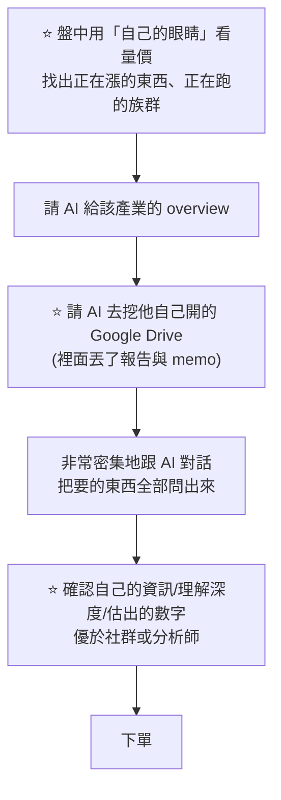
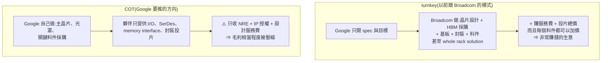

# 股癌近期立場與傾向(質化摘要,涵蓋 EP643–EP702)

> AI 從最近約 60 集的逐字稿摘要整理,捕捉「他最近更看好/更謹慎什麼、操作心態」。**集數越大=越新。**
> ⚠️ 這是對一位真實 podcaster 公開談話的 **觀察推斷**,非他本人意見、非投資建議,可能過時或誤讀。最新整理基準:**EP702(2026-10-03)**。

---

## 🟢 最新進展(EP702,2026-10-03):光輝十月兌現、押注主軸就是「光」,拆解摩根士丹利 65% 美國 BOM 光模組禁令傳聞

> 主線兩條:**① 大盤新高、光輝十月「如假包換」,重申「大盤沒轉弱就不要跟它對作」**;
> **② 拆解 Morgan Stanley 10/1 的光模組禁令傳聞(65% 美國 BOM)** —— 他的結論是**「這不就是原狀嗎?原狀重申而已,但大家的反應很大」**。
> 他明講自己這波的部位核心:⭐ **「光算是我這一波最主要的一個押注。」**
> 另外延續上集「AI 協助 IC 設計」的話題,談**聯發科限縮員工 AI 額度**引發的 token maxing 兩難 —— 一切回到成本。

### ⭐⭐⭐ 盤面:光輝十月兌現,不要跟大盤對作

- 夜盤**台指期貨創新高**、**NQ 表現極好**,⭐ **「光輝十月果然是如假包換」**,十月盤面整體轉向更好的方向。
- ⭐⭐ 過去一兩個月一直講的核心:**「大盤根本就沒有轉弱」**,這時候提早放空 ——
  **「就跟 Michael Burry 很像,就是你就會被嘎到媽都不認得。」**
- ⚠️ 他對「找神拜」的散戶很不客氣:七月修正時把空方意見領袖(Burry)捧成神,漲上去又說他們超爛 ——
  **「這個就是注定會導向你的失敗。」**
- ⭐ 判斷轉空的條件:**「除非你今天看到它已經確定的轉向,均線已經下彎,再來討論都不遲,就是不要太早的想要去預判高點。」**
- ⭐⭐ 一句很硬的話:**「新高如果你還在講說這個盤很爛…可能就是選股不行。」**
  **「如果說大盤都走得好好的,手上的東西都不會動,那就是回到選股的問題。」**

### ⭐⭐ 全面轉強的訊號:最後一棒(被動/功率元件)也動了

- 七月前題材輪動,**最後一波是被動元件與功率元件**;這一波**最慢上去的也是被動/功率**,上週終於動起來 ⇒ 他把這視為**全面轉強的訊號**,
  「有點又回到上半年那時候…各種東西亂衝」的味道。
- 他觀察到「身邊的勇者還是很多」,Passive 一起來就一堆人手上裝滿被動元件;⚠️ **但他自己這波「手速沒有這麼快」**,
  因為手上東西都走得好好的,**以光為主,就繼續留著**。
- ⭐ 對被動/功率的基本面:接下來幾個 Q **規劃的漲價還是持續**;但最主要缺貨的是 AI 相關。
  ⚠️ **非 AI 的是在賭「排擠效應」—— 他放在 tier 2 以後的故事,「我會比較害怕一點」**,暫時不選;
  只是承認「市場還蠻喜歡去押這種排擠的東西…很快就衝上去開燈鎖燈」。
- 也提到:**今天有押 CPU 的,連日狂噴停不下來**(⚠️ 未點名個股,語意偏「他有押」或「有人押」不完全清楚,原話是「像我今天跑去押那個 CPU 的,那也是這樣連日狂噴都停不下來」)。

### ⭐⭐ 持股心態:七月清完浮額,不必在族群間跳來跳去

- 上半年是**有節奏的一個族群換一個族群**;現在 ⭐ **「7 月剛把一些浮額給清掉,所以其實好像也不需要一直在每個族群之間跳來跳去,就是你抓好一些東西。」**
- **「你也不會太想要去在短期內去換持股。」**

### ⭐⭐⭐ 產業趨勢 vs 短線雜訊:「不學無術」才把短線波動解讀成產業大變化

- ⭐ **「產業的東西呢,從年初至今都是維持在同一個趨勢上面。」** 3–5 月噴超多、7 月衰很大,很多人就說故事是假的 ——
  **「那個就代表說就不學無術。」**
- 案例 1:**SSD 股跳樓**,有人歸因 HDD 廠擴產 —— 他反駁:**HDD 廠產能基期很低,就算大擴產對產業影響也不會太大。**
- 案例 2:**3037(欣興)**先前被傳某利空(⚠️ 逐字稿為「稀產地」,疑為聽寫錯誤,實際利空內容不明),大家以為完蛋,**結果上到新高**。
- ⭐ 心法:**盡可能鎖定產業趨勢;短期超漲與否是操作者自己的考量**,不做太多評論。

### ⭐⭐⭐ 摩根士丹利光模組禁令傳聞:65% 美國 BOM

**傳聞內容(⚠️ 他強調「比較偏向是一個傳聞…不要太認真看待」):**
- 光收發模組(Transceiver)只要 **65% BOM 為美國成分**就可持續出貨;
- 對 **800G / 1.6T** 不會做太多限縮,**要到 3.2T 才處理** —— 「那個已經是幾個世代以後的東西」。

**他用 800G 模組拆解架構**(以中際旭創 800G EML DR8 為例,ASP 約 **315 美元**):

```text
發射:Switch/GPU → DSP(洗訊號、重定時)→ Driver(放大驅動雷射)→ EML 雷射 ×8 → 透鏡/隔離器/光纖陣列 → 出光
接收:光 → 透鏡/光纖陣列 → PD(光轉電)→ TIA(放大電流)→ DSP → 回伺服器
口訣:「出去是 Driver,回來是 TIA,然後都要經過 DSP。」
```

- ⭐ 對光的 know-how:**「把光對準本身就是不容易的」** —— 大立光、FAU 等話題就是在討論**誰能把光對好**。

**⭐⭐ 他的核心評析:原狀重申,不是誰立刻被打**
- 先進 800G 模組本來就用 **Broadcom、Marvell、Semtech** 的晶片、**Lumentum、Coherent** 的雷射,**本來就約 60 幾 % 是美國元件**。
- ⭐ **「所以你說它到底禁到什麼?好像也沒有禁到什麼。」**
- **真正被壓制的是:中國未來想用自家 DSP / Driver / TIA / 雷射去 cost down 的路被封住。**
- 但週五 **DSP 相關(Marvell、MaxLinear、Broadcom)股價都起來**,他認為是事件驅動;市場邏輯是「美國政府有意處理,先試水溫、後面可能收緊」⇒ **大家提早去賭受惠者**。
  ⭐ 「往 DSP、Driver、TIA 的方向去做押注,或者一些雷射件,就很合理。」

**受惠/受害分層(他的說法):**

| 角色 | 判斷 |
|---|---|
| **美系核心元件廠**(DSP、雷射) | ⭐ **核心受惠** |
| **中國雷射廠商** | ⚠️ **核心受害** |
| 其他(含台系) | **偏 neutral、偏想像** |

- 剩下約 35% BOM 由一堆廠商分:**被動光學、機構件、透鏡、隔離器、光纖陣列、PCB、外殼** —— 台/日/中商,**毛利較低**。
- ⚠️ 現實:**全球光模組組裝能量 6–7 成以上在中國** ⇒ 所以他一直認為**不可能立刻封殺**,否則美國自己 data center 也受傷。
  ⭐ **「美國人的老樣子,就是他要把毛利比較漂亮…比較有核心 know-how 的環節留在自己的手上。」**
- 美系光通廠在電話會議多次提到**往東南亞、台灣發展去中化**;但**上游材料在中國**,趕盡殺絕會被反制 ⇒ **「這個應該不會推得太快」**。

**台系的想像空間:**
- 美系客戶怕「夜長夢多」⇒ **便宜的機構件、光學件、甚至組裝、EML 封裝**有機會往台灣找 —— ⭐「非常有機會發生」,**但屬間接想像**。
- **達發(聯發科旗下,台系唯一 DSP)**:目前鎖定 **400G**,3.2T 是好幾世代後;且**台灣不算美國成分 ⇒ 不在 65% 受惠清單**,不會是第一波受惠。
- 若中國反向「去美化」:可能出現**投片轉到台灣/搶在封鎖前拉貨**的排擠效應(類比當年晶片禁令前趕投片);
  或美系找 **second source 從找中國改成找台灣** —— ⭐ **「以長期來說 promising、蠻好的故事」**。
- 中國 DSP 最大瓶頸是**拿不到 3/5 奈米先進製程**;⭐ **尖端 DSP 跟 GPU 共用產能 ⇒ 這也是 DSP 缺、lead time 拉長的原因**(呼應先前講的 DSP 漲價)。
  ⚠️ 中國多重曝光、自製 EUV 等**他歸為想像/謠言,不評**。
- ⭐ 一個加分點:海外研調擔心**中國大擴產會把光通關鍵零組件價格玩壞**;**若禁令要求美國成分占比,中國只能「捲到自己」** ⇒ 「這個禁令來得正是時候」。

### ⭐⭐ 聯發科限縮員工 AI 額度:token maxing 的兩難

- Threads 上傳出**「大 M」(他先開玩笑說麥當勞,實指聯發科)**限縮員工 AI 用量 —— 他說**之前就聽說**。
  用量**一個月支出約一兩億**;為降成本**自建 Data Center 跑地端模型,但伺服器負荷不堪、速度變慢**,引發工程師反彈。
- ⭐ **「如果預算是無限的話,大家誰不要 token maxing?」** 他自己用最新模型開無上限模式,**問一題幾千塊、跑五分鐘**,也會想中斷它要答案。
- ⭐⭐ 核心觀念:**「最終都是回到成本。」** 他用模擬城市比喻:錢無限就全部直上最好,但現實會卡經費;**「屎山代碼」式慢慢迭代的城市反而經營得好**;從零造鎮(中國案例)常 BBQ。
- 歐美較小企業也開始**不追 token maxing**。
- 解方:延續上集 —— **「開一個私服給你」的地端伺服器 + 尖端模型**,前期建置大一張、但**沒有高額 recurring 費用**,長期可能更便宜。
- ⚠️ **開源模型跟尖端模型「還是差蠻多」**:美編、文字工作夠用,**晶片 layout/設計不一定夠用**,要等特化模型 ⇒ **「貴森森的模型它會存在是有其道理的」**。
- ⭐⭐ 對供應鏈的延伸提醒:**企業主已是最願意花錢的使用者,連他們都開始踩煞車 ⇒ 「在供應鏈的想像,就是確實不能夠想像得太快。」**

### 📉 EP702 的盤面體感

- ⭐ **「這個盤是一個不錯的盤。因為就新高了,不然你要怎麼樣?」**
- 延續性要**看下禮拜**能否帶出去,但他判斷「沒有什麼爭議」。
- 自己部位:**以光為主、續抱**,不追被動元件那波;七月浮額清掉後**不急著換股**。

### ⭐⭐ EP702 Q&A 最重要的一則:Quant 是排位賽,我們是積分制

- 做 Quant 的人**高比例是數學/資工天才**。
- ⭐⭐ 比喻:**「我們玩的遊戲是有點類似積分制」** —— 不必某領域最強,**整體綜合評價不錯、長期參與就能持續疊加**;
  **量化/高頻是「排位賽」** —— 最快、延遲最低的人把利潤吃光,**「縱然你一身神力」設備輸人也不一定賺**。
- ⭐ **「在我們比較偏向是題材、基本面,然後跟中長期投資的這個角度來說…有機會真的每個人都賺到錢。」**
- 他自己去做 Quant?**「應該是沒有辦法」** —— 對「賺一兩 % 再槓很大」沒興趣,「不是我喜歡或會想研究的」。

### 💬 EP702 其他 Q&A 摘要

- **Muse 三個月後還有人用嗎**:⚠️ **「聲量會掉很多很多」** —— 其他巨頭會馬上 roll out 類似產品,Muse **變成其中一個商品**(呼應 EP701「每個巨頭褲底都藏了槍」)。
- **給兒子十歲生日(美西聽眾)**:他認同「賺錢的苦差事爸爸扛」;⭐ 延伸觀點:**台灣很多人仍是匱乏心態、能撈就撈**,
  上市公司沒配息就沒人投、不給 PE ⇒ **「你這樣的心態,你就養不出美國的一些那種什麼軟體巨獸」**(舉 Amazon 刻意虧錢擴張)。
  希望孩子有**「戰略的縱深」**,可以選擇不做不舒服、短視近利的事。
- **單親爸的空虛感/想買跑車**:⭐ **「你有的東西是不會獲得快樂的,你想要的東西才會獲得快樂。」** 時間分配:早睡早起(11 點就睡)、固定陪小孩、**避免晚上應酬**,先把人生順位理清楚。
- **紐西蘭**:想去但要等孩子大一點;推 **Central Otago 的 Pinot**,品質好又便宜。
- **追星/BIGBANG**:他買的是**高雄場**,會帶兒子去;接受自己在演唱會可以坐著後又重新喜歡上演唱會。
- **功能性訓練與左右不平衡**:單邊訓練能有效調整;他近期**「頓悟」發現推的時候下背在出力**,連刷牙、坐姿都重新檢討(「坐太挺」反而讓下背持續出力)。
- **不知道吃什麼**:他吃穿都沒想法(衣服老婆買);⚠️ 自嘲「當我突然間產生想法的時候,那就代表說我的帳戶要哭了」(如紅酒)。
- **大武營傘訓鬼故事**:他是傘兵(特一營),分享「白宮」與軍官落跑的故事;大武營已拆。

### 🏠 EP702 生活

- 又一次**抽不到 Radiohead 日本/澳洲場**(但朋友抽中可帶三人,大多能上車);討厭實名制抽選、希望有「救濟管道」。
  ⭐ 自我開解:**每次覺得很順、想截圖損益,後面就一定吃大便** ⇒ 不順的小事當作消耗惡運。
- **信念的力量/拜觀音**:以前不信,Choco 結紮手術、第二個孩子身體狀況後才明白 —— **「你已經沒有別的東西可以做的時候,你能夠做的就是跟某種神秘的力量去許願。」**
  但不在節目推廣;⚠️ 也罵只求神不努力、被神棍騙的人。
- ⭐ 近年瘋狂追求**「內心的平靜」**,甚至不排除斬斷連線;「有些人最好就是停留在你的回憶裡」。

---

## 🟡 上一期進展(EP701,2026-09-30):Q3 回顧(回三成→收復高點)、小 IC 設計集體表態、閉源模型下地端、德州設廠傳聞

> 季末回顧:**七月台股部位最大回撤約三成,九月初就收復台股高點**(美股因重押 Broadcom 落後)。
> 市場面:**小型 IC 設計集體表態**,他拆成「大哥吃肉小弟喝湯(訂單外溢)」+「AI 讓小公司開出營運槓桿」兩個想像。
> 盤面:**中秋後「人與人的信任有回來」**,後面會轉向比較積極,**但自己仍「放慢、不用急」**。

### ⭐⭐⭐ Q3 回顧:最大回撤三成,九月初台股收復高點

- 七月是**台股今年最大崩殺,「可能也是數年來最猛的一次」**;1–6 月覺得是「世界上最好做的盤」。
- 他的台股部位 **Maximum Drawdown 約 30%**;但**年初到高點約兩倍多**。槓桿約 **1.1–1.3 倍**,⚠️ **「媽的,也回太多了」**,心中有點不能接受。
- 本來想凹,**七月下半大型均線「該煞車的地方都沒有煞車」⇒ 信心缺失,開始減碼**(多數還是賺錢部位)。
- 本以為今年 peak 就在 7 月初、年底前難修復;⭐ **結果 9 月初台股就收復高點**。
- ⚠️ **美股沒有** —— **重押 Broadcom 後來「爆炸了下去,躺了蠻久」**,美股新高時間被拉到蠻後面。
- ⭐ 八九月換成**新主流題材**的順序:
  1. **光通**(第一個站上去)
  2. **小 IC**
  3. **銅纜相關概念股**
  4. 光通持續往上 + **衛星題材**
  5. **深度價值區、換算明年約 10 倍本益比的股票**
- ⭐ 觀察:**衛星是今年最早強勢表態(一月,他在飛羅馬途中鎖漲停)→ 光通 → 修正後光通又第一個站上去** ——
  「重新的去把前面走過的一些順序,都再一次的去走一遍」。
- ⚠️ 他歸因於轉換明快,但強調**「有時候有點運氣」**,「這並不是說『你看我超屌』」。
- ⭐ **「Hunting is over,結果沒有想到還是可以繼續的打獵。」**

### ⭐⭐⭐ 小型 IC 設計集體表態:兩個想像

**① 訂單外溢 —— 「大哥吃肉,小弟喝湯」**
- 晶片設計團隊與投片量是**稀缺財**,大家衝 AI 晶片 ⇒ **非 AI 訂單被丟出來**。
- 例:**MTK 接很多 TPU 訂單**,有些接不了 ⇒ **台灣 IC 設計大頭也分到新單**,再一路往下滴到最小的公司(⚠️ 逐字稿「GEN D 的一系列」語意不明)。

**② AI 讓小公司開出營運槓桿**
- **OpenAI Jalapeño** 宣稱 8–9 個月(他估約一年)從架構定型到 Tapeout,**對外說靠 AI 協作省下 layout 層大量人力**。
- ⚠️ 他認為**「有蠻高機率是 Broadcom 本身的晶片設計能力非常厲害」**,但假設官宣為真 ⇒
  ⭐ **小公司「兩三年內本來只能推一個產品,現在是不是可以推三個?」**
- 他自承順序是**「先射箭再畫靶」**:**「先買再研究」**,再找業界朋友驗證 —— 確認晶片設計業**已高度仰賴 AI**。

### ⭐⭐ 閉源(Frontier)模型有機會走進地端機房

- Design House 因機密問題,**多用 Open Weight 模型在自家機房跑**。
- ⭐ 他得到的資訊:**Frontier Labs 未來可能提供類似 open weight 的地端部署**(灌版本、落後尖端一兩版定期更新)。⚠️ **「現在有點講太早,大家先稍微聽一聽。」**
- 舉之前講 **Google 要自己賣伺服器**被罵亂講、後來成真為例。
- ⭐ 立場:**不是零和** —— **「像以前大家講什麼光進銅退——沒有那麼簡單,就是一定是大家都先一起成長。」**
  消息若成真**對 market cap 會有影響,但對營收獲利不會有太多衝擊**。

### ⭐ 美中會面:No change

- 沒什麼建設性;中國能否買 NVIDIA 還要看美國政府要不要賣;**中國光通封鎖令也沒拿掉** ⇒ **「直接把它當成是就是什麼都沒有發生」**。

### ⭐⭐ 德州達拉斯設廠傳聞(先當謠言評論)

- 德州水電 infra 充足、是化工 hub ⇒ **地點很合理**。報導說 **6 個 fab(前段)**;⚠️ 他最早聽說是**先後段**,前段也在評估,**很早期**。
- 若為真:⭐ **廠務、設廠、材料相關公司受惠**(美國單價高);⚠️ 但**毛利有爭議**(法人曾 trade 過高毛利後瘋狂下修,實際又沒那麼差)。
- ⚠️ 廠務股「**便宜、未來好,但就是不會動**」,他 Q1/Q2 試過幾波**不好做**;**若新 upside 拉出來,市場可能重新聚焦**。
- 地緣觀點:川普/盧特尼克言詞強硬,但**「並沒有說什麼要把你的根給刨掉」**;⭐ **是客戶要求**(馬斯克的 **NCNT = No China No Taiwan**)。
  ⭐ **「反正我不是來跟你談戀愛的」**(同時下訂他的車);**上市公司最終用投票解決,不爽就買成大股東,或看空就空、看多就多**,不淪為政治辯論。

### 📉 EP701 的盤面體感:氣氛回來了,但不用急

- 中秋後第一個開盤**尾盤又搞人**,今天大噴後**「有可能明天再搞大家一次」**;⭐ 但**「人與人的信任有回來」,後面會比較積極操作**。
- ⭐⭐ **「現在行情並不難做。你只要不要每天想要狂追,然後接著又一直什麼嚴守停損的話,你就是跟著波段這樣一路 flow 出去。」**
- 要回到 7 月前賺快錢需**天時地利人和 + 大盤成交量上去 + FOMO 出來**(今天買不到、明天只會更貴,連續幾天)。氣氛漸回,**再等幾個交易日確認**。
- ⚠️ 身邊已有人重新押注動能回來;⭐ **他仍「後面該會稍微放慢做」,前三季已很好,「不用特別的急」**。
- 走兩步退一步、再走三步退兩步、**慢慢往上墊 = 健康的盤**。
- ⚠️ 公債利率高「值得擔心」,但**全看總經會很難出手**;⭐ 鎖定**個別公司、題材、錢在哪、誰要開營收獲利**,抓住 **100 到 200 的路**,不被途中事件嚇走。
- ⚠️ **恐懼貪婪指標不可能拿來交易**(換來換去抱不住部位)。
- ⭐ **被嚇到不敢碰、等他下次敢碰又 FOMO 回來時,「搞不好就是又是下一波要殺人的時候」。**

### 💬 EP701 Q&A 摘要

- **動能大佬盤中做什麼/尾盤才進場?**:⭐ **「一般最強的股票就是早盤就會鎖起來…甚至只做前面的半小時」**;尾盤偷拉代表**主力不想花錢、沒認真進攻**。「大家要的東西一定是一早就搶掉了。」
- **產業研究深度跟 PM 同等級?**:整體架構理論上比較好(看全部、直接跟發言人對接);⚠️ 但 **他所在 AUM 最高的群組「對基本面研究沒有到很深」** ⇒ **懂產業不是賺錢的必要條件**。
- **J 大、上流哥**:上流哥因病淡出;他不刻意維持固定朋友圈。
- **資產變多跟朋友漸行漸遠?**:不用錢衡量人;⭐ 「台灣吃到這波 AI 大潮…過去幾年很多人都翻上來了」;羨慕**有可累積興趣的人**;⚠️ 大談「舊朋友跟不上我」的新富是在說服自己。
- **Apple Podcast 留言?**:**「一個東西沒有壞掉就不要去修它」**;但有任何不舒服就**立刻換掉**(A 君、E、老婆推他往前)。
- **台股破 5 萬?**(聽眾):他回 **「我也覺得會幹上去。」**
- **Cybertruck 交車?**:冷卻後覺得**太大台、台灣停車很麻煩**,要三思(他有 Model X Plaid)。

### 🏠 EP701 生活

- ⭐ **下訂 Tesla Roadster 2**:先聞到味道(設計人員、馬斯克轉發、內部封口令、下單頁被關)、蹲點網站一開就訂;
  預期**交車可能還要等幾年**、估**台幣約一千萬**;**定位為「投資的成本」**(同買新手機,參與過程可能有靈感);期待 **10/15 發表會**。
- **Muse Charm 業界回饋**:⭐ **「每個人的褲底都藏了幾把大槍,只是你敢不敢拿出來」** —— 其他巨頭(暗示 search engine 那家)也有購物 agent,Muse 受好評後可能被逼推出。
- 近期開始找**便宜實惠的好酒**,「有點像在冒險」;林口壽司包場。

---

## ⚪ 更早(EP700,2026-09-26):Meta Connect 的 Muse Charm(電子雞)與「個人超級智慧」,中秋前觀察

> 中秋連假前的一集。主軸是 **Meta Connect 2026**:他最愛 **Muse Charm**(像電子雞的 AI 鑰匙圈),
> 認為**這是第一次看到新 AI 裝置「有機會突破」**,但**眼鏡/AI 裝置要取代手機「不切實際」**,Meta 最大隱憂是**信任感**。
> 盤面:**動能仔互相凌遲、宙斯法則喪失,但「信任感快回來」,看中秋之後**。

### ⭐⭐ Muse Charm:第一次覺得新 AI 裝置「有機會」

- **沒價格、沒規格、沒預購**,只有一句官方文字 + email 登記;規格(2 吋 OLED、5G、前後鏡頭)是 Bloomberg/The Verge 挖的。
- 他看了**就會買** —— 像小時候電子雞/怪獸對打機,「Delightful and Fun Device」。
- 對照死掉的前輩:**Humane AI Pin**(699 美元+月費,被 HP 買資產後停機)、**Rabbit R1**(199,「本來就只是一個 App」)、**Limitless Pendant**(被 Meta 收購後停售)。
  ⭐ 他當年就說 AI Pin「量一定不會出來」。
- ⭐ 差別:**Meta 本身就是巨頭**,FB/IG 用戶可導入,**起跑點更好**。

### ⭐⭐⭐ 結論:最大的競品是手機,眼鏡取代手機「不切實際」

- 這些裝置本質都想**繞過手機**;眼鏡若賣幾億支,**光波導(Waveguide)吃大量 12 吋 wafer、台積電產能都不一定夠** —— ⚠️ **但前提是眼鏡變成下一個手機**。
- ⭐ **「手機實在是太強大了」**(像薩爾達裡的 PDA),**高滲透、高數量「都是比較不切實際」**。
- VR 眼鏡變輕(本體約 100 克,Puck 另計)解決痛點,但 ⚠️ **VR 不是現在最核心**;他**比較想注意 AR 眼鏡或小裝置**。
- 出無鏡頭版眼鏡回應隱私反撲。
- ⭐ 整場是 **「Muse 的身體發表會」** —— 眼鏡、VR、鑰匙圈都是 Muse 載體;祖克柏喊**個人超級智慧**,執念是**擺脫 Apple/Google 作業系統抽稅與隱私政策**。
- 商業模式:**大量免費 token 撐、長期靠交易抽成**;⚠️ **Amazon 擋 agent 合理**(話語權問題),巨頭之間會**合縱連橫**,被排在外面「可能會出很大的問題」;Meta 前期可能有**讓利**。

### ⚠️ Meta 最大隱憂:信任感

- 調查:願把密碼存 Google 的 30 幾 %、**Meta 只有 8 %**。
- 他「認同一半」:**詐騙廣告「就是不抓」**,重複 pattern 洗幾個月 —— 懷疑**營收有高比例來自灰色/黑色經濟**。
- Muse 串 Walmart、Best Buy、Gap、Sephora、PayPal、Expedia 等,**前提是你完全相信它**;他對 Google 願意、對 Meta 會懷疑,**但服務夠有趣仍想試**。

### ⭐ 投資角度:當「新科技的盤子」去提早卡位

- 新科技**初期預期很高、出來後發現蠻鳥,要有耐心**;示範訂房被吐槽「自己按兩分鐘就好」。
- ⭐ **「我們願意去嘗試新科技,我們其實某個程度上會有點像是盤子」** —— 提早熟悉、卡位。
- 投資機會**不一定在硬體供應鏈**,可能是 **Meta 本身**,或**串接後聲勢變大的服務**。

### 📉 EP700 的盤面體感

- 連假前常見賣壓(降部位、丙種/地方借貸資金收回),**這些錢放完假多會回來**;富台指夜盤又往上 —— 期待假後開盤。
- ⭐ 七八月他也**「覺得自己不會做股票」**;七八月到九月前半**專殺追高**。
- ⭐⭐ 他的調整:**「我選強中帶弱的…它的型態是多頭型態,只是我就是買綠。」** 以前都買紅追強。
- 財報狗 Jeff:**台股這樣才正常,瘋狂動能是過去 5 年的事**(剛好是他生涯快一半)。
- ⭐⭐ **就算以後回到動能盤,他還是想用現在的方式** —— AI 總有休息的一天,**三四十趴震盪、加槓扛不扛得住?「或許就是真的該慢下來」**;挑喜歡的公司、不急著追,**往價投心態調整,選的股票一樣,只是介入方式不同**。
- ⭐ **「你這個東西你只要拿著放著,其實它一直是往上墊,你看指數都要新高了。」** 貪快、上槓的才被上課。
- ⭐ **「大家在互相凌遲…宙斯法則的一個喪失。但最近真的有聞到一點味道,好像那個信任感快回來的感覺,看中秋之後。」**

### 💬 EP700 Q&A 摘要

- **怎麼判斷能不能做動能的盤?**:他身邊有「乘風等級的動能宅」,**連他們都說難做,那就一定難做**,宜用波段處理;
  ⚠️ 動能仔隔天一刀殺出、開低 6% 殺跌停 ⇒ **「同一群動能仔在那邊互相搞自己…這個盤面是在反映大家的一個心性」**。
  ⭐ 欣賞的動能仔:處理標的像「事後帶去吃小火鍋」,**負責任收尾 ⇒ 隔天開高/穩住機率高**。
- **聽眾十大持股(0050、QQQ、IFX、Google、Lumentum、Coherent、Bloom Energy、康寧 GLW、Teradyne、AMD)**:
  先嘴「菜籃族瞎買」,後評**「配置感覺是選得還蠻漂亮的」**:IFX 牛皮但功率元件必看、光通兩家全包、BE 賭表後供電(Data Center 敘事)、**康寧有光的味道**、Teradyne 機台、AMD CPU;
  ⚠️ **「未來的話,裡面有些東西我現在可能不一定會挑了」**。
- **社群與快樂寶貝**:七月前被狂吹、後被罵,「打稻草人」;⚠️ **Threads 是「很有惡意的平台」**(被罵的每一則都推給你),後來不看;
  ⭐ **「會的就是會,不會的人交易百年還是不會」**,想多講生活。
- **愛馬仕/配貨**:老婆開始買愛馬仕,他是「愛馬仕勞工」;反感配貨制度,**寧可溢價 4–50% 直上最好的款**。
- **罪犯打馬賽克**:支持像日本直接公開嫌犯。

### 🏠 EP700 生活

- **中秋帶大兒子去日本**;球隊租下**東京巨蛋**比賽:壘球打出一支「鳥安」、棒球被**三振**心情極差。
  ⭐ 類比:**大魯閣打擊練習 vs 正式比賽 = 模擬交易 vs 真實交易**(模擬有 pattern、無心理壓力,人人都是股神)。
- ⭐ 看到地方爸爸跟大學生兒子一起打球、互相錄影 ⇒ **生涯目標:孩子 15–17 歲時不嫌棄爸爸、願意一起參加比賽**(轉頭發現 5 歲兒子嫌無聊跑去寶可夢咖啡)。
- 推薦**飛羽田不要成田**(成田到市區計程車 1 小時 20 分)。
- 保加利亞分腿蹲「已經是我的愛,不是我的恨」。
- 推薦 Radiohead:Let Down、Motion Picture Soundtrack、2 + 2 = 5、Nude、Weird Fishes、The Tourist。

---

## ⚪ 更早(EP699,2026-09-23):Agentic 帶動 CPU 二度催化,DSP 漲價,指數新高但不要摸頭

> 市場重點有三個:**Meta Muse 帶動 CPU 二度催化**、**DSP 漲價**、**指數創新高時不要摸頭**。
> 他開始「**默默聞到市場熱度回來的味道**」,恨天高的數字(例如 CPU 對 GPU 40:1)又出現了,但他把這類數字定位為 FOMO,**趨勢沒錯,只是數字喊太高**。

### 📉 盤面體感:指數新高,盤面結構在改善

- **NQ 和加權指數都創新高**。加權創新高那天收了一根小避雷針,隔天又往上墊。他猜指數走得比較扭,是因為「**台灣人很怕連假**」(9/25–28 中秋連假)。
- ⭐ **盤面結構慢慢改善**:「前一天鎖漲停、隔天就被打爛」的現象開始減少,也有族群走出來。
  - **功率元件**在 7 月大逃殺後一直躺在下面,最近慢慢站回來。
  - ⭐「**過去連狗都不要的光通跑第一棒**。」
- ⭐ 他的推論:指數繼續往上的話,**類股會進入輪動**,「應該會有蠻多機會可以繼續去找」。但他也預期要**等連假之後再觀察**。

### ⭐⭐⭐ 交易紀律:不摸頭,隨時八、九成部位

- ⚠️「指數在新高附近怎麼會轉空?**這變成是摸頭啦**。」個股破底可以視為那檔轉空,但不能因此說整個大盤要轉空。他「**不會羨慕那些摸到頭的人**,他可能就賽到了」。
- ⭐ **眼見為憑**:要真的出現破底、很多股票轉空,才會認為要轉空。如果只是交易一直被打臉,⭐「**那是你這個策略這陣子不好用**」,不代表盤壞了。
- ⭐⭐ **他自己的做法**:「**在場上一定隨時都是八九成以上的部位**,不太喜歡空手、轉空,沒有意義。」這是向大型資金操盤者學來的:「誰會跟你說整天空手?」
- 理由:Cash is king 只在突然崩盤時有用,「**你可能就爽那一下**,後面沒有及時把錢打回去,最後還是錯失很大的報酬」。
- ⭐ 他也說「不想好像自己是死多頭、要跟大家喊多,就是講自己的看法」。

### ⭐⭐ Meta Muse 讓 CPU 二度催化,但不要 FOMO 那些數字

- Meta Muse 可以幫使用者建立 Agent,串接 FB、IG、Gmail、定位和 Calendar,在 App Store 衝到冠軍。他形容是「**更加人性化的龍蝦**」。
- ⚠️ 他對 AI App 的整體看法:每次新東西出來,大家就 FOMO 下載、裝懂,「**一段時間之後一堆龍蝦棄養**」。他認為還在探索階段,「多了解是好的,但不用每個都立刻玩到很熟」。
- **CPU 在 Agentic workflow 的重要性已經是共識**:
  - AMD 說 CPU 對 GPU 的比例會從 1:8、1:4 往 1:1 收斂。他認為 1:1 有點極端,但確實有機會往那個方向走。
  - Bernstein 6 月的報告:傳統大模型工作負載中 CPU 約佔 15%,Agentic 則約 50%。
  - Arm 的數字:**每 GW 的傳統 AI 資料中心約需 3,000 萬顆 CPU 核心,Agentic AI 則約 1.2 億**。
- ⭐⭐ **他對這波行情的定位是「二度催化」**:Muse 出來後 CPU 股票立刻上漲,隔天台股 CPU 相關股不是漲停就是很強勢。「**第一度是今年上半年 CPU 類股全部射出去**,二度一般**沒有一度那麼激情**,還是會衝一下,後面應該稍微休息,再回到正常軌道。」題材如果是對的,營收獲利會開出來,股價就會慢慢往上。
- ⚠️ **他戳破 40:1 的說法**:
  - Wccftech 引用 X 上的推算:每個用戶用 2 vCPU,一億用戶約需 158 萬顆 CPU。他指出這是**假設 100% 用戶同時在線**,算法「拼拼湊湊」。正確算法應該是用戶數乘以同時上線比例,再乘以每個 VM 的實體核心消耗,最後除以核心數和目標利用率。
  - 「40:1」的說法**沒有任何機構或 analyst 提過**,網友追問情境也沒有合理解釋。
  - ⭐ **他的 consensus**:**1:4 到 1:2 比較合理,1:1 是最樂觀的情境**。目前某些巨頭說 CPU 不是他們缺貨的重點,但其他地方確實看得到拉貨潮。
- ⭐⭐ 他說這是「**每兩三個月就會發生一次**」的劇本:「每次我們講完『沒有這麼誇張』,然後就繼續噴,因為大家會 FOMO。」要小心之後回檔的衝擊,但「**不代表這東西的趨勢不對,只是前面的數字喊太高**」。

### ⚠️ 宏碁陳俊聖說不缺貨:他的評價

- 他肯定陳俊聖在 AI 時代之前推動多角化,但認為「**在 AI 時代,宏碁很明顯是弱勢玩家**,從股價、產品線都看得出來,他根本沒有東西跟在線上」。
- ⭐「如果 AI 泡泡真的破掉,大家一定會說他是先知。」但新產品(例如 Agentic CPU)一出來,供需就會產生新的變化,短期很難改善。「**當然有一天一定會被他喊中,但這就跟在股票摸頭一樣,意義不大**。」
- 他再次回應 CCL 降規:就算真的發生,也要等 CPO 等技術都成熟之後,而且到時候 M6、M7、M8 也會變便宜。⭐「**長遠來看,我們都死了**」,AI 抒情文看看就好。

### ⭐⭐ DSP 漲價與 CPO:不要用零和思維

- 傳聞美國主要 DSP 廠商會**漲價 15%–20%**,大客戶和密切的合作夥伴漲幅會比較少。他認為「**蠻合理的**」,因為交換機速率越高,越需要 DSP 維持訊號。
- 他用比喻解釋原理:ADC 把類比訊號轉成數位,DSP 負責算數學、去除雜訊,DAC 再轉回類比。他把 DSP 比喻成「紅酒流水線上挑葡萄的品管」。**NPU 可以看成 DSP 的後代**,例如 Qualcomm 的 Hexagon。
- **光模組需要 DSP 的程度**:10–100G 不一定需要,400G 蠻常見,**800G 是標配,1.6T 是必需**。LPO 和 CPO 則不一定需要。
- ⭐ **他對時間軸的判斷**:CPO 全面放量並拿到很高的市佔率「**是幾年之後的事情**」,而現在處於 400G 到 800G 的過渡期,所以「**DSP 持續有表現空間**」。另一種說法是,DSP 廠之後可能把產品變成 chiplet 或 SerDes IP,繼續保有價值。
- 他說這塊目前**非常缺貨**,過去大家一直在等漲價,現在終於漲了。可以關注 **Marvell、MaxLinear** 和台系 DSP 廠的說法,從中取得情報。
- ⭐⭐ **他反對零和思維**:「說要死的東西,其實會持續放量,甚至賺得比大家想像中還要久。」老玩家「**會瀟灑的轉身**」,例如台灣做連接線、銅線的廠商開始跟光通廠合作,「也會變成某個程度的光通廠」。⭐「**這是股票很有魅力的一點,公司如果不是笨蛋,不會停在原點等人家把自己殺掉。**」

### 💬 EP699 Q&A 摘要

- **罕病孩子的爸爸(關稅戰後資產從 A7 翻到 A9,一半轉進美債,靠債息支應生活後和太太一起辭職)**:他肯定這個選擇。三十幾歲是人生開銷最高的時期,債息能 cover 生活,「後面應該很難超出這樣的支出」。⭐「**急流勇退,好好專心過生活,也是一種選擇。**」
- **只會當聆聽者、問不出好問題**:他說自己現在也**大多是聆聽者**,「已經跳脫想要說服任何人、證明自己是對的階段」。⭐ 判斷自己是否真懂的方法是:**能不能把複雜的東西用簡單的比喻講給家人聽,而且講完自己可以自洽**。
- **17 歲炒股後「生活陽痿」**:他坦白股票「非常刺激多巴胺,我每天看盤都覺得很高興」。但他也點出自己的職業病:「500 塊的東西你不要再跟我討論,浪費生命。」這正是他一直想避免的跟家人脫節。⭐ 他建議學生「**detox,遠離盤面,好好談場戀愛**,後來要炒股有的是時間」。
- **努力不夠還是沒能力**:他的判斷方式是**看產業的 benchmark**。條件跟別人差不多卻做不到,就是努力不夠;怎麼對都對不進去,就是不適合。他也引用一位量化朋友的話:⭐「**股票要做得好,個性要跟一般人不太一樣**,跟太多人一樣就會在固定的地方犯固定的錯;**散戶最好不要整天做決定**,偏偏他們就是想整天做決定。」
- **女兒讀遊戲設計**:家長只要做好後勤,例如買電腦、付 AI 訂閱、付參展機票。⭐ AI 讓修 bug 變得超快,也減少 headcount。他把 AI 比喻成 **Foundry,開發者則像 IC design house**,但 AI 不會取代人才,「AI slop 在 Steam 上連上架都不給」。
- **蕭南資本的投資規模**:⭐ ticket size 大約 **500K 到 1M 美元,目前出手都是 500K 起跳**,還有很多錢可以投,也開始看海外。他說當初成立時「**剛好在產業最低點,有點像又抄底了**」,之後遊戲 VC 又陸續出現。他也說 portfolio 目前表現「蠻不錯」。
- 他推出了「500 盤」美食清單(跟「500 碗」一起)。對於有人把他推薦的店當反指標,他反應很激動;他也說⭐「**麥當勞是世界上最偉大的餐廳之一**」。

### 🏠 生活

- **棒球初體驗**:跟朋友組隊,對上世界冠軍級的**國小一軍球隊**被電爆,不過**第一球就打出安打**,他說「功能訓練的種種都回到身上」。
- ⭐ 他說「**今年是運動之年**」。3、4 月開始瘋狂運動,球友已經**認不出他**。正式儀器測量的結果是**肌肉量沒有掉、甚至略增,掉的都是脂肪**,而且沒有鬆垮的皮膚。他說這是過去幾年「最讓自己開心的變化」。
- 從 4 月練到現在,搭配握力帶可以推起 60kg。一週去健身房約三次,加上網球、泰拳。

---

## ⚪ 更早(EP698,2026-09-19):CCL 降規只是鬼故事,大盤在新高附近卻有很多人轉空

> 第一次出差的心得(東京電玩展,他觀察到大 IP 不如 indie games),加上市場上的「**CCL 降規**」鬼故事。
> 他的立場跟 EP693 一致:**de-spec 是短期利空,長期材料一定會繼續迭代**。他也提醒,大盤在新高附近卻出現很多人轉空,這種**沒有連續性的盤**其實可能才是常態。

### ⭐⭐ 「意識流」貼文的真正用途:打暗號換情報

- 他在臉書轉貼 Wccftech 的報導:AMD 被台積電漲價約 10% 後轉嫁給下游。他的短評被聽眾說是「意識流」,曼報的 Manny 還開玩笑說再發展五年會變成「牽絲體」。
- ⭐ 他承認是刻意的:「**我其實不太在意多數一般聽眾聽不聽得懂,我只在意看得懂關鍵字的人會不會來跟我討論**」。貼文是「**一種打暗號**」,目的是**取得情報**,因為「以股市交易為核心,獲取情報可能是最重要的東西」。
- 那篇短評實際想表達的內容:
  - **MSRP 參考價值不高**。板卡上各種零件都在漲,包括被動元件、PCB,甚至 socket,MSRP 不一定會即時調整。
  - **NVIDIA 是把 GPU 加 GDDR 打包賣給 AIC**,AIC 再反映到終端售價,所以即使 NVIDIA 沒有公開宣布,價格還是往上走。他認為「**NVIDIA 顯示卡漲價才是最重要的環節**」。
  - ⭐ **漲價最大的因素其實是記憶體**,台積電「只是一個擋刀的角色」、「背鍋」。
- 台積電明年漲價:市場已經在傳,他覺得「非常合理」。他引用 Jensen 說台積電「太便宜」,也引用魏哲家說記憶體廠漲得「令人羨慕」、但要跟客戶共同成長。
- ⚠️ 他說這則漲價消息只是 rumor,「處理 rumor 有時候要帶點藝術性,甚至要看當下盤面決定」。

### ⭐⭐⭐ CCL 降規鬼故事:為什麼只用 M4 不成立

- 事件經過:上週有人在論壇發表言論,導致盤中「一堆東西跳水」,接著網路罵戰、迷因圖、外資券商的反擊文都出來了。
- 背景是 AI 供應鏈很多環節卡關,所以業界一直在找 **alternative solution**。他把幾件事放在一起看:
  - **HBM 降層數**:改用 8-high 甚至 4-high。⚠️ TrendForce 認為 4-high 用在 edge 可以,用在 AI 比較難。但他也提醒,容量不夠就得「多放幾顆」,這樣會用到更多板材,「**頭痛醫頭、腳痛醫腳,全身都還是不太舒服**」。
  - **Power rack 換代不急**:CSP 的朋友說 Rubin 的功耗沒有原本預估那麼高。另外 800V 也可能遞延。
  - **板材**:說法是高速訊號在晶片旁邊就轉成光,主機板只剩低速控制訊號,所以「M4 就夠了」。
- ⭐⭐ **他的反駁**:CPO 只能消除 **ASIC 到前面板可插拔光模組**、**ASIC 到背板或中板的長距走線**這兩段。可是 **CPU 到 GPU 的 PCIe Gen6 走線、CX9 NIC、CXL 存儲**都還跑在高速規格上,用 M4(10–25G 等級)「跑不太動」。板材廠自己也說,導入 PCIe Gen6 要**從 M6 升到 M7**。
- ⭐「科技最終就是會持續的進步。」這些是缺貨、通膨時期的「**非常時期的非常手段**」,局部會發生,但不會全面化。

### ⭐⭐⭐ 交易心態:不去 trade 鬼故事

> ⭐⭐「**可能也是因為年紀增長了,部位也越做越長,就會覺得反正你終究是要往這個地方去,所以我也懶得在過程之中先 sell the rumor,然後等某個低點再買回來。**」

- 理由是:「有時候那個東西不一定會跌,或是跌兩根之後就直接好幾根拉上去。」板材廠過去好幾次都是「**鬼故事在很短的時間內就被擊敗**」。
- 前例跟 EP693 一樣:**銅轉光的時候銅相關類股被打爆,之後一堆創新高**。光通訊回檔時有人自嘲「伺服器之間已經不用連接了是不是」,結果 **7 月修正之後光通訊跑第一棒**。
- ⭐ GB200 的例子:市場一路喊 3 萬、5 萬、7 萬 rack,接著又自己修正成砍單、遞延。「**如果真的很認真去研究,不是從頭到尾就是 2 萬嗎?**」數字是市場吵上去、再自己喊下來的。
- 他的結論是,這些都是在 trade 還在發展中的 roadmap,「最終它還是會出現,再出現時可能又會再上去」。他也補充:**看短還是看長沒有對錯,看個人的交易週期**。
- 對發言者的評價比較中性:「他這樣說也不能夠說他錯」,問題出在用詞像「殺手鐧」,把市場嚇到了。

### 📉 盤面體感:大盤在新高附近,怎麼轉空?

- ⚠️ 過去一兩週**很多人全面轉空**,他覺得「**蠻奇怪的,因為大盤在新高附近,根本沒有掉下來**」。如果是 7 月轉空還算合理。
- 盤的特性是**沒有連續性**:今天突破、明天跌破,小破底之後又拉上去。用月線看是越墊越高,但每天盯盤的人淨值一直往下。
- ⚠️ 他聽說朋友的朋友做動能操作,**淨值跌破 7 月的低點**,原因是「每天看到強勢就追進去,隔天沒開高就丟」,幾輪下來錢就不見了。另一個風險是**槓桿開太大**,被短期 rumor 洗掉。
- ⭐⭐ **他引用財報狗 Jeff 的觀點**:沒有連續性的盤**其實是常態**。「我加入市場的時間有快一半都是超級熱鬧的盤,所以我覺得那才是常態。」他也預告:**「等 AI 大潮稍微告一個段落之後,就會有更長的一段時間長這個樣子」**,所以要「趁現在好好習慣」。

### ⭐ 東京電玩展與蕭南資本(遊戲 VC)

> ⚠️ 他投資遊戲團隊的創投,逐字稿寫作「蕭南(資本)」,可能是聽寫誤差。

- **大 IP 的大館沒什麼印象**,因為 demo 和影片在家就看得到;他覺得「**電腦展比較好玩**」。主要目的是去看 **indie games**,以及之前寫信聯絡他們的日本團隊(成員多數是外國人)。
- 很多團隊的痛點是**缺優質的發行和行銷**。他們給自己的定位是:「**掏錢加不會有太多廢話,不會想要拐你、跟你要一堆 cut**」,還能協助法務、簽約、發行和行銷。
- ⭐ 他的觀察:「**排場大、有 Showgirl 發傳單的一般都不好玩**;看起來乏人問津、三個宅男在排、負責人很認真介紹的,蠻多都很有趣。」
- 他開始看**海外團隊**,包括西班牙、歐洲,甚至美洲的團隊,但仍然以台灣為主。投後管理會先集中在亞洲,之後再考慮歐洲的 hub。
- 他說 deal sourcing 有優勢,因為他是「小名人」,好案子會自己送上門;去東京則是「陌生開發」。他印了「American Psycho 式」白底黑字、低調奢華的名片,也坦白說「平常只想縮起來,根本不想認識任何人」。

### 💬 EP698 Q&A 摘要

- **長照與安樂死(延續上集)**:⭐ 他談「**通例 vs 極端案例**」:「我們無法改變的是通例,就是不能幫別人決定他要生要死。」他也承認自己在苗栗長大,看過資源不足時的取捨,所以理解為什麼有人會說出比較極端的話。他刪掉 Threads 的理由是「太多人喜歡**用極端案例去反駁通例**」。
- **龍(大一聽到出社會,從戰士韭菜變成乖巧指數仔,資產八位數)**:他說「過去的指數是很好沒錯,但是沒有好到這樣」,推測家裡有支援,但「不會去酸」。⭐「**父母就是孩子的起跑點**,我努力也是希望讓兒子家裡有礦。」
- **台法遠距離**:觀念正確就不難,必須**設定共同目標**,也要有「把另一半接過來」的心態;如果只是邊看邊走,「高機率就結束了」。
- **財務自由後不快樂,生小孩是不是 trading fun for joy**:⭐ 他不同意這種說法。他認為「**錢可以買到的東西太廉價了**,可以重複做一百次的東西,到底好玩在哪?」他搭星宇頭等艙「一點感覺都沒有」。真正的 fun 和 joy 是「**被需要的感覺**」,以及跟孩子一起重新體驗童年。他還說:「你生活過得很好的,沒空在網路上整天喇叭。」
- **GTA6 跟炒股**:沒有關係。不過**他在 Take-Two 這檔股票上是賺的**,在 CD Projekt(他口中的「波蘭蠢驢」)上是賠的。他**會讓孩子玩遊戲**,但會參考分級建議。他認為遊戲能讓人紓壓,「社會上會少一些事件」;對他影響最大的是 GTA 系列和艾爾登法環。

### 🏠 生活

- 住幕張新大谷。因為 Agoda 上的禁菸只是 request,入住時被安排吸菸房,**升級到大房間又多付大約 15 萬日圓**,還好大房間沒有菸味。
- 他說這趟商務旅行「久久一次很好玩」,下次還想說服老婆讓他再去;不過後段已經在找能不能早點回台灣。

---

## ⚪ 更早(EP697,2026-09-16):Dario 長文是「監管捕獲」,但驗證與監控只會吃掉更多算力

> 主線是拆解 Anthropic 執行長 Dario Amodei 的 3,800 字長文〈We Must Pace the Frontier〉。這篇文章發出後,週一費半跌 6%、資安股逆勢漲 13%。
> 他的結論分兩層。**動機層面**,他認為是各懷鬼胎:OpenAI 和 Anthropic 要的是監管捕獲,馬斯克要的是對手先煞車。**算力層面**,他認為**驗證與監控反而會用掉更多算力**,所以硬體因此下跌「蠻奇怪的」。

### 📉 盤面體感:低波動、「像是死掉一半」

- 盤面維持低波動,⚠️「這個盤感覺是已經像是死掉一半,不太會動了」。
- **抽籤資金回流的假說**:這次很多人去抽一檔新股(逐字稿寫「漢冊」,⚠️ 可能是聽寫誤差),規模比之前的 7769 還大。朋友做過回測:抽籤圈住的錢一放出來,市場就會有活水。
- ⚠️ 他自己對這個說法**打問號**,因為 Nasdaq「要跑到盤整下緣去」。他的判斷是「感覺不會出大事啦,就只是又往弱勢的方向去」,所以要**看全球盤面**。

### ⭐⭐ 三巨頭罕見同陣線:他怎麼看各人動機

- Dario 的文章這次得到 **Sam Altman 和馬斯克的附議**。他形容是「星星已經連成線了,天有異象」。
- **對 Dario 個人非常反感**:他自己串模型時會**刻意選 Anthropic**,但還是說「我覺得他超級猥瑣」。他說自己的「猥瑣雷達」以前準過,舉的例子是 SBF。
- **馬斯克**:自從 Anthropic 跟他租 data center、成為客戶後,他對 Anthropic 的態度「直接扭轉 180 度」。⭐「馬斯克也是一個很典型的生意人。」
- **OpenAI 延後上市反而是好事**:⭐「如果 OpenAI 跟 Anthropic 在差不多的時間發 S-1 上市,**AI 的故事就會提早結束**,因為它就再也不是朦朧美了。」

### ⭐⭐⭐ 核心論點:監管捕獲,是跑去華盛頓求監管的特洛伊木馬

- 他引用副總統 J.D. Vance 的說法:Frontier Labs 主動跑去華盛頓要求監管,像一隻 **Trojan Horse**。
- **監管捕獲的邏輯**:領先者藉由要求監管來**設定遊戲規則**。監管會提高作業成本,對巨頭只是「毛利掉一點」,新進者卻可能「連孵都孵不出來」。
- ⭐「規則是我設計的,我知道怎麼樣去做、怎麼樣去繞。」他認為 **Anthropic 和 OpenAI 打的就是這個算盤**。他自己也承認「在股癌這邊可能會被認為偏向陰謀論」。
- **馬斯克的算盤不同**:xAI 是追趕者,「前面有一點算是踩錯方向」。如果別人慢下來,他等到地面超大算力和太空算力建好,就有機會「**彎道超車**」。他也引用 Jensen 的說法,稱讚馬斯克建 Colossus 的執行速度。
- ⭐ **心法:每個人講話一定有動機。**「你每次只要看到 Bill Ackman 跑出來講一個主題、講得很恐怖,你就知道他手上有部位。」

### ⭐⭐ 超級對齊的前車之鑑:承諾 20%,實際只給 1–2%

- OpenAI 的超級對齊團隊(Ilya Sutskever 是領頭人之一)原本承諾 20% 的預算,最後**只投入 1–2%,還用最舊的晶片**。
- 他用台灣公司不願意花錢在資安、內控上來類比:這類支出跟業務沒有直接關係,「真的出事情了之後才會開始注意」。
- 他把這篇文章拆成三種解讀:①**卸責**;②**排擠對手**;③反方 Michael Burry 的說法是「**掩蓋成長放緩**」,也就是替之後調整硬體採購找理由。

### ⭐⭐⭐ 大結論:要驗證和監控,只會用掉更多算力

> ⭐「你沒有辦法用人類去教育 AI,你還是會用到大量的 AI 去教育這些 AI。」

他列出會多出來的算力用途:

| 階段 | 新增的算力需求 |
|---|---|
| 訓練前 | 資料**消毒**,先過濾壞掉的題目 |
| Checkpoint 送考 | **常駐第三方評估者**重考一次,有保留意見就再多跑幾次 |
| 危險能力測試 | 長任務,一次要跑數小時,檢查模型會不會逃出 sandbox |
| 對齊考試 | 模型可能偶爾作弊,所以「**重新考它 1,000 次**」 |
| 可解釋性掃描 | 像幫模型做 fMRI,打開腦袋檢查動機 |
| 部署後 | 監考推理過程、隔離沙箱、重考、修正訓練 |

- 他請 AI 調資料做推論,得出這些步驟**可能要多花 15%–20% 的算力**。⚠️ 他自己說「沒有辦法找到例證」,這只是推估。
- ⭐「訓練可能掉一點點,推論一樣多,甚至會更多,再加上驗證跟監控的新推論,**理論上算力的使用會用到更多**。」
- ⭐⭐ **對市場的判斷**:「市場共識是硬體可能減緩或停掉,**我不覺得啦**。sentiment 會受影響,**P/E ratio 搞不好要再下修一些是 OK**,可是實際用量上只會用到更多。」週一費半和硬體一起跌,他覺得「蠻奇怪的」。
- 資安股大漲:他提到 CrowdStrike 的方案「不用最尖端的東西也可以把資安做好」,之後可能有合作空間。他也回頭吐槽幾個月前流行的「Mythos 要殺掉資安」說法。
- 他引用老黃常舉的放射科醫師例子:**人對未來的預測很不準**。「從幾年前就說 AI 要讓大家怎麼樣死,那大家都沒有死啊。」他甚至覺得 David Sacks、川普的直白說法,「都比那些偽君子更動聽」。

### 💬 EP697 Q&A 摘要

- **抽籤**:⭐ 他**自己不抽籤**,理由是「生活已經過得蠻不錯」、「籤運沒那麼好」,不想把好運花掉;也不會用小孩的帳戶抽。但他認為「有閒錢的話最好都去抽一抽」。
- **打星星的股票**:星號表示曾經做過分割。⭐ 節目「**不太會 cue 中小型標的,以產業大趨勢為主**」,但市場上那些暴漲暴跌的股票他「一定都知道」,如果自己掌握得了「就會一起蹭車」。
- **陸股**:大約 2018–2019 年以後就不做了,以前做過的滬深正二也不碰,「中國市場沒有那麼好的一個環境」。
- **江海(被動元件)**:⭐ 他說那時是**抓到被動元件漲價**,上半年漲最多的就是被動元件。「現在蠻多都軟掉、在休息,**但漲價趨勢都還是在持續**。」⚠️ 他也提醒「**不要把這邊當成是報牌台**」。
- **3% 以下的資金**:股票相關的借款要拿到 3% 以下「蠻難的」,房貸還有辦法。
- **高資產客戶/專業投資人**:懂得用的人會覺得好用,但很多菜籃族會被壞理專推奇怪的產品。「開啟了一扇大門,不確定出來的是鬼還是神。」
- **跟單之道**:他引用朋友的話,⭐「**跟單的人就是有耳無嘴**」,被套也不要抱怨。他講到被問股票時情緒很大:「你要不要去問川普?還是去問 Dario?」他說自己從 2022 年起**不處理聽眾的心理壓力**。
- **朋友的女友抄襲又封鎖**:建議**直接斷絕**,不要嗆對方,以免結仇;中間那位朋友也可以一起切掉。
- **安樂死**:他支持,但強調「**安樂死不是幫別人決定該不該死**」,一定要本人同意。植物人的情況無法確認本人意願。真正該處理的是長照結構,以及「自己好好賺錢」把下半生規劃好。

### 🏠 生活

- **人生第一次出差**,去幕張看展。出門前大兒子「**直接大爆哭**」,說不要寶可夢也不要糖果,「他就是要你」。他形容這是「最純最猛的愛」,也是「魔幻體驗」。
- **抽血報告全部漂亮**:即使前陣子經歷了「瘋狂的紅酒探險」,肝功能、膽固醇、三酸甘油脂都正常,他歸功於運動。紅酒現在已經踩煞車。
- 功能訓練加入新器材**滑輪組**,他說「比保加利亞袋更靠北」。練了約三個月,完全沒有倦怠感;反而泰拳和網球都曾經倦怠過,林口夏天太曬也讓他很火大。
- 還在打猛健樂,體重已經持平,醫生建議不要隨便停藥。
- 聽眾問到百事生可樂,他說自己很愛喝。

---

## ⚪ 更早(EP696,2026-09-12):中年戰鬥陀螺與謝家家恥日 —— 消費題材打不贏 AI,別亂上空單

> 開場推百事「生可樂」、自行車是中年人的戰鬥陀螺;9/11 定為「謝家家恥日」(被酒商與美容業者差別定價)。
> 市場:Apple iPhone Duo、Oracle 財報、Hock Tan 在 GS 會議的說法;Q&A 是本集最該內化的**避險/空單觀**。

### ⭐⭐ 「人與人的信任不見了」—— 盤面與生活同一件事

- 盤面:**鎖漲停的東西隔天不繼續跑**,大家開始互相「猥瑣」,分點藏在總公司匯撥抓不到人(講了一兩個月以上)。
- ⭐ **「開營收你就是要漲,有好消息你就是要漲,不可以每次都用利多出盡來搞人家」**;NVIDIA、TSM 利多發幾次也沒出盡、還是一直上去。
  ⚠️ 整天趁利多灌爆的股票「以後就沒有朋友」,有些公司派也一起配合 —— 這是不對的。
- 生活:朋友經他介紹去同一酒商業務,買得比他便宜;他七位數起跳、不比價、立刻匯款,卻被說「要累積幾瓶才有折扣」。
  ⇒ **不公審、直接不再往來**;「成年人的世界不去指教別人,就是去選擇」。稱這種心態為「難民心態」,因小失大。

### ⭐⭐ Apple:iPhone Duo 定價比預期實惠,但消費題材資金不會多

- Pro Max 就是更新更強,不用琢磨;⭐ **iPhone Duo(折疊)他會第一時間入手**,價格只比 Fold8 稍貴,低於市場共識 ⇒ **銷量應會超出預期、明顯上修**,折疊機市占有機會拉高。
- 論點:Apple 等技術成熟才介入,強在 UI/UX 與軟硬整合;「科技的重點不是誰先做」,類比任天堂用成熟硬體但有 IP 與體驗。
- ⚠️ 待驗證:**中國市場**(消費明顯降級、精品趨緩、華強北整新機賣得好)。
- 記憶體漲價中 Apple 反而有優勢(毛利守得住、用實惠價格拉新客);LLM 日常應用 commodity 化後,**掌握通路者能分到價值**。
- 蘋果長期被看衰「AI 時代邊緣化」,現在越來越多證明能留住並獲得新客(不敢講股價會漲多少)。

### ⚠️ 供應鏈:鉸鏈、射頻與蘋果的壓價

- 鉸鏈:**3376 新日興**為主要 player 之一(有 major share),另有美系 **Amphenol**;但新日興要跟鴻海拆帳,較難掌握。
- ⚠️ 業界朋友說**第一代產品 margin 沒有想像好,蘋果壓得嚴** —— 解釋為何 rumor 時就先走、之後一直橫盤;除非明顯上修。
- 美系**射頻元件廠**蠻多動起來(折疊機射頻設計不同、價格較好)。
- ⭐⭐ **「消費性的題材,你再怎麼樣成長,你都打不贏 AI」** —— 外面俯拾皆是 YoY 100% 以上的東西;
  加上蘋果到第二、三代一定會把你幹掉(例:C1→C2 Modem,高通角色被擠掉)、養二供壓價,**他不會想去賭這個**。
  類比:跟諾蘭強檔片同檔期上映,拍得不錯票房也不一定好。
- 蘋果的垂直整合讓他想到 Tesla/SpaceX(關鍵零件自己卡住,其他人只能打工)。

### ⭐⭐ Oracle:不用出錢的魔術 + AI 基建進入地方政治

- 魔術:客戶預付、BYOH(客戶自帶硬體、收代管費)、供應商融資(NVIDIA/設備商)——
  ⚠️ 承平時期沒問題,反轉時**需求可能被自身融資放大、虛胖**;「我們不是末日博士」,心中有底就好。
- ⭐ **四年舊卡反而漲價 20%** —— 呼應黃仁勳 Fungible/Durable/Rentable,空方「高速折舊」論述沒發生(⚠️ 反轉後可能掉很快)。
- ⚠️ **電力與許可是關鍵瓶頸**:17 英里管線被否決兩次、某州要求 A- 信評否則交 70 億信用狀、大量選民反對;Bernie Sanders、AOC 反 AI 資料中心。
  ⇒ **AI 基礎建設進入地方政治階段**,若民主黨聲勢上來,資料中心建置可能出變數 —— **列為後面要注意的利空**。
- 解方:表後供電(活塞式、燃氣、太陽能);傳 Tesla 放出大量太陽能訂單,帶動相關供應鏈。
- 數字:營收年增 30%、RPO 6,600 多億、上修全年 —— 但「利多也不一定會漲」,仍是震盪盤。

### ⭐ Hock Tan:封閉模型最後是寡頭通吃?他打問號

- Hock:封閉模型贏家是寡頭甚至一家;封閉模型投 1,000 億賺 1,300 億、開放權重投 1,000 億賺 310 億。
- 他的看法:⚠️ **較傾向雙頭(Anthropic 與 OpenAI 輪流超車)**,且各領域會有特化模型;簡單應用之後交給開放權重模型,硬體成本拉平後價值會慢慢出來。
- ⭐ **「只要有一家爆炸,我覺得市場就一起爆炸」** —— 若真如 Hock 劇本,他自己也是最大受害者,所以傾向相信不會發生。

### ⭐⭐⭐ EP696 Q&A 最重要的一則:滿手多單、何時上空單避險

- 轉進 0050 等指數仍是**滿手多單**,沒錯。
- ⭐ **風險姿態隨 YTD 調整**:今年太好 ⇒ 可以拗久一點(所以 7 月有些幾百 % 的部位回很深才停利出場);
  若今年只有一二十 %、再往下就轉負 ⇒ **立刻轉防守**。每年/每季重算,「還是會把錢當錢很認真看」。
- ⭐ **空單是罕見狀況才上,要明確知道出事**:2022 年是 Q1、Q2 以後才上空單;「摸頭去空的,在多頭路上早不知被軋多少次」。
  空單主要目的是**保護多單**,不是想靠崩盤賺錢。
- ⚠️ **「散戶的避險都越避越險」**,疊床架屋最後雙巴;2020 後是罕見的狂噴行情。
- ⭐⭐ **「投資是什麼?就是你找到好公司,買進並等待……報酬真的都是等出來的。」**
- 觀察:核心圈朋友長線多單不動(股息都贏);**反而較小的參與者最近全面轉空、喊明年崩盤 —— 他覺得蠻可惜**,這種想法從 2020 聽過好幾次。不鼓勵散戶做太多空單。
- 處置股:會做但**沒動機**,跟一趟幾百到一千,「老老實實蹲,有時一天就超過了」。
- 「你真的覺得自己是藤原拓海很會開車,當然可以多去試試看,**反正你的績效會告訴你答案**。」
- 納斯達克 23 小時開盤:類似台指夜盤,可當 Early Indication 參考,但無法明確推到個股。

### 💬 EP696 其他 Q&A 摘要

- **YTD 從 300% 掉到 15%(7 月起做動能+開融資)**:⚠️ 這種 drawdown 代表風險太高;暴漲暴跌的報酬曲線「趨近爆炸的機率會高蠻多」,建議穩當一點。
- **群聯 aiDAPTIV**:一兩年前就去參訪過;⭐ 回頭看「蠻真知灼見」—— 用 NAND 做地端 fine-tune/推論省錢,呼應 KV Cache 往 NAND/Storage Rack 丟的趨勢;
  企業日常應用往地端走(「Uber 帳單直接爆發」)。⚠️ 關鍵仍是**客戶採用速度、ramp 需要時間**;猜會找夥伴(如研華)推,不會自己做 SI。

### 🏠 生活

- 自行車 = 中年人的戰鬥陀螺(SHIMANO 105 被嘴成垃圾、風櫃嘴/武嶺);想騎 YouBike 上風櫃嘴,也想弄台三五十萬的車,但「不想那麼快跟年少道別」先放著。
- 推薦百事「生可樂」;iPhone Duo 會首發入手;安卓 Fold 用 Google 點數形成課金「永動機」(妮姬等手遊)。
- 孩子:諾亞常喊無聊、很有主見(會叫朋友回家);會順著但對的事(運動、出門)用誘拐不用罵。安哥對運動有天分、諾亞耳朵好可能學音樂。
- 台灣當小名人沒有不舒服體驗,New Balance 10K 終點可以拍照。

---

## ⚪ 更早(EP695,2026-09-09):TPU 一年回本 —— 股價是狗,產業是牽繩

> 開場烏龍:以為 TGS 是台北電玩展,其實是**東京電玩展(千葉)**。蕭南資本開始往海外(歐洲、亞洲)物色團隊。
> 市場主軸:**Google Cloud 的 Thomas Kurian 在 Goldman Sachs 會議說自研晶片一年回本**,他視為「市場裡面超巨型的一個利多」。

### 📉 EP695 盤面體感:「隔日沖的地獄」

- 震盪已約一個多月;⚠️ **鎖得越死,隔天一般就越慘**(開低大逃殺甚至跌停,幾天後又復甦)。「你只要搶快就會被打」。
- 震盪成本積沙成塔,⚠️ **「搞不好吃掉你淨值的 5%、10% 以上」**。
- 兩條路:**堅持原做法但縮部位**,或**調整做法** —— 他選後者:⭐ **再想買也先等,沒買到就算了,幾天後真的會掉下來給你買**;
  不習慣做反動能的極短線,追漲停的規模持續縮小。
- 大盤在新高附近,但「遲遲沒看到表態突破棒,讓大家重建人與人之間的信任」;⚠️ **盤好才有題材可以看,現在先不聚焦題材**。

### ⭐⭐⭐ Google Cloud:AI 伺服器不到兩年回本,TPU 只要一年

- Kurian 數據:新客獲取速度是一年前 2 倍;>1 億美元大單 2 倍以上成長;**客戶 commit 100 最後花 150 以上(超額消費 >50%)**。
- ⭐ **AI 伺服器回收期不到兩年;自研晶片(TPU,含 TPU as a service/外銷)回收期再減半,一年回本** ——「超級變態恐怖」。
  呼應先前 xAI/Tesla mega cluster 租給別人回本很快的情報。
- 推論:Google 前沿模型「好像不太行」、**3.5 可能被跳過直接做 4**,資源往 Infra 與 Flash 傾斜是合理判斷(不是放棄前沿模型)。
- ⭐ **「他們印鈔的速度實在是太快了」**,很難想像 AI 市場短期內爆炸。
- 自稱 CP 值(訓練優 2.7 倍、推論優 80% 等)⚠️ 屬宣傳語言,「稍微看看」。

### ⭐⭐ 自由現金流轉負?「廢話」

- 有一年回本的投資,當然加快 CapEx、不做回購 ——「他已經告訴你這東西的 ROIC 比回購更好」。
  ⚠️ **反過來:哪天他開始把錢拿回去回購,可能是投報趨於中庸的訊號。**
- 潛在 downside:從前沿模型玩家變成 **Infra supplier(類水電業者),P/E 乘數可能降低**,但賺的是真金白銀。
- 這也解釋**巴菲特(波克夏)投 Google** —— 基礎設施是可以算出投入產出的防守領域。

### ⭐⭐ 前沿模型半衰期只剩兩三個月 ⇒ 模型商品化,高 CP 值的 TPU 吃香

- 前陣子大家說只剩 Anthropic 的「Fable」(⚠️ 轉錄名稱,依原文)能打,沒多久 OpenAI 端出「Extra」(⚠️ 轉錄名稱)全網狂吹。
  ⭐ **「半衰期已經不是半年了,可能是兩三個月」,別太快蓋棺論定。**
- API 費用持續收斂、特殊技能的 premium 被壓 —— 逐漸 **commodity 化**(Anthropic 在 coding 仍有口碑)。
- ⇒ 模型商收入趨同時,**選高 CP 值硬體很有吸引力,TPU 是現階段 CP 值蠻高的選項**;Vera Rubin、Feynman 出來後光景可能不同。
- 供應鏈 check 與此一致:⭐ **Google 越買越多,一年前講的態度到現在沒變;要滿足 Google 需求,全世界 AI server 特殊零件「全部加起來都是不夠的」。**
  ⚠️ 但 Google 股價與供應鏈「不一定會漲,好像最後看起來只有散熱有在跑」。
- 引 Gavin Baker:「告訴我壞消息」—— **「我們看不太到壞消息」**。

### ⭐⭐ 循環融資:誰在墊錢、誰在買單

| 角色 | 現金流位置 |
|---|---|
| 晶片商/供應鏈(台灣人) | 出貨就收錢,紮紮實實賺進來 |
| 雲商(Google、Oracle、Microsoft) | 先花錢,靠五年合約收回 —— 墊錢的人,但已證明能瘋狂印鈔 |
| 模型商 | 燒股東的錢買算力,股東很多就是雲商;風險最大的一塊 |
| 唯一外部進來的錢 | 終端客戶 + 模型商的募資 |

- 爆炸劇本:外部資本吸不進來/消費者不再擴大採用 → 模型商指引變差、成長顯著下滑 → 雲商合約收不回 → 往回炸。
- ⭐ 但 **「這個週期可能會超出大家想像,就是會非常的長」**;供需平衡那天才會 backfire。
- ⭐⭐ **「我們不是末日學派……重點是有沒有辦法在上去的這一段賺到錢,而不是展現自己很聰明說我知道都會爆掉,所以什麼都不要參與。」**

### ⭐⭐⭐ 股價是狗,產業是牽繩

- ⭐ **聚焦產業 —— 股價像遛狗時的狗,跑上跑下,但會順著產業的線跑。**
- 直到看到 Early Indication(⚠️ 通常那時股價已崩不少)之前,不當末日論者,順著產業方向走。
- 「也有可能泡沫已經要破了、市場很聰明遲遲不決定方向 —— 只是看起來真的不太像」,太多偏正向訊號。

### 💬 EP695 Q&A 摘要

- **CPO 供應鏈價值落在哪(FAU、主動對位、台積電 COUPE、Coherent/Lumentum 光引擎)**:⭐ **買題材「一包直接包」** ——
  每個主題挑一兩檔,總共可占部位 **30%、50%** 分散下去,過程中再看價值鏈往哪跑;方向押對就會賺,整條鏈包到「應該都會 outperform 大盤」。
  ⚠️ 最受惠的不等於短期漲最多,要看**漲價夠不夠狠、是不是被瘋搶的環節**。台積電是 bottleneck 但「太有品」不狠漲價;零組件狠漲常推一波就掉(客戶會找二供三供)。
  ⚠️ 點到某些 FAU 概念股「說做進台積電,台積電的人說沒看到斬獲,股價卻永遠高位」(未點名)。
- **美股開槓桿**:用 **option + 一些 margin**;美股融資利率十幾 % 常見、台灣約 2–3%(現約 3%)。option 多數賠或小賠,偶爾撈大的補全部 —— 最近一次是**一波 Intel「極爽」**。⚠️ 槓桿不長期持有,偏 trade 看法或消息。
- **Palantir 受 Google DeepMind 切入政府/軍工影響?** ⭐ **「完全不會去想這種東西」,世界不是零和,TAM 會擴張,越多 player 進來才是值得爭奪的市場。**
- 遇到有錢又摳的人:跟有錢與否無關,閃遠一點就好。

### 🏠 生活

- 前週跟日本遊戲大廠的人見面:大廠有很多因規模/內控投不了的「遺珠」,正適合沒包袱的蕭南。投後管理(若投歐洲團隊)還在想。
- 節目當日記本:「每一集沒東西可講,代表我可能已經停止前進了。」
- 一隻在台東飛行訓練時撿到的貓,因威航倒閉、後來養狗而託給苗栗家人,前陣子過世 ——「至今都覺得有虧欠」。⭐ 自認**狗派**。
- 教養:跟孩子當朋友就無法要求超級尊敬;不喜歡吃肉拆解出是「尺寸」問題(用剪刀剪小);「夢幻手錶」幫諾亞做好夢。會帶兒子看 G-Dragon/BIGBANG。

---

## ⚪ 更早(EP694,2026-09-05):內容通膨論 × 博通「外蒙古學生」—— 好財報不漲,AI 進入中場休息

> 前半是 Startup Sphere 論壇(全英文 Panel,同台 Twitch 共同創辦人 Kevin Lin、Sony Ventures)的心得與蕭南資本的定位;
> 後半解讀博通財報。盤面總結:**「動能難做,傻傻抱著反而墊高。」**

### ⭐⭐ 次級市場做動能、初級市場做價值(蕭南資本的分工)

- 次級市場(股票):⭐ **「我們甚至把它稱為 Momentum Trading」** —— AI 相關的東西「有些我們不求甚解」,只要在浪潮上、有 AI exposure 就可以買,
  因為 **「等到你已經完全可以具體化跟想像的時候,股價蠻多時候就漲完了」**。
- 初級市場(蕭南資本):反過來做**價值投資**,深入了解團隊與 pipeline,Evergreen Fund、跟公司一起複利。
- ⚠️ 金融股最近很猛,但「跟我們的領域有蠻大差距」,**不參與**。
- 蕭南**零對外募資需求**,股東願意持續投入;他自己「都還願意再繼續增資下去」。

### ⭐⭐ 內容通膨(Content Inflation)不會讓好內容變便宜

- 共識說 AI 讓內容爆量、內容會不值錢 —— ⭐ **他認為是錯判**,類比「SaaSpocalypse 會殺掉所有軟體」一兩年後被證明沒這回事。
- ⭐ **「好的內容反而會變得更加值錢,因為大家真的是受夠了那些粗製濫造的東西。」** 用 AI 當工具可以,但硬尻跟風產品「你馬上就聞得出來」。
- **信用時代**:選擇太多,「信用毀掉了,你大概一輩子就毀掉了」—— 別為快錢砸名聲。
- 方法論延伸:⚠️ **「不要一竿子打翻一船人」**(硬體也有東西被淘汰,但不是全部)。
- 遊戲業的 **Design House 模式**:像 IC Fabless —— AI 工具是 Fab、遊戲引擎是 EDA(都用租的)、Steam 是通路(抽 30% 也甘願)。
  蕭南的角色是 Infrastructure layer(募資、合約、代理商),把 hit-driven 變成「星星之火燎原」,經營長尾 IP Catalog。
- 真正的國際化不是「senpai notice me」,而是台灣資本出去投資、設廠;台灣上市櫃市值曾排全球第四、五名,「這他媽啥小」。

### ⭐⭐⭐ 博通財報:「外蒙古的兩個學生」= Anthropic 與 OpenAI

- Hock 的新語錄(前一個是 ankle biters):六個客戶裡**只有兩個需要幫忙搞錢** —— Anthropic、OpenAI(未上市、信用待遇差,new player)。
  ⇒ 博通/NVIDIA 下來協助融資,讓他們先把設備做出來。
- 博通有動機大力扶 Anthropic:**Ironwood 一堆 shift 到 Anthropic,v8 與後續 Google 晶片也可能往那丟**。
- ⭐ **「需求是千真萬確的強大」** —— 不論 seller financing、螺旋圈圈、互相投資的疑慮,每次財報看下來都還算健康。
- Rumor:**微軟明年 CapEx 會開很高**,「沒有要停下來的意思」。
- 博通首次給中長期指引,「一堆都是加 100% 以上」,數字看到都有點鈍化。

### ⭐⭐ Hock 第一次點名聯發科 = 利多

- 以往 Hock 輕視對手(ankle biters、talk shit),**這次第一次把 MediaTek 拿出來講**。
- ⭐ **「最強的才需要被殺……當我需要把你拿出來提的時候,其實對你來說是利多。」**「他等於是幫聯發科開了一個法說會」。
  如果是一兩季前的市場,「MediaTek 應該要再給它一根」。
- Hock 說 MTK 東西會比較慢 —— ⚠️ 他承認「跟我們考察到的也類似,晶片出來速度會有一些落差」,
  但公司擅長預期管理(看到 20B 報 15B,低報高 beat),**即使遞延也可能仍超出預期**。

### ⭐⭐⭐ 好財報為何不漲:AI 的中場休息

- AI 在資本市場已第三年要往第四年,一堆東西翻倍再翻倍,⚠️ **「並不會覺得每份財報都理論上一定要讓大家大噴」**。
- 台積電很好,但「過去幾個月可能就是沒有給你收益」—— 這是他仍做動能交易、找有進攻機會標的的原因。
- 近期有進攻機會的多是**相對後線、補漲型題材**,「沒有那麼香」;但最終會回歸 fundamental 持續開好的大咖,**他不擔心大咖**。
- 類比網路/.com:長期趨勢好,但資本市場上上下下 —— ⭐ **「我們現在可能就是在中間的一個休息一段,然後後面搞不好還有一段大的……可是一定會有一天他就是會砸下來。」**
- ⚠️ 別被「股價不漲 ⇒ 找理由說它不好」的報導帶走:**「它就只是不會漲而已、還沒漲而已」**,公司已洩題給 guidance。
- ⭐ **「現階段做 big names 最大的挑戰是你就是要有耐心、願意蹲,反正成績會出來」**;股價終究跟著 EPS 趨勢跑。

### 📉 EP694 盤面體感(9 月前 5 天)

- 非常震盪、難搞。⚠️ **做動能的「短短幾個禮拜內應該就輸掉蠻多錢」**(型態上去要追、掉下來又要砍)。
- ⭐ **傻傻抱著的,淨值反而慢慢往上墊**;用 4–7 月的做法就會「持續的沒有錢」。
- 但策略不能盤不好就停:**可以縮部位、做風控,理論上還是要持續做**,等盤轉回動能時持續做的人收穫最多。
- 自己:搭車搭一搭「媽的隔天大家都不玩了」被迫減 → ⭐ **把槓桿再縮小,等很明確再做**。兩週前就覺得大盤該表態,一直拖。
- 加權越墊越高、「第二隻腳沒有就直接上去」,快到前高;身邊朋友兩極、有人心灰意冷 ——「指數位置在這麼高,你到底要心灰意冷三小?」

### ⭐ 外圍次題材(AI 橫盤時往外找)

- **Tesla Cybercab 無稀土馬達**:可能帶出供應鏈機會,但 ⚠️ **「只會把它當一個次題材」**,growth rate 最強的還在 AI。
- **Snowflake**:數字再上調。重點情報 —— **預設模式由 Snowflake 的 router 決定用哪個模型,毛利好**(例:收 10 塊、成本 5 塊);
  指定模型則毛利薄。⇒ **router/平台信任會是軟體與模型商之間利潤爭奪的重點**(他用 Perplexity Computer 時也好奇過這點)。
- **FDE(Forward Deployed Engineer)**:跟進 Palantir 大量鋪人,PM+工程師+Sales 合體;通才整合者是新工作需求來源,⭐ 屬「中型趨勢」。
- 軟體在他 portfolio 中**不是大宗**,只是稍微看。

### 💬 EP694 Q&A 摘要

- **《紅眼路比》**:明年會上 PlayStation 與 Switch。
- **Semicon**:各家都 On Track、有些比想像慢,**沒看到太多新東西**(SoIC、整合封裝是大家都知道的方向)。
  ⚠️ 「以前一看就靈光乍現、回去馬上下單的感覺,這一兩年比較沒有了」——呼應中場休息。博通前段仍持續下單台積電(後段在新加坡有自有廠辦)。
- **開課宅**:早期會開幹,現在不會;產業 know-how(如 SemiAnalysis)收費合理,⚠️ **教交易就奇怪 ——「你這麼會交易,怎麼會想賺這種小錢?」** 業配一整年收入比不上一天的震盪。「可憐之人必有可恨之處」,學會沉默。
- **400 萬變 1600 萬想轉全職**:7 月若前面賺 200% 以上、回檔 30–50% 內都算不錯。⭐ **財富自由的關鍵是物慾控制**;全職交易「就是另外一門工作」,
  ⚠️ **要先設 Stop Loss —— 賠到某處就乖乖回去上班,別賠光才回去。**

### 🏠 生活

- 從 Startup Sphere 回家,全家下樓接他、兩個兒子搶著抱 ——「二三十年來最幸福的一刻」。
- 對世界失去興趣的解方:孩子會不斷帶來新東西;⭐ **把注意力當重要資產**,不想回的訊息就不回,守住能量。
- 有錢人家孩子試錯成本低,「有效率是我們這些窮鬼要去想的事情」;以前哭著說「我再也不要窮回去」,現在願意去掃條碼。

---

## ⚪ 更早(EP693):輝達史上最大 ECB 插旗聯發科 —— 從賣 GPU 到賣「萬能雜貨店」

> 主線是一筆錢:**NVIDIA 用 35 億美元的可轉債(ECB)插旗聯發科**,這是它**第一次投資台灣上市公司**,
> 一出手就是**史上最大的一筆 ECB**。他的解讀跟「seller financing」那派不同。
> 盤面上他偏樂觀:**「從 8 月到現在盤面真的是很好…你就是 hold 著不要動,他就越墊越高。」**

### ⭐⭐⭐ 這筆 ECB 的本質:不是融資,是一張選擇權

- **票息 0%**,付出的是**十幾 % 的溢價**。⭐ **「他們圖的當然絕對不會是票息 —— 他要的就是一個選擇權。」**
  賭的是:**如果 XPU 在聯發科這邊發展 OK、股價上漲,就可以相當程度轉換出股份。**
- Alphabet 也認了一部分(份額不明),**但絕大多數被輝達拿走**。

### ⭐⭐ 為什麼「這不是 seller financing」(他明確與循環融資切割)

> **聯發科本身就是一個財務健全也很賺錢的公司。**
> 不像 NVIDIA 投的某些相對新的公司會被質疑是「賣方融資、自體循環」。

⭐ 他給的對照組很清楚:**算力租賃公司**「真的有點像是幫 NVIDIA 收一些庫存、當一個中轉廠,
如果沒有 NVIDIA 這些投資,可能連生意都很難做」—— **MTK 不是這樣的狀況**。
⚠️ 他也不否認**有部分成分**(MTK 銅鑼資料中心應該也會採購 NVIDIA),**但主軸是夥伴綁樁**。

### ⚠️ 「桃園三結義」是誤讀:NVIDIA 與 Google 是兩個獨立事件

他的結論:**跟 Google 的關係不大,是兩件事同時發生,不是三方結盟。**

- Google 本來就是 MTK 的客戶 —— ⭐ **TPU v8 在聯發科做**(聯發科第一次幫他們設計 TPU),
  後面的 roadmap「其實都已經有相當程度的雛形了」,所以**客戶進來卡位**很合理。
- ⭐⭐ **關鍵理由:NVIDIA 各種 interconnect 目前最大的對手,正是 Google 的 ICI 與 OCS(光交換機)** ——
  「目前市場上 NVIDIA solution 以外最強大的玩家之一」,**Google 應該不會想更深入綁進這個生態系。**

### ⭐⭐⭐ NVIDIA 圖的是什麼:從「賣 GPU」變成「賣 total solution」

```text
XPU 市占拉高 ⇒ GPGPU 市占被吃 ⇒ 但 TAM 同時變大
              ⇓
「一座 AI 工廠要七種輝達晶片,XPU 只是其中一部分」
```

⭐ 他翻出今年 3 月 NVIDIA 的投影片:除了主軸的 **NVL72 compute rack**,還有

| rack | 可與客戶 XPU 結合之處 |
|---|---|
| **MGX ETL rack** | 客戶自研 XPU 的搭配主體 |
| **Grace / Vera CPU rack** | CPU 側 |
| **BlueField 4 STX storage rack** | 存儲 |
| **Spectrum rack** | 網通連結 |

> ⭐⭐ **「以前大家的認知是反正你跟 NVIDIA 買,他整套都給你;現在客人要轉 XPU,沒關係,
> 周圍附帶的東西你還是可以跟我深度綁定。」** —— 他形容成**「萬能雜貨店」**。
>
> 所以插旗 MTK 圖的是:**未來客人走「MTK 設計 XPU + NVIDIA Fusion + MGX ETL rack」這條路線**,
> 在 MTK 的成功案例裡順便帶動周圍 solution。

⭐ 他也點出 NVIDIA 對 XPU 的真實態度:**沒辦法阻止客人開發 XPU**,
所以 Jensen 「不會明說,因為踩別人商品看起來非常 low」,**但會持續暗示「你那個後面推可能很辛苦,
我們算下來是最便宜、買越多省越多」**。

### ⚠️ 一個冷靜的對照:世芯拿 Amazon 投資那次「連拉都沒拉」

當年世芯拿到 Amazon 投資,大家看到貝佐斯以為超屌,**結果只是開高後來就下來**。
這次 MTK 先送一根漲停,**但當天就回到平盤** —— ⭐ 他評為「一根漲停的消息機率,算是蠻不錯」。

### ⭐⭐ NVHBM:連記憶體都想開特規

官方宣稱:**比 HBM4 頻寬多 30%、功耗少 15%,還額外給晶片面積**。
做法是**把 controller 從 accelerator 搬到 HBM 的 base die**。

> ⚠️ **最大的差別不在規格,在標準**:**本來走 JEDEC,現在變成 NVIDIA 自己的特規。**

⭐ 他的推論(價值往哪流):

- HBM4 之後,**SK Hynix 的 base die 應該交台積電**;**美光因前面沒能滿足 NVIDIA 要求,也丟給 TSMC**;三星應該自己做。
- 若 MTK 協助設計並採用 NVHBM,**base die 大概率還是給台積電** ——
  **NVIDIA 因此可以在記憶體這一段 capture 到額外價值。**

⚠️ **但他自己加了保留**:NVIDIA 常推「又新又酷」的東西,有些**雷聲大雨點小** ——
他舉 **CPX rack** 為例(本來大家以為不見了,最近郭明錤又寫說它復活了)。**NVHBM 先觀察。**

### ⭐⭐⭐ 大格局:大家都想從博通身上吃肉

> 「NVIDIA 已經把市面上所有玩家都納入麾下了 —— 三星、發哥、Marvell…幾乎每個都加入他的行列。」

⭐ **而現在他想吃的肉,其實也是博通的肉。**「大家想要拆東西都要從他身上拆出來,
你就知道這家公司有多強的競爭力。」

⚠️ 他預告 **Hock 在電話會議應該會火力全開**,並且提醒一個反向證據:
**Jalapeño 做出來是超級強大的晶片,證明博通的設計與統整能力非常強。**
(⚠️ 有一派說「OpenAI 用 AI 協助設計」才是主因,**他認為還是博通的深度 know-how 佔比更大**。)

### ⭐⭐⭐ 最該內化的一段:短線事件反應 vs 長期產業真相(光銅之爭的重演)

他把這件事講得非常直白:

| 層次 | 他的判斷 |
|---|---|
| **產業長期** | AI「不用吵幾局下半,反正還是很前面」,**市場大到超過想像,大家應該都會受惠** |
| **短線市場** | ⚠️ **法人「不一定會屌」這件事** —— 看到 de-spec 就先 sell,直接 sell 到爆掉 |

⭐ **兩個已驗證的前例:**
1. **光銅之爭** —— 銅相關類股股價直接被打爆,**但營收根本沒被打掉**,後來一堆新高。
2. **HBM 降規** —— 12Hi 高容短期少見、往 8Hi 甚至 4Hi 走,
   ⭐ **理論上記憶體反而能賣更多、對市場其實健康**,但市場只看到 de-spec。

> ⭐⭐ **他的心法:「市場有點偏執 —— 當大家知道有某個新東西可能出來,就會很直覺認為舊東西會被 challenge 掉。」**
> ⚠️ **但務實面也要接受:「事件一丟出來,市場一定會有所反應,而且幅度會蠻大。
> 雖然很多時候回頭看根本就是沒事 —— 但有波動就會有行情。」**

### 📉 EP693 的盤面體感:從七月的重殺一路爬回來

- ⚠️ **動能仔在罵**:「覺得這個盤子他媽有夠垃圾。」
- ⭐ **但他的評價相反**:「從 8 月到現在盤面真的是很好,**是一個好做的** ——
  反正你就是 hold 著不要動,他就越墊越高,距離你可以收復的高點就越來越近。」
- **自己還沒收復 7 月最瘋狂的高點,但已持續追上**,「下個月或下下個月感覺應該有機會再創新高」。
  **大盤角度已經在新高附近。**
- ⭐ **7 月從高檔跌 30% 時,他本來想「這可能要到年底才有辦法救回來」** —— 沒想到修復這麼快,「算是非常感恩讚嘆」。
- ⚠️ **他沒吃到最噴的**(大立光、玉晶光有買但「不可能買多,那就是配置的其中一環」);
  ⭐ **「人生是沒有這種後悔藥或水晶球的。」**
- ⭐⭐ **一句操作總綱:「只要不要一直想要去幹動能就沒問題。」**
  ⚠️ 但他也承認在日本時打散、不盯盤所以沒感受,**一回台灣把部位集中就開始覺得這個盤蠻磨人的。**

### ⭐⭐⭐ EP693 Q&A 最重要的一則:看對加碼要加到哪裡

這則把他的加碼紀律講得很完整,**模擬時最該內化**。

**① 他基本上不設目標價**
> 「幾年前很常聽到目標價,這些年越來越少 —— 因為大家真的認識到 AI 非常狂,
> **一堆東西會長到超出你的想像,五倍十倍的一大堆。**」
⭐ 但心中會有一把尺當參考(他舉大立光碰到 7000 多、大概知道是明後年的幾倍),**只是不認為到了就要停。**

**② 你用的模型決定結論**

| 你的核心 | 越漲該怎麼做 |
|---|---|
| **價值投資** | ⭐ **越漲越減** —— 除非你覺得這邊都還很便宜(例外) |
| **題材 / 動能交易** | ⭐ **會持續加碼** |

**③ ⭐⭐ 市場別決定上限(這條最具體)**

| | 美股 | 台股 |
|---|---|---|
| **加碼上限** | ⚠️ **加到某個上限就停**,初始部位 10–15%,**最多讓到三成或四成** | ⭐ **願意一直買**,不太在意部位是多少 |
| **理由** | **「每次開什麼電話會議,直接一個晚上給你崩 20% 的一大堆」** ⇒ 提早風控、越漲越減、壓在固定 % 數 | **有跌停機制**,而且台股「沒有像美股這麼狂」 |
| **真正在意的** | 不擔心進出(市場夠大),擔心**被暗算** | ⭐ **只在意流動性** —— 能不能一鍵清倉、5–10 檔內丟個幾次能丟光 |

**④ ⚠️ 一個反直覺的個人慣性**
> **本夢比的他反而願意一直買;本益比的如果脫離太遠,他就會覺得要小心一點。**

⭐ 理由值得記:**「如果你都不去買本夢比的股票,那從 AI 起步至今,你應該每次買東西都是買在最高點。」**
最早的 OEM/ODM 營收獲利還沒出來股價就先噴完,**等他開始開營收獲利的時候你看是不是每個都在橫盤**;
光通也一樣,**等到他開出你看得懂的東西時,說不定也噴完了。**

⚠️ 他強調這種事沒有絕對答案:**「你去對兩個女生,一個長相是你喜歡的、一個沒那麼喜歡,你的態度會一樣嗎?」**
⭐ **「每個人心中都會有一把尺,你會用過往的行為慣性跟你是怎麼樣賺錢的,持續在這個基礎上疊加。」**

### 💬 EP693 其他 Q&A 摘要

- **九月數據說會跌怎麼看**:⭐ **「知道會跌的話,不就是趁機會買,然後接下來 10 月就噴上去,不就發財了。」**
  ⚠️ 但補了一句誠實話:**「那些數據看看就好,因為有時候會遇到活久見的事情」**(今年 4 月、7 月都崩過)。
  ⭐ **重點只要做好相當程度的風控。** 慣例上他仍認為**九月一般鳥、十月是光輝十月**。
- **折疊 iPhone**:今年一定會買一支折疊機來玩,不喜歡再去買 Pro Max。
  ⭐ **他把買新機定位成投資支出**:「一支手機幾萬塊,但玩一玩可能有靈感、在投資裡找到機會,那都是很容易就回本。」
  ⚠️ 而且**越到後期跟得越勤**。
- **A 君(自家操盤手)近況**:⚠️ **今年表現普通**(去年很強),遇到幾個災坑。
  ⭐ 但他評價很高:**「他是一個非常有韌性的人」** —— 部位回吐、信心動搖時仍有勇氣持續下單。
  **「在生涯早期遇到挑戰都是蠻不錯的。」** 目前 A 君**滿手指數**(赴日前一兩週全換指數)。

---

## ⚪ 更早(EP692):玩具多巴胺論與供應鏈卡位戰

> 主線是三份電話會議/訪談串起來的同一件事:**東西好沒有用,你要有人幫你做出來。**
> 他的盤面判斷是「還是比較震盪一點,**但其實已經蠻有資格去發展下一波的多頭了**」,
> 而且「市場中突然間產生超級多的機會」。

### ⭐⭐⭐ 本集最該內化的一句:「東西好沒有用,你要有人幫你做出來」

ASIC 會持續 gain 市佔沒錯,**但他認為這個吃市佔的過程有可能被高估**,理由有三:

1. ⭐⭐ **供應鏈超級缺貨** —— 你的東西再強,找不到人幫你把整套做出來,還是競爭不贏 NVIDIA。
2. ⭐ **供應鏈管理是門檻** —— 就連 NVIDIA 都常見「某個環節卡住,ramp 時間往後拉」,
   何況沒有供應鏈管理經驗的新玩家;**等你做出來,人家又準備跳下一代了。**
3. ⭐ **資源不對等** —— NVIDIA 一次賣很多人,收入回頭養研發;**你的 XPU 多半自己用,是省錢不是賺錢**,不一定有資源持續丟進競爭。

> ⚠️ 結論:**長期來看 GPU 仍有非常強大的競爭優勢**,不會因為 ASIC 如雨後春筍就代表它不行。

### ⭐⭐ NVIDIA 的採購地位:他幾個月前的伏筆收線了

- **OpenAI 的 Jalapeño 晶片**讓 SemiAnalysis 實測,**token per watt 與推論表現優於 GB300**。
  ⚠️ 但他提醒被忽略的一塊:**那顆晶片本來就是為推論設計的**,要做訓練那種暴力算力仍嫌不足;
  而 NVIDIA 已迭代到 **Vera Rubin**,依電話會議說法是**過往產品線裡 ramp 最快的一次**。
- ⭐ 他對這類「跑分贏了」的新聞給了一個很實用的鈍化心法:**每一兩個月就有人說自己最強,而且當下都沒說錯**,
  所以你很快會忘記誰最強 —— **反過來也別看低當下跑分輸的那個**(他舉 Google 被唱衰、但 Flash 表現其實不錯為例)。
- ⭐⭐⭐ **真正的關鍵在採購**:他們幾個月前就注意到 **NVIDIA 採購的光通與雷射元件數量遠超自身所需**,
  當時在節目丟出「為什麼」的問題,**判斷是要把對手擠出去**;現在這已變成 buy side 的論述。
  加上**在台積電下的量大到嚇人**,別人要來搶非常困難 —— **光是把供應鏈卡好,就是巨大的競爭優勢**。
  ⭐ 他笑說突然看懂 Jensen 常跑來台灣吃飯**「是一個局,他佈得非常深」**。
- 電話會議另兩個上修:**CPU 業務**已開始繳出不錯營收、後續續拉;**connectivity(光通)持續看好**。
- ⭐ 一個少見的角度:**NVIDIA 應該會很希望開源模型表現好** —— 開源陣營沒有 first party ASIC 能力,只能用通用 GPU。

### ⭐⭐ Marvell 上修:光通才是這波反彈的主軸

上修的兩大來源:**XPU**(Google 案子從 design win 進入放量出貨)與 **scale up 的光互聯交換晶片**
(CEO Matt Murphy 點名的成長動能)。

> ⭐ **這也是這波反彈的最主要主軸 —— 光通股跑得特別強勢,蠻多已經進入新高。**
> 光通在前面修正很長一段時間之後終於醒過來,在多份電話會議加持下有望再往上推。

### ⭐⭐ Anthropic × Salesforce:大老闆自己出來說「根本沒有 SaaSpocalypse」

兩家推出 **Cloudforce**:在 Anthropic 介面可直接用到來自 Salesforce 的 **37 個 Skills**;
反之在 Salesforce 介面,**Anthropic 模型會成為預設選項之一**。Dario 與 Marc 同上 Cramer 節目,
**直接否定 SaaSpocalypse**。

- ⭐ 他強調這是他講了一整年的事:**不能用軟體/硬體一刀切** —— 有些軟體會被 AI 競爭掉,
  但有些硬體在 AI 環境下照樣起不來。**價值不會被一鍋端,但分配會大洗牌。**
- ⭐⭐ **進入門檻在資料與信任**:Salesforce 掌握大量企業數據與經營 know-how(含法遵),
  ⚠️ **而企業願不願意把資料交給一個 frontier lab 是個問號** —— 他直接點名 Anthropic 過往行銷語氣
  (想告訴大家只有他是對的、要政府管制)已引起反彈;很多人寧願留一點自主性,或主張資料要落地。
- ⭐ **Marc 的應對很聰明**:第一時間**放棄介面層**,把重心轉到後面的應用與行動層。
  **「誰有數據誰就有黃金」** —— 以前不知道怎麼用,現在有 AI 就知道了。
- 拆帳看起來是**兩筆帳單**(用 Cloudforce 要付 AI 使用費,用到 Salesforce API 是另一筆;反之亦然)。
  ⚠️ **他自己押定價權會偏向 Anthropic 多一點,但保留但書:說不定企業資料的影響超出想像,價值反而落在 Salesforce。**

### ⭐ 記憶體卡住,反而長出替代路徑

記憶體現在是「卡住了」—— 不是不願意付錢。他引馬斯克的說法:**AI 成長率 200%、記憶體輸出容量成長只有幾十趴,當然會漲價**。
⚠️ **但不是每個老闆都願意像馬斯克那樣暴力 roll out** —— 其他人要對股東交代,
就會去想替代方案(例如轉向**載板**這種同樣缺、但被漲價幅度較小的環節),**開始探索降規**。

> ⭐ **他認為這種「到處鑽、到處撞」正是機會來源** —— ASIC 與 GPU 同時搶料,
> 台股的**光通、板材、伺服器組裝**這些環節都可能繼續漲。⚠️ 但也提醒供需最終會走到價格平衡與需求破壞。

### 💬 EP692 Q&A:外商七年不分紅,要不要回台積(薪水兩倍但沒有平日陪小孩時間)

> ⭐ **他的選擇是小孩這邊多一點** —— 前提是家庭支出已不是捉襟見肘
> (他說:**當你已經有閒錢可以投資,你應該就只是想要有更多錢**)。
> ⭐⭐ **「每個人都會想要有更多錢,不管你有多少錢…很少人 know when to stop。」**
> 他重申財富自由的本質是**物慾下降,跟你賺多少錢沒有關係** —— 現代資本社會的變態之處是
> **你一定有辦法把錢花光**。

### 🏠 生活:多巴胺閾值,與「過了這個村就沒這個店」

- 移動到**札幌**市區後體感大幅改善(鄉間對家庭客的心理負擔太大,怕吵到別人)。
  在義大利餐廳看到傳說中的 **Takahiko** 卻被告知 not for sale,小遺憾。
  ⚠️ 他對「兩千塊的東西被黃牛加價到一兩萬」的堅持是**態度問題**,不是價差問題。
- ⭐⭐ **本集最有價值的生活段:玩具與多巴胺。** 兒子把寶可夢玩透之後就退坑、轉向七龍珠,
  而快感來源已經變成**卡牌收集**。他警覺到:**當爸之後想把自己小時候的遺憾補給孩子,
  做到極限後,孩子喜歡的東西會從「玩玩具」變成「買東西」本身。**
  ⚠️ **「我是為了你好」這個想法本身就是錯的。**
  ⭐ 現代家長要克服的是:**物資太豐沛,可能提早把小朋友的多巴胺受器玩壞。**
- ⭐ 推薦 iPhone 內建的 **Journal** App 記錄每天的片刻(可附照片與地圖大頭針)。
  他也用它寫**交易日誌** —— 因為人會忘記很多事、**會 sugar coat 那些不錯的事,導致思想偏差**。
- 北海道司機(師傅)講的一句話他記下來了:女兒 12 歲後已經不跟他講話,
  **「有時候過了這個村就沒這個店」** —— 小孩吵的時候會煩躁,但晚上看到睡臉又覺得早知道讓他多講一點。

---

## ⚪ 更早(EP691):AI 兩三年回顧 —— 人人一個 Jarvis,但開槍的還是自己

> ⭐⭐ **本集主軸不是盤勢,是他把「AI 如何改變自己的研究與交易流程」完整講了一遍。**
> **這是目前為止最能還原他實際工作方式的一集,模擬時應重點內化。**

### ⭐⭐⭐ 核心隱喻:每個人都帶著一個 Jarvis

> **一開始對「AI 做研究」這段頗刮目相看,覺得生產力超強;但後來發現身邊會做這件事的人不少 —— 大家都會做。**
> **所以這件事某程度上只是:我們現在好像每個人都帶一個 Jarvis、帶著一個管家,而每個人都有。**
>
> ⚠️⚠️ **「沒有 Jarvis 的人可能連考場都進不去。」**
> 管家幫你把 2B 鉛筆磨好、擦子弄好、速記小本本交給你,說「你現在可以上戰場了」。
> ⭐⭐ **「可是重點就是,上戰場去做的各種判斷,其實都還是要回歸到自己。」**

### ⭐⭐ 三個與直覺相反的回顧結論

| 一開始的想像 | ⚠️ 兩三年後的實況 |
|---|---|
| **自動化會產生、我會被取代** | ⭐ **自動化沒辦法產生,因為自己的判斷還是很有價值**。任何在前線打拚的人(**工作直接影響收益多寡的人**)應該都能明確感受到 |
| **把 AI 用到很好就能把競爭對手全部幹掉** | ⚠️ **大家都會用 AI。** 少部分不會用的本來就是時代的眼淚;⭐ **而且還多了新競爭者 —— 本來不是這個領域的人可以撈過界用 AI 來跟你競爭** |
| **省下時間 ⇒ 生活變輕鬆** | ⭐⭐ **工時實際上是變長的** |

⭐⭐⭐ **關於「工時變長」他講得最直白,值得完整記住:**

> **每個人摸著良心想一下,你真的有省下比較多時間嗎?你確實在某些議題上省了時間,但絕大多數有在用 AI 的人,會發現工時實際上是變長的。**
> **你並沒有因為有了 AI,就發現自己打高爾夫球的時間變長了。**

⚠️ **而他點出一個很現實的職場分歧:**
> **受聘於人的有可能「水時間」** —— 本來兩小時的報表現在五分鐘,剩下時間可以跑去幹嘛。
> ⚠️ **可是老闆也不是白痴,老闆也知道生成報表或總結非常簡單 —— 所以第一個被開掉的可能就是這些人,或是老闆第一個就跑來 review 你。**
>
> ⭐ **而以自顧者或公司經營者的角度:AI 在某些事項省了時間,但整體工作花的時間是變多的** —— 甚至有蠻多時間是要拿來**了解最新的 AI 工具怎麼用**。

⭐ **他拿電腦的誕生做類比**:知道有一個超級強的機器能很有效率地做事,**但它並沒有讓工作時數下降,甚至讓每個人工時變長**。它對社會產生變化,但工作都還是繼續。
⇒ ⚠️ **「所以大家想像的 universal basic income,搞不好又會拉到更後面的時間才會出現。」**

⚠️ **他對 vibe coding 的檢驗標準也值得抄:**
> 現在還是很多人在 vibe coding,也看到蠻多有趣的產品跑到市場上,**但你說有誰因為這樣子大發財?**
> ⭐ **「我們講的『有誰』是說你要可以講出很多人,你不要說每個人都是舉特定的幾個例子 —— 那就跟幣圈去舉特定幾個人發財是差不多的道理。」**

### ⭐⭐ 世界不是靜態的(他反駁「AI 會讓資源大幅傾斜」的論證)

> **如果今天只有你有模型、或世界是靜態的,AI 確實有可能讓資源分配產生傾斜。**
> ⭐ **但世界是非常動態的** —— 除了分析,還有:

| 變數 | 說明 |
|---|---|
| **信息差** | 誰獲得資訊早、誰晚 |
| **情緒** | |
| **突發事件** | 川普可能又做什麼;⭐ **民主黨那邊 Bernie 跟 AOC 想去杯葛資料中心** |

### ⭐⭐⭐ 他實際的工作流(最具體、最該內化的一段)


```mermaid
flowchart TB
    A["⭐ 盤中用「自己的眼睛」看量價<br/>找出正在漲的東西、正在跑的族群"] --> B["請 AI 給該產業的 overview"]
    B --> C["⭐ 請 AI 去挖他自己開的 Google Drive<br/>(裡面丟了報告與 memo)"]
    C --> D["非常密集地跟 AI 對話<br/>把要的東西全部問出來"]
    D --> E["⭐ 確認自己的資訊/理解深度/估出的數字<br/>優於社群或分析師"]
    E --> F["下單"]
```

⭐⭐ **而他自承:「我現在可能有高達三到五成左右的買賣,其實比較偏向是某種 improvise 的行為」** —— 盤中看到一個東西,立刻查資料、問 AI、順便看社群有沒有人在討論。

⚠️ **盤中現在比較少看新聞了**(XQ 那類跳出來的新聞、自結),**單純用量價找到東西後快速研究** —— 因為股票就是輪來輪去那幾個族群,要找的是**擁擠度不高、且「你獲得的資訊與市場有落差」、又剛好有突破**的。

### ⭐⭐ 最關鍵的分界:哪一段交給 AI、哪一段絕不交

| 環節 | 交給誰 | 理由 |
|---|---|---|
| ⭐⭐ **盤中識別訊號**(什麼在漲、哪個族群在跑) | **自己的眼睛** | **「我還是不相信 AI…我覺得這可能就是去鑑別一些績效的最主要的來源之一。」** |
| **判斷有沒有人跟、市場資金推不推、賣壓大不大** | **人為判斷** | |
| ⭐ **後端研究處理**(產業 overview、翻財報、撈數字) | **AI** | ⭐ **以前零零散散、盤後慢慢看;現在 10–20 分鐘就能完成** |

⭐⭐ **他對「AI 為何在盤中識別上不夠好」的解釋很有意思:**
> **「可能是因為他沒有賠過錢,他沒有在市場裡面真的血淋淋的被虐殺、或者說被搞過,所以在這方面敏感度可能目前還不夠。」**
> ⭐ 他也承認**認真 train 是有機會的,但這是 CP 值問題** —— 「你有必要去取代社群媒體幫你看資訊的能力嗎?沒有必要,因為你可能要花很多錢。」

### ⭐⭐ 資訊獲取:社群 > AI(反直覺但重要)

> ⭐ **「以 X 來講,我覺得 X 底下就是一個非常好去獲得各種消息或資訊的平台,它甚至是比所有的 AI 本身來得好。」**
> **你不會想要去請 AI 幫你講這幾天發生什麼事,然後一個一個去看 —— 那其實相對沒有效率。**

| 平台 | 他的評價 |
|---|---|
| ⭐ **X** | **最新資訊的主力來源**,追蹤特別有幫助的人與消息源 |
| ⚠️ **Threads** | **「世界上本來就有很多怪咖跟笨蛋,只是 Threads 上面的怪咖跟笨蛋特別多」** ⇒ **對心理負擔很大的平台** |
| **Facebook** | 以前覺得是老人家的根據地,⭐ **現在自己也變成相對老人的思維,所以 FB 的價值觀跟他比較合**;把 feed 客製化(該追的追、不該追的刪) |
| **金十** | 即時推播(⚠️ 有些是假的要 filter) |

⭐⭐ **結論:「在資料的獲取方面,用社群的效益是大於用 AI 的,而且 AI 它會幫你白燒很多 token。」**

### ⭐ 財報研究:AI 幫助最大的一塊

> **「AI 在看財報實在是有夠厲害的。」**

- **他目前用 Perplexity Comet,最常使用的模型是 Fable 5**
- ⚠️ **對 GPT 的評價**:「有一種**油臭味**,它的回答一看就是 GPT 的回答」
- ⚠️ **對 Fable 的評價**:還蠻不錯,**但要注意 —— 它認為自己永遠都是對的**。⭐ 他順帶開了一槍:**「其實跟 Dario 的個性有點像。如果今天真的讓 Anthropic 去掌握世界大權,我覺得會出事情,因為他們真的是認為 AI 是要掌握在少數人的口袋裡面。」**

⭐⭐ **為什麼 AI 讀財報對「他的風格」特別有用:**
> 他做的是**題材股**,所以會接觸很多不一定熟悉的產業。⚠️ **(他自承這在投資 101 裡不一定是好事 —— 大家都告訴你要投資看得懂的東西 —— 但這就是他的風格。)**
> ⭐ **而隔行如隔山**:合約資產/合約負債在不同行業意思不同;收貨與收款的時間在某些行業要力求快(怕違約),但在另一些行業因為客戶結構特徵,違約機率本來就很低。
>
> ⭐ **以前要自己翻、找線索、對數字;現在只要告訴 AI 框架、甚至不用告訴框架,它就知道這個產業該怎麼讀財報。** 重點是確保模型夠強、有在付錢。⇒ **自己花時間讀財報的時間變短了。**

⚠️ **但他也給了例外**:定型化的東西 **`Ctrl+F` 比較快** —— 「叫 AI 去看,他可能又再搞個三五分鐘,還要重新跟你確認需求,**一來一往除了花錢之外也花掉更多時間**。」

### ⭐ 「我情願跟 AI 對話」

> **現在一整天跟 AI 對話的時間很長,甚至情願跟 AI 對話,優於去跟股票圈的朋友聊。** 以前會想在群組拋個東西聊一下,現在絕大多數東西跟 AI 聊就好。

⚠️ **但他點出這有階段性:**
- **剛加入市場的人比較難做到** —— 跟 AI 聊的是從**公開資訊**撈,而公開資訊一般較難帶來利己性收穫
- ⭐ **大趨勢 OK**(報紙好幾年前就說 AI 可以,你信報紙去投 AI 這幾年都賺翻了);⚠️ **但微觀的、特殊標的、新議題,沒有專有資訊源就很難有優勢**
- ⭐ **而當你有專有資訊之後,反而也不太需要跟別人討論了** —— 以前需要多人 input 才會產生新想法,**現在 AI 直接幫你把所有 scenario 丟出來**
- ⭐ **「AI 某程度上算是 I 人的福音,可以降低很多跟人接觸的機會。」**

### ⭐⭐ 最誠實的兩段:安慰劑效應與自我懷疑

**① 安慰劑效應**

> 這些東西沒辦法立刻保證能帶來多少績效,**但它幫你心裡的踏實感是真的蠻穩的**。
> ⭐ **「有時候我甚至覺得,這有點那種 placebo effect、安慰劑效應的感覺:你過往下單的時候可能不太穩,因為你是先買再研究,但是現在你下單的時候,其實你都是非常有自信。」**
> ⚠️ **「但這不影響 —— 最近那種震盪的盤勢,你可能不小心還是會被幹到停損,或者回去想一想越想越不對勁,還是會去做一些減碼。」**

⭐⭐ **他的總結**:市場競爭者眾、各行各業的人都在、會用 AI 的人也一大堆 ⇒ **你無法感受到 AI 為你帶來壓倒性優勢,但它可以讓你整個心態變穩,有點玄學面,讓你做決定時更有莫名的自信。**

**② ⭐⭐ 自我懷疑(這段最有價值)**

> **「講到後來,我自己都會覺得說好像有點心虛:到底 AI 幫了我什麼東西?」**
> 沒錯,它真的幫我變成一個更強大的人。**可是在市場這種充滿不確定性、各種隨機事件都可能發生的地方 ——**
> ⭐⭐ **「就算你有一個超級 AI 幫你分析,你對一個產業跟買點都研究到非常透徹,那因為這樣你選擇要開一個大槓 —— 你看那個 Situational Awareness,他非常了解,在 AI 的領域有多少人可以比他理解?很少。但那個槓開到這麼大,就還是會爆炸。」**
> ⭐ **「那你說我槓不要開這麼大就好了?對 —— 那你可能最終拉長來看,也是跟半導體指數說不定差不多,或是贏人家一點點而已。可是你在 AI 這邊要投入指數等級的開銷,所以最後算起來也不一定會是划算的。」**

### ⚠️⚠️ 一個重要的盤面觀察:市場變得更有效率了

> **因為會使用這個工具的人太多了,所以你現在會有感地感受到市場好像有一點變得更有效率了。**
> **有些東西,即便以過往來說它這個地方不應該漲這麼多,但它現在就先狂噴了。**
> ⚠️⚠️ **「所以你就算有一些資訊的優勢,你可能會聰明反被聰明誤,反而會在後面的一些回檔裡面受一些傷害 —— 因為它可能就一次反應完了,所以市場的節奏也變得非常快。」**

### ⭐ 下一階段想做的事:把「感覺」量化

> 越來越想去研究過往一些量化朋友所做的事情,因為在想:**「會不會我們這種『感覺』的東西為我們所帶來的績效,都是一個短暫的東西?」**
> ⚠️ **「雖然過去十幾年都還蠻不錯,但你不知道未來十年二十年是怎麼樣,你也不知道會不會其實過去的十幾年就是你人生的高光時刻。」**
> ⇒ ⭐ **「或許還是得把一些感覺的東西 —— 因為現在很相信感覺 —— 要有辦法量化出來,變成一個可以重複去實踐的東西。有可能是下個階段我想要去努力的方向。」**

⭐ **目前的定位是 hybrid**:「短期內還沒有辦法看到說是要往人的方向去傾斜、或是往更多 AI 去傾斜,**反而是在找一個折衷的平衡,怎麼樣讓人跟 AI 結合得更好**。」

### 📉 EP691 的盤面體感(很短)

- 這禮拜「就是一個震盪而已,沒有什麼方向性」,**但至少停留在差不多的位置**,昨天跟今天出現一些反彈
- ⭐ 對比七月:「至少比七月好多了」

---

## ⚪ 更早(EP690):Marvell 牽手 Google —— COT 轉向與 ankle biters 的翻身

### ⭐⭐⭐ 本集主菜:Google 更加決心走 COT

**事件**:Marvell 與 Google 簽了客製化半導體的商業協議。

| 項目 | 內容 |
|---|---|
| **合作範圍** | ⭐ **任何 attach 到 TPU 生態系的產品** —— AI inference chip、memory controller、NIC、near memory compute ⇒ 也就是**除了 TPU 主晶片(main chiplet / main die)以外的周邊晶片** |
| **交換條件** | Marvell 給 Google **認股權證**,行使價約 **206.8 美元** |
| **規模** | 全部行使約**流通股 7%**,將讓 Google 成為 **Marvell 第五大股東** |
| **Vesting** | **按營收慢慢認,一路到 2033 年底** |

⭐ **他的結論很直接:這代表 Google 已經更加決心要往 COT 走。**

**什麼是 COT(Customer Owned Tooling)?** 客戶自己把晶片裡**比較高單價的部分**扛在身上 —— **晶片設計、光罩,以及關鍵料件的採購**。

### ⭐⭐ turnkey vs COT:錢是怎麼被重新分配的


```mermaid
flowchart TB
    subgraph T["turnkey(以前跟 Broadcom 的模式)"]
        T1["Google 只開 spec 與目標"] --> T2["Broadcom 做:晶片設計 + HBM 採購<br/>+ 基板 + 封裝 + 料件<br/>甚至 whole rack solution"]
        T2 --> T3["⭐ 賺服務費 + 投片總價<br/>而且每個料件都可以加價<br/>⇒ 非常賺錢的生意"]
    end
    subgraph C["COT(Google 要推的方向)"]
        C1["Google 自己做:主晶片、光罩、<br/>關鍵料件採購"] --> C2["夥伴只提供:I/O、SerDes、<br/>memory interface、封裝投片"]
        C2 --> C3["⚠️ 只收 NRE + IP 授權 + 設計服務費<br/>⇒ 毛利相當程度被壓縮"]
    end
```

- **MTK 的案例**(V8 / V9 / Zebrafish / Humufish):MTK 提供 **I/O、SerDes、memory interface**,幫忙封裝投片;⭐ **主晶片由 Google 自己做。**
- ⭐ **他形容這個模式的極端形態**:夥伴「**甚至是直接就告訴你說你可能可以賺多少錢,這都算好了**」。

### ⭐⭐ 他明確反對「這是 IC 設計利空」的市場解讀

**理由一:Marvell 拿到的都不是主晶片,而且都是新案子。**

- Marvell 這邊的東西(MPU、CPU,以及傳出的 **Frozen**)**都不是 fish 系列**(Broadcom 的 Triggerfish / Merope / Wellfish、MTK 的 Zebrafish / Humufish 那條線)
- ⭐ **Frozen 據他的考察**(非公開資訊,他自己也說「聽聽就好」):應該是用在 **search engine 上,專門 for AI Overview 之類的特殊應用晶片**;⚠️ **量不會太大,大概 million 左右**
- ⇒ **並沒有直接搶到 MTK 或 Broadcom 既有 roadmap 裡的東西**

**理由二:市場太專注短期。**

> ⭐ **「就算我沒有全部都給你、我只是給你其中一塊,你就可以賺到死掉,那個東西都會持續的去放量。」**

**他能接受的「擦邊球」解釋**:大家本來想像 Google 未來要開的晶片會由 Broadcom + MTK 分掉,**現在多了 Marvell、甚至傳出 AMD 也要加入** ⇒ **本來拿來意淫的未來市場少了一塊**(即便從沒被證實過),被拿來當短線殺盤題材。

⚠️ **但他也補了一句**:最近盤子大家都在回、幾乎很多股票都在跌,**其實不用刻意去解釋是不是因為這個原因在跌。**

### ⭐ 唯獨 Broadcom 往負面解釋是合理的 —— 而 ankle biters 要翻身了

- **Broadcom 本來的生意模式太美好**(連 HBM 都是加價賣)
- ⭐ Hock 過去在電話會議裡稱這些競爭者是 **ankle biters**(小朋友,如世芯、發哥)——「你根本沒辦法來競爭,因為我們有強大的 IP 跟設計實力」
- ⭐⭐ **結果在「大老闆想撙節」的背景下,這些被叫小朋友的,反而有可能分到蠻多案子**
- **量化的想像**:本來以為 Broadcom 能拿五個案子,**現在五個裡面有兩三個要走 COT** ⇒ turnkey 的總量就變少了

> ⭐ **所以他的分法很清楚:Broadcom 偏空可以理解;其他 IC design partner 反而是利多** —— 因為大家會想像「Google 都這樣做了,後面是不是會有越來越多機會跑出來?」

### ⭐ 反向解讀(他偏好的那一個)

**Marvell 拿到的都是新案子 ⇒ 代表 Google 非常有動機、而且蓄勢待發要開更多案子。**

接上 EP687 的 **Google 房東論**:Google 正認真往硬體/雲端租賃衝(也可能是巴菲特投資的主因)——從充滿不確定性的 frontier model house,變成**在伺服器租賃、雲端與 AI token 產生上非常賺錢的存在**。

> ⭐ **當它把更多資源丟到這邊,晶片可能越開越多、COT 方案越搞越多 ⇒ 其他設計夥伴其實都會受惠。**

### ⚠️ 但長期的議價權風險他也點出來了

**未來的玩法可能變成:Google 掌握絕大多數價值鏈環節,其他包給你,甚至直接告訴你能賺多少錢。**

> 類似台系供應鏈裡比較末端的零組件 —— **你能賺多少其實是客戶決定的**。就算你想漲價,客戶可以說我不給你漲,**除非你缺到爆炸敢去嗆聲**,不然會怕之後被修理。

⭐ **但他給了一個很重要的緩衝條件:**

> **如果晶片的生產需求仍然非常強勁,就不用擔心 design house 會被無條件壓榨 —— 因為你不做它的,搞不好還有很多選項,議價權還是在自己身上。**(類比:有廠商選擇不做蘋果、去做別人,一樣賺錢)

⭐ **另一個他認為 COT 不會走到極端的理由:產能。** 即便走 COT,Google **還是會跟設計夥伴保持密切關係,因為台積電的產能比較難拿** —— 像 Alchip 能拿到客戶,除了設計能力,**還因為卡到產能**。

### 📉 EP690 的盤面體感:還是黏,但失土持續收復

- **7 月底最深處時**,他本來預計**要等到第四季、甚至明年**才能收復失土(一瞬間回太多,從高點掉兩三成,不少朋友跌四五成)
- **結果現在蠻多人陸續在收復** ⇒ ⭐ **他吐槽「大家都偏貪心」**:本來以為年底才有機會,現在已經收復一半,**結果還嫌這個盤太慢**
- **自己的持股**:有些已經站上五日線,蓄勢待發
- ⚠️⚠️ **但這是專幹動能仔的盤**:今天鎖漲停,明天可能直接開低殺爆。**如果你沒有一直去追漲停或追強,其實還好** —— 以波段角度看,蠻多東西是慢慢墊上去的

⭐⭐ **與四五月的對比(很重要的體感校正):**

| | 四五月 | 現在 |
|---|---|---|
| **氣氛** | **非常 FOMO** —— 反正追漲就會賺錢 | ⚠️ **完全沒有 FOMO 的味道,大家都在互相算計** |
| **後果** | — | 今天追比較兇,明天就有機會被修理;**能拉出去的族群相對少** |

> ⭐ **但他仍認為這個盤算健康**:基本面有看到數字的東西**真的會漲給你看**,只是**沒有延續性** —— 漲一漲然後休息、跌一下然後再漲,**最後是慢慢墊高**。這樣的盤面可以接受。

### ⭐⭐ EP690 Q&A 最實用的一則:「不會賣」的低能解法

**提問者的困境很典型**:自承很會買(用體感加線圖,AI 回測準確率 **72%**、PF **1.6**),**但對什麼時候賣沒有感覺 —— 有時候沒賣就抱過一座山,又回到買點。**

⭐ **他的解法極簡,而且他自己就說「就這麼低能」:**

> **「你就是用十日線出場就好。」** 試看看每次達到十日線就出,再去揣摩要出三成還是五成,繼續回測或在接下來的交易試。
>
> ⭐ **「其實我覺得光是用十日線或是月線去做出場,應該就不會再面臨抱過一座山、又回吐三成的窘境。」**

### ⚠️ EP690 少見的坦白:基本面派的人,鄰居都是看線的

他自己主張**基本面是核心**(因為他知道身邊蠻多基本面做得好的人真的很賺錢)。**但接著講了一段很誠實的話:**

- 他有一個群組,**群友好幾個是台北那種超級貴的頂尖豪宅的鄰居**
- ⭐⭐ **這些人的共通特色是:基本面都不是他們的主軸** —— 抓量、抓動能、看圖
- ⭐ **他甚至自嘲:「是不是有入錯行了?我們那邊研究產業那邊幹三小?」**
- **他試著去學他們的方法**,覺得蠻好玩,**融入一點他們的打法真的蠻順**
- ⚠️ **但不會整個切換掉** —— 因為技能一開始就點在基本面,已經有自己的模式了

---

## ⚪ 更早(EP688–689):800V 白皮書的四階段受惠鏈 + 房間裡的大象 + 交易三分法

### ⭐⭐⭐ EP689 最有結構的框架:把市場拆成三種 Trade

這是近期**最值得直接拿來用的判讀工具**,他用它來回答「多頭若還在,下一個主流族群是誰」。

| Trade | 本質 | 現在的領頭指標 | 他的判讀規則 |
|---|---|---|---|
| **Components Trade** | 缺貨漲價 | ⭐ **記憶體** | 記憶體是**最缺且展望最明確**的東西,**如果連它的 PE 乘數都拉不上去,其他 components 憑什麼說服市場給更高乘數?** ⇒ 記憶體要持續強勢,components 才會動 |
| **Bottleneck Trade** | 瓶頸卡在哪就買哪(現在焦點在**後段封裝 / OSAT / 測試**) | 封測股價能不能推上去 | **如果封裝段推不上去,瓶頸交易就暫時休息了 —— 因為還有什麼比這更缺?** |
| **Value Add** | 晶片迭代、軟體更新**真的為客戶創造價值**,近似無形資產 | — | 不是秤斤論兩。⭐ 他吐槽拆解 iPhone 算零件成本的人:**「那你那麼厲害你也去組一台。」** |

⭐⭐ **他給的定調規則**:這波回檔之後,**不管哪個 sector、哪一種 trade,誰先攻破回檔前的高點,誰就是下一個主流族群。** 目前看起來比較兇的**偏向 Value Add**,以及他自己去找的一些「相對有價值的東西做 parking」;但同時他也買了一些高 PE 的東西,因為**看得出族群性已經跑出來、市場有做出初步選擇**。

**Bottleneck Trade 為什麼會被解決得很快**(他列的手段,順帶解釋了一些市場行為):
1. 直接接受漲價,或用高價把產能整包下來 —— 因為 **time to compute 很重要**,大家都想快點上線。
2. **NVIDIA 買設備直接放到封測廠**:讓供應商自己擴產他們不敢、覺得風險太大;**我買設備去放、利潤談好,你做不做?那就一定做了。**
3. ⭐ **多下單不一定是自己要用**:他判斷 NVIDIA 之前多下光通元件,**目的是讓競爭者買不到東西而出局。**

### ⚡ EP688 主菜:NVIDIA 800V DC 白皮書 —— 四階段受惠鏈

⭐ 這是把 EP686 已提過的 800V **大幅深化**的一集(圈內在瘋傳這份白皮書)。

**為什麼非得從 54V 走到 800V(不是炒股題材,是物理瓶頸)**:

- rack 功耗從「100 多 kW、快 200 kW 的怪物」走向 **330kW、570kW**。
- ⭐ **54V 在 350–400kW/rack 遇到的瓶頸不是電源轉換效率,是「低壓大電流的物理尺寸」**:busbar 截面越來越大、cable 重量與彎曲半徑要變大、connector 尺寸與插拔力有問題,**留給運算與冷卻的空間被吃掉。**
- **電流對比:54V 約 6.1kA;800V 約 0.4kA。** 電壓拉上去,要改的東西就變少了。
- **第二瓶頸:power shelf 與轉換空間。** 硬推 54V 就要更多並聯 PSU、更大 busbar、更多 power shelf 與 connector、更複雜的均流控制 —— 而 server 是全世界最寸土寸金的地方,這些都在吃 GPU / NVSwitch / 記憶體的位置。**800V side card 把部分 AC-DC 轉換拉到 compute rack 外面,機櫃內運算空間就變大。**
- **第三瓶頸:冷卻直接惡化。** 四五百 kW 以上,GPU 必須液冷、power shelf 要液冷、連 busbar 與 connector 都要液冷,**power rack 自己也變成熱源。**

**四階段受惠鏈**(⭐ 他明確標了時間軸與「已被反映 vs 還沒」):

| 階段 | 時間 | 架構 | 受惠環節 | 他的評價 |
|---|---|---|---|---|
| **一** | **2026–2027(現在進行式)** | **power rack** | AC→800V PSU、800V→54V shelf、電容、連接器、**BBU** | ⚠️ **市場已相當程度反映過**(power whip / power rack 前面吵過了)⇒ 偏向「**估值打底**」,不是能上修 PE 的加成 |
| **二** | 中期 | **power center** | 集中式整流器、**SiC**、IGBT | ⭐ **IGBT 電話會議說「還好、不是市場上缺的」;但 SiC 特別是 GaN,有公司派人出來承認「超乎自己想像」** —— 本來認為不會缺,現在慢慢變成主流 |
| **三** | **2028–2030** | DC UPS、busway、tap box、SSCB | 大型電源廠、UPS 廠 | 「這個還早」 |
| **四** | **2030 以後**(或新建 data center 特殊規劃) | **DC power block** | SST、BESS、DC switchboard、超大安培 bus duct、設施級控制 | 系統整合、儲能、**重電**是主要受惠對象 |

- **BBU 的關鍵爭論**:過去共識是**選配**;但當伺服器效能與功耗越堆越高,**走到相對後期有可能變成標配**。

⭐⭐ **他讀白皮書的方法論(可直接複用)**:
1. **自己先把內容拆成「未來一到兩年會發生的」vs「moon shot」。** 白皮書給的是長展望,回頭看輪廓大致對,但內部一定有很多細部修正 —— 理論上最好的規劃,現實中因為 data center 已經蓋了、電力設備已經裝了,**你只能用既有設備去改,不是打掉重來。**
2. ⭐ **一定要考慮良率與價格**(多數人初步不會考慮):**「有些解方真的很好,但是他太貴。」** 商業最終回到價格 —— **即便一個方法看起來脫褲子放屁、還要繞一手,但它便宜又穩定,大家可能就選它。**
3. ⭐ **對「滲透率只有 5%」的反駁**:海外研調說 800V 可能遞延、未來一年滲透率只有 5%。**他的意見是「5% 就算很好了,因為我們甚至會去買那種兩三年後都還看不到的東西」** ⇒ 明年就有 5% 的東西完全可以看。

> ⭐ **他點出這波 power 的時機學**:白皮書出現的時間剛好 —— **power 廠在過去幾個月是「爹不疼娘不愛」**(前面吵過、大家都買過,再叫我買就會犯「知識的詛咒」),剛好在很多股票修正完、大家在找市場還有什麼可以看的時候丟出來,**結合散熱股拉出去,新故事正在醞釀。**
>
> 並附帶一句對 7 月的複盤:**崩跌時很多人告訴你「零組件沒了、漲價沒了」,回魂後才發現蠻多是自己嚇自己,然後把東西砍在最低檔。**

### 🐘 EP689:房間裡的大象 —— 水下的三兆與爆炸的預警訊號

**事件**:《華爾街日報》報導大科技的 AI 支出**比帳面看到的多 3 兆美元在水下** —— 表外的未開始租約與採購承諾,**把真實槓桿率藏起來了**。

- ⭐ 他點出這種報導的**解讀會隨盤面轉向**:以前多半會被當**利多**(原來丟這麼多錢,供應鏈衝啊);**現在搭配回檔就變成鬼故事。**
- 跟**黃仁勳做的供應商融資**是類似的東西 —— **場外的槓桿與融資持續疊加。**
- **他的定性:這已經是「房間裡的大象」。什麼時候發作、什麼時候對市場造成破壞,沒有人知道。但他猜「不會這麼快」** —— 要煮一陣子才會爆,爆的時候會造成巨大衝擊。
- ⭐⭐ **他給的具體預警訊號(很實用)**:
  > **當你看到 AI 的債務與投資被層層打包成各種理財商品,連地方大媽都能買到「資料中心發的債券、利率多少、保證回本」這種東西在市場上大量流竄時,離爆炸就不遠了。**
- ⚠️ **但他同時反對現在就恐慌**:AI 的變現還算明確(**Anthropic 已經證明自己能賺錢,一兩年前很少人敢想像這麼快**)。而且 —— **「哪一次的多頭最後面沒有變成泡泡跟泡沫?一定都會。」** 問題是你不知道泡泡會吹多大,**想完美閃掉每一個泡泡,結果就是沒參與到資產增長。**

### ⭐⭐ EP689:什麼時候該休息(他罕見講得最具體的一次風控)

| 判準 | 他的做法 |
|---|---|
| **看回吐程度** | 7 月他**一次回了三成**。**但因為今年上半年賺太多**,回三成後仍是「連年多頭之後很難想像的報酬」,所以**願意續留場內等** |
| ⭐ **績效用「年度」結算** | 假設走到 2027、當年只賺 20–30%,而這 20–30% 被一次回檔全打掉 ⇒ **他會考慮先去休息**,即便市場與基本面指標都還正向 |
| **類比投信風控** | PM 當月回檔數字太大就**強迫綁手** —— 他自己也做這種基礎風控 |

- ⭐ **「股價一定先跑」**:每次都是股價已經腰斬,我們才知道 shit hit the fan。但也不必太緊張 —— 正常多頭本來就會有回檔。
- ⚠️⚠️ **他明講「提早離場」極難,不要信行銷話術**:
  > 回到六月,你問自己敢不敢把手上的東西丟掉?非常困難。**沒有人在看 YTD,大家都在看 MTD、甚至 WTD** —— 身邊朋友每天 3%、5% 在漲,你怎麼可能想離場?
  >
  > ⭐ **「一般來講,你就是要做到最後一刻,甚至去吃到一小波的大怒神之後再出場,我覺得這個是很合理的。」** 不要太相信外面行銷的「賣在高點、買在最低點」。
- ⭐ **他為什麼能談笑風生**:7 月回三成**等於 2022 級別的回檔**,但**今年上半年太好,所以只是獲利回吐**;2022 是從年初就一路賠錢,體感完全不同、策略也會跟著調整。
  - **數學提醒**:回檔三成後要回本**不是漲三成**(0.7 × 1.3 = 0.91,還沒到 1)。
  - 他本來預期**第四季**才能收復失土,**結果八月就收復一半,超出預期** ⇒ 心裡踏實,不會再去做額外擔心。

### ⚠️ EP689:2021 庫存教訓的既視感 —— 最該盯的預警訊號

- ⭐ **「產能過剩就是需求不夠」**(他自己吐槽這個詞講得太高大上):需求沒有不見,**它只是拉平了**;但已經蓋的廠、已經融的錢、已經買的設備都要進來,**到時候就有痛苦要承受。**
- **2022 年的修正回頭看**:一開始大家以為是烏俄戰爭(那可能只是 trigger),**最終是供應鏈的庫存調整** —— 因為 2021 年大家相信「手上握有越多庫存 = 你是大贏家」。
- ⭐⭐ **現在的既視感**:美國每家公司都在告訴你缺、缺、缺到爆炸。**如果 2021/2022 有教會我們什麼,那就是:當你注意到有些料的報價「穩住了」—— 它不一定要下跌,只是穩住還上不去 —— 這時候就要有警覺了。**
- **現階段的實況**:各種元件其實**都還是持續維持在漲價**。

### 📉 EP689:對這波回檔的解釋(他不太買單主流說法)

- **主流說法**:美債殖利率變高 ⇒ **利率像地心引力**,無風險就能拿到這樣的報酬,為什麼要去承擔科技股的風險 ⇒ 壓縮高乘數股票的評價。
- ⭐ **他覺得「硬套還 OK,但不太買單」的理由**:7 月跌很多沒錯,**但最近已經有蠻多股票回到前高、甚至直接攻新高,而且不是一兩支是蠻多支。** 前面反彈幾十趴,現在一天跌 3%、跌個兩三天,**真的還好。**
- ⚠️ **但他觀察到身邊很多人選擇大幅降資金** —— 7 月真的被嚇到一波,現在大家都很害怕。
- **記憶體的 de-stack 隱憂**:為了改善供應(12 high / 16 high 良率低、產出少),**不拼容量改用顆數拼容量,要的是頻寬** ⇒ 即便長多故事沒變,**有些人光聽到這段就不想要了**;或是看到「最缺的 components 都漲不動,那我幹嘛買沒那麼缺的」。

### 💾 EP688 Q&A:被動 / 功率元件的漲價已被財報證實

- **族群狀態**:噴過很多 → 跌很多 → 現在開始反彈。⚠️ **他吐槽股民心態**:噴的時候無條件相信後面會很好;跌下來就開始有論壇在問「所以是不是根本沒有漲價?」—— **絕大多數股民基本上是當成進賭場在玩。**
- ⭐ **產業面的硬證據**:這些族群**營收持續開新高**,而且**獲利的成長速度高於營收的成長速度** ⇒ 代表**價格條件與各項狀況都越來越好**。
- ⚠️ **但要分清楚 AI 與非 AI**:AI 領域需求持續轉強、可以一直狂漲;**車用 / PC / 消費電子比較偏向被排擠**,有些跟著漲但**漲到某個位置就會遇到價格破壞** —— 跟 AI 不一樣。
- **他自己的操作誠實話**:被動元件噴到後期時,他在節目上就說過「已經不知道在噴什麼」,但**當下也不會立刻丟**,一般是**等到開始回吐、被殺之後才慢慢獲利了結。**

### 🔌 EP688:SpaceX / Cerebras 的籌碼解禁 —— 流動性是好事

- ⭐ **反直覺的觀察**:大家以為解禁一開始外流就會打擊股價,**結果剛好相反 —— 解禁之後反而打底往上衝,下殺的賣壓出現在解禁「之前」。**
- **梯次效應**:SpaceX 拆成 **9–10 個梯次**,**第一次的衝擊最大**,後面隨著流動性放大、承接的人越來越多,**影響會越來越小、可視為隨機事件。**
- ⭐⭐ **他對流動性的正面詮釋(可推廣的觀點)**:
  > **放出更多流動性其實是好事。籌碼要有越來越多人持有,價格表現與整體運作才會比較合理,技術分析看起來才比較有道理。** 少部分人控盤的中小主力股,一個人就能決定走勢,**你不知道共識在哪、也比較難抓位置,進去可能就被玩。**
- **Cerebras**:wafer-scale 晶片(整片 wafer 大小),用 **SRAM** 拿到極高頻寬。
  - ⭐ **推論工作負載的拆分**:**prefill**(處理長 context,重**總吞吐量**)vs **decode**(逐 token 生成,重**記憶體頻寬與延遲**)。
  - **與 AMD 合作 disaggregated inference**:AMD Helios 處理 prompt 與長 context,**Cerebras WSE 做低延遲 decode** ⇒ 不再是一顆晶片包辦。
  - **供應鏈實況**:產能拉得非常快、投片數量越來越高,還要自建 data center。⚠️ 但**也有大量解禁股要釋出**,看點與 SpaceX 類似 —— **籌碼的影響非常大。**
- ⭐ **NVIDIA CPX 的教訓(很好的一般性提醒)**:CPX 後來雷聲大雨點小。**「在 AI 時代蠻多東西最後面就是會沉下去」** —— 有可能是時不我與,也可能是後面發展出更好的解方交叉替代。**這也讓股票變得很好玩:有些你篤定會發生的事情,最後就是轉個彎、然後沒有發生。**

---

## ⚪ 更早(EP686–687):從「收復失土」轉為「重新思考配置」+ Google 房東論

### ⭐⭐ EP686 最重要的轉向:**保本大於賺更多**

這是近期**最值得記住的心態轉變**,因為它動搖了他長年的核心信念。

- **起因**:被身邊前輩點名「風控可以再做得好一點」。他自己的朋友則認為他已經算穩(打得散、往台指/台積這種最穩的方向去,沒在搞權證或期貨)。
- **他的反思**:以前**獲得最多的資本報酬是最重要的目標**;但隨著進入不同的家庭階段、資產又爬到新的水位,他開始懂得**「有些人的思維是:保本大於賺更多的錢」**。
- **具體的取捨陳述**:
  > 寧願拉 5–10 年看,資本投報比另一個全押市場的人低,**但遇到 drawdown 時我賠得比他少、痛苦指數比他少**,不用因此縮衣節食、不用因為大盤不好就把家庭旅行改去差一點的地方。**因為你相對平滑化了。所以用一些上檔去換,就變成非常合理的事情。**
- ⭐ **他開始懂 Hedge Fund 與 all weather portfolio 為什麼存在**。老實講幾年前他不懂——那些基金費後(甚至不算費用)根本打不贏 S&P 或 0050,為什麼有人要買?現在懂了。
- **long short 配置**(2022 就分享過,這次重提):做多某個 IC design 就空另一個 IC design;做多 100% 搭配 **30%/50%/70%** 的空單,視盤面調整。目的是 **neutral 掉大盤 beta**——大盤崩時空單保護你,大盤漲時空單被嘎但**如果你的 investment thesis 正確,做多賺的會比做空被 beta 帶上去的多**。
- **預告**:「假如這個節目一直有存續的話,你可能會開始聽到我會講這些配置的東西」——甚至包含**股債配**(雖然現在沒人在討論、覺得配債很 low)。
- **他正在動搖的具體問題**:**「把所有東西全部丟科技股到底是對是錯?」** 以過去來講絕對是對(賺很多);但如果**四十幾歲再遇到一次像 7 月這樣、每天看著資產爆炸**,要不要扛就變成重大問題——**有些修正後的東西是不一定會再回來的**。

> ⚠️ **7 月被他定位成「警鐘」**:基本面完全沒改變,只是籌碼堆疊過高、槓桿太高就能這樣殺;**等基本面真的改變的那一天,一定會比這個大,幾乎可以篤定地說。** 這波受 X 的傷害,下一波真的狼來了(AI 不可能無限投入,一定有休息的那刻)可能是**幾個 X**。

### 🏛️ EP687 的主軸:Google 房東論 —— 算力是數位時代的鐵路與電網

**事件**:Demis Hassabis 交出 DeepMind CEO;Jeff Dean(據說員工編號 30)帶著一群人出去創 **Discovery Loop**。市場質疑 Google 是否已掉出前緣模型競爭行列。

**他的解讀(明確與市場主流不同)**:

| 市場的看法 | 他的看法 |
|---|---|
| Google 輸掉 AI 競賽、放棄 SOTA 模型 | **不認為 Google 會退出 frontier lab**,一定還會繼續推進 |
| 人事大搬風是利空 | **短期可視為「雲端陣營獲勝」**;DeepMind 從雙軌(Mountain View / 倫敦)收成單軌——接班人掛 **SVP 而非 CEO、直接向 Pichai 報告**,是拉回母公司掌控 |
| 算力租給別人代表自家軟體不行 | **算力就是數位時代的鐵路與電網**,是新時代的基礎設施 |

⭐ **關鍵是把「波克夏買 Google」串進來看**:

- 2025 Q3 買 **1,780 萬股**,而且**巴菲特親口說是他買的**,不是 Greg Abel 的決定;Abel 上任 CEO 後加碼到 **5,800 萬股**,再私募認購 **100 億美元**。
- **波克夏喜歡的是什麼?** BNSF(重資產、長約、寡佔)、BHE(管制報酬)。**他不可能去買 frontier AI lab 這種買權型資產,那太賭了。**
- **所以**:Google 把更多資源丟到 cloud ⇒ 它某個程度上變成 **AI 模型商的房東**。這正是波克夏看得懂、也願意重壓的東西。
- **Discovery Loop 的安排很巧妙**:Google 是**創始投資人兼其雲端夥伴**——「這件事在我的組織裡做不了,那我把你放出去,但我還是有投資你、你還是要用我的雲」⇒ **反而加深了它想推的方向:當基建供應商。**
- 引用聽眾留言:**玩《大富翁》初期買房買到快破產的,一般就是後期的贏家。** 現金流一個 Q 轉負,但後面轉正的速度可能衝得很快。

⚠️ **他也點出 downside**:一旦自居為基礎設施提供者,**P/E 乘數就不會這麼高** ⇒ 有機會 **re-rate 下修**(因為本來的高估值含有「夢」的成分)。

> **但他馬上補了一個反例警告不要太快下結論**:市場對「AI 投資最憨慢的 Apple」給了正向肯定——**嘴巴上大家都說 Apple 輸了,但錢往 Apple 跑,它 YTD 表現最好**,反而是 frontier labs 與大型 CSP 跑輸。所以不能直接推論市場一定會懲罰 Google。**要看後面是破底還是往上。**

**兩個延伸判斷**:

1. **frontier lab 競爭最恐怖的點在中國**:就算西方最後真的分出高下、一兩家贏,**中國那邊有一群不一定尊重制裁的人會瘋狂蒸餾/copy**,端出便宜不知道多少的服務(甚至補貼)。若沒辦法完全封禁,**很大一塊餅其實是被吃走的**。
2. **價值鏈分配可能跟想像不同**:過往認知是 infra → platform → software,而 software 最賺、一本萬利。**但 AI 時代把戰爭迷霧打開後,可能不是這樣。** frontier labs 現在毛利好可能只是初期現象——連 Dario Amodei 都親口說過,如果不繼續用暴力方式推進,**是有可能破產的**。
3. **Meta 在做一樣的事,只是表態沒這麼明確**:earnings call 說算力自用,但布局與拉貨都是為租賃——**想當 CoreWeave + AWS 的組合體**,靠廣告收入去養。**觀察訊號:TPU 若再上修、Meta 出現新採購指標 ⇒ 代表這條路線要 double down。**

### 📉 EP687:宙斯法則的崩壞(當前盤面體感)

- **處置股新制(兩分鐘一撮)上路後**:**掛假單的人超多**,想拐別人。
- **他對制度的通則**:每個制度出來都有受惠與受害者,而**絕大多數散戶站在相對受害的一方**——你不會因為改了制度就突然會賺錢,**能賺到錢的都是非常認真研究制度的人**。
- 假單對一般散戶影響其實還好(最多被騙幾檔);**真正要煩惱的是想在制度裡博弈獲利的人**。他對散戶的「證交所是不是在監聽我」有個很好的比喻:**「兩個巨人在互幹,你只是不小心站在旁邊被拳風震到——人家揮拳不是要揮你。」**
- ⭐⭐ **「宙斯法則已經不適用了」**(取自《奧德賽》的核心概念:大家要有共識、不可以互搞):
  > 開好的營收要幹嘛?**就是要上漲。** 你不要說開好的營收拿來出貨,那就變成大家互相算計了。
  - **實例**:某 AWS 概念股營收開超高(Trainium 開始放量),大家都知道會好、只是沒想到這麼好——**結果沒開漲停** ⇒ 一定一堆人早就知道、在互相搞。
  - **他朋友的行為**:昨天還跟他做基本面分析說買這支一定贏,今天問就已經賣掉了 ⇒ **「基本面隔日沖」**。他說如果昨天聽了進場,今天會很傻眼——**車長自己跳車。**
  - **判斷**:要等**大盤整個新高週**才會改善。在那之前盤面會像區間盤、大家互相凌遲。
- **但整體仍相對樂觀**:已有蠻多族群匯聚成形,理論上是可以做的盤,只是過程 bumpy。⚠️ **如果一直用超短線思維去看,可能會把自己困住**——最後車開走、手上部位沒了。

### 📊 EP686–687 的族群輪動判讀

- **美股錢明顯跑回軟體**:**Palantir 財報後直接射、Cloudflare 開完也噴**。這兩家都是市場公認「貴到不可思議」的股票,**但它們就算是軟體的第一棒**。美股資安股也類似——forward PER 相對貴,**但資金願意湧回**。可類推適用到巨頭(泛軟體股)。
- ⭐ **光通全部站起來,而且有跡可循**:光通是整個 supply chain 裡**第一個休息**的、散熱是第二個;**現在光通第一個轉強、散熱也跟著轉強** ⇒ 可能是一個 chain 這樣帶過去,**最後才輪到五六月最強的族群(被動元件、功率元件)再次醒來**。
- **五六月的漲價故事被財報證實了**:當時噴漲的被動元件、功率元件是漲價推升;崩跌時很多人質疑「根本沒漲價」,**但公司陸續開營收獲利證明真的有漲**。最近漲價反映到 ODM/OEM/EMS 端也持續看到。若國際原物料再上去,可能有新一波價格上調。
- **Power 是他點名的下一波關注重點**:市場 rumor 美系某大 AI player(非 CSP)下了很多訂單,因為其 data center 會**比同業提早往 800V 走** ⇒ power supply / 整體 power 方案規格提升 ⇒ 內含 components 與 BBU 的**用量與規格同步提升,ASP 可跑到數倍以上**。**光寶開完財報直接射** ⇒ 會不會 power related 公司都跟得動、最後連大哥 Delta 都跟得動?(Delta 線型走得爛爛的,但**訂單超滿,只是錢沒在這裡**——他強調不會因為線型爛就說人家是爛公司。)
- **光通的上游瓶頸是氧化銀基板**:市場上可能最缺的東西,**巧婦難為無米之炊**。台系美系公司對原物料掌控都算有信心,**但財務數字看得出還是有遇到缺料**——不然按市場頂面,數字應該開得更高。
- **台系光通嚴格說多是 Tier 2 / Tier 3 玩家**,但整體市場好會連帶受惠。

### ⚠️ EP686 的兩個新鬼故事處理(延續他的寬鬆解讀傾向)

| 消息 | 他的判斷 |
|---|---|
| **矽電容(Si-Cap)會取代高階 MLCC** | **不成立**。Si-Cap 是把鋁質電容埋進晶圓/載板,在高階、靠近板端的應用有它的空間;**但隨 data center 與 AI server 功率功耗越來越高,passive 是越用越多**,不存在「某個東西起來、另一個就要下去」。而且**很多廠商本身就是雙棲、兩個都能做**。對供需影響不大 |
| **12Hi 換 8Hi = 記憶體末日** | **不是**。代表的是**真的非常缺、大家想快點拿到**,所以才做這樣的調整 |

> **他對鬼故事的處理原則沒變**:絕大多數直接過濾掉(發現是假的);有些是真的,但因為**有心人士要導向某個論述所以講嚴重一點**,他就出來緩解。

### 🩸 EP686 的定調:7 月是籌碼屠殺,產業面沒有改變

- **產業面完全沒有看到任何轉弱跡象**,但中小指數可以疊掉三成、一堆個股跌五六成。
- **唯一的產業變化**是先前就提過的:Q3/Q4 記憶體報價會趨緩(但前面是漲 100% 那種超多)。**SanDisk 開 guidance 後大家終於懂**——guidance 低於部分人預期**是因為價格拉平,不代表需求受影響**。
- 他順帶自陳:當時講這件事在網路上被砲,**因為別人看不到你的東西**;但他們都會打原廠,**而且從沒改變 AI 多頭的敘事——好就是好,只是過去漲很多,後面漲幅會趨緩**。
- **結論**:過去這一段可以直接 wrap up 成**籌碼面造成的屠殺**。現在回歸平靜,重點是**在平靜的水面中找出哪個東西突然浮起來**。

---

## ⚪ 更早(EP685):絕世大反彈 —— 從「承受」轉為「收復失土」

- **淨值狀態**:最深時 drawdown 近三成,**EP685 已收復到 -16~17%**。
- ⭐ **「撿便宜的時間段真的很短」**:才 4 個交易日。強調**不可能全買在最低點**,合理的是**微笑曲線**——**平均成本落在 5 日線就算 OK**。
- ⭐ **不等第二隻腳**:2020 之後盤面明顯「加速」——A 轉直接下去、V 轉直接上去,**第二隻腳不一定出現或訊號極小**(關稅那波反彈後只小回兩三根,很多人跑去空結果被軋)。**所以他不會為了等第二隻腳而先賣掉。**
- **核心判準:貴的東西撐得住,市場就沒問題**。Palantir 財報好 + 市場願意給 2–3 成漲幅(多半嘎空)叫**「表態」**;高估值天花板若能被推上去,**代表其他人都還有上修空間**。
- **對三則鬼故事(HBM 降規、TPU 遞延、中國光通被 ban)一律寬鬆解讀**,貫穿原則:**「前面已經疊過的標的,對利空會比較寬鬆解讀。」**
- **「AI 幹掉軟體」論他持續站反對方**:承認 token 成本讓軟體從「一本萬利」變「一本很多利」、純套皮軟體會被淘汰,**但明確不認同馬斯克「未來軟體直接卷一個出來」**——沒考量成本、有隨機性,企業端有法遵需求不能接受。證據是資安股、Palantir、Cloudflare 都沒被幹掉。

---

## ⚪ 更早的骨幹(EP684):謎底揭曉 —— 這波是「降槓桿浩劫」,不是基本面壞掉

- **核心兇手:Leopold Aschenbrenner 的 Situational Awareness 基金爆倉被清算**(部位被 Citadel 整包接走),性質類同 2021 年 Bill Hwang 的 Archegos。
- **這不是韭菜基金**:2024 創立至今報酬 1000%+,即使這波 drawdown 約 67%,YTD 仍 +80%。**爆倉純粹是槓桿開太大 + 流動性,不是選股爛**;空單放軟體股卻被軋,**多空雙巴**才被掃出場。
- **不只他一個**:傳言多家大型 hedge fund 內部有數個 **Momentum Pod 也爆倉**(回檔 5–10% 就被清算),砍多倉 + 回補空倉**加劇跌勢**,也解釋了谷底時軟體股為何大反彈。
- **他自身**:Max Drawdown 約 **25–28%**,淨值退回 5 月初,**而且這已經是絕大多數部位早就換去台積電(戲稱「盛虧股」)+ 台指期的結果**。櫃買一個月跌完 2022 整年的幅度。
- **殺不出量的原因**:多數人只是「回吐」不是「斷頭」,**大家在互相虐待、互相耗**。

---

## 1. 近期最高熱度(他最近狂講的題材)

**▶ EP694–EP702 新增(集數越大越新)**

- ⭐⭐⭐ **光通 / 光模組是他這一波最主要的押注(EP702)**:「**光算是我這一波最主要的一個押注**」,七月修正後光通是**第一個站上去的主流**(EP701)。⭐⭐ 拆解 **Morgan Stanley 光模組禁令傳聞(65% 美國 BOM 即可出貨、要到 3.2T 才處理)**:先進 800G 模組本來就約六成以上是美國元件(Broadcom/Marvell/Semtech 晶片、Lumentum/Coherent 雷射)⇒ **「原狀重申」**,真正被壓的是中國想用自家 DSP/Driver/TIA/雷射 cost down 的路。受惠分層:**美系 DSP、雷射核心受惠;中國雷射廠核心受害;台系(機構件、光學件、組裝、EML 封裝)屬間接想像**,長期 second source 轉台灣「promising」。⚠️ 全球光模組組裝六七成在中國 ⇒ **不可能立刻封殺**。
- ⭐⭐ **DSP 缺貨漲價(EP699、702)**:漲價 15–20% 合理;**尖端 DSP 與 GPU 共用先進製程產能 ⇒ lead time 拉長**;CPO 全面放量還要好幾年,現階段 DSP 族群有表現空間。⚠️ 達發(台系 DSP)目前鎖 400G、且台灣不算美國成分,**不是第一波受惠**。
- ⭐⭐ **Agentic AI 帶動 CPU 二度催化(EP699)**:Meta Muse 等 agent 應用推升 CPU 需求;⭐ 他抓 **CPU:GPU 約 1:4 到 1:2**,⚠️ 不追市場上 40:1 這類「恨天高的數字」;定位為二度催化,「衝一下後會休息」。
- ⭐⭐ **小 IC 設計集體表態(EP701)**:①**訂單外溢**——大廠衝 AI 晶片,非 AI 訂單往下滴(大哥吃肉小弟喝湯);②**AI 讓小公司開出營運槓桿**——若 AI 協作設計屬實,「兩三年本來只能推一個產品,現在能推三個」。他自承「先買再研究」。
- ⭐⭐⭐ **AI 基建的獲利證據(EP694–696)**:博通指引 +100% 以上;**Google Cloud 稱 TPU 一年回本**(他稱「超巨型利多」);前沿模型領先半衰期只剩 2–3 個月 ⇒ 模型商品化、**便宜的 TPU 吃香**;Oracle RPO 6,600 多億、四年舊卡漲價 20%。
- ⭐ **AI 治理與算力(EP697)**:Dario 長文造成費半單日跌約 6%,他解讀為「監管捕獲」;⭐ 反向論點:**驗證與監控只會吃掉更多算力**,硬體下跌是錯殺,頂多本益比再下修。
- ⭐ **de-spec 鬼故事又來(EP698)**:「CCL 降到 M4 就夠」——他不認同,**PCIe Gen6、CX9、CXL 仍需 M6/M7 以上**;「鬼故事每次都很短時間就被擊敗」。
- ⭐ **漲價鏈(EP698)**:台積電明年可能漲價、AMD 轉嫁、NVIDIA 顯示卡漲價,**最主要推手是記憶體**。
- ⭐ **AI 裝置(EP700)**:Meta **Muse Charm** 是他第一次覺得新 AI 裝置「有機會突破」(巨頭起跑點好),⚠️ 但**眼鏡/VR 取代手機「不切實際」**;Meta 最大隱憂是**信任感**;EP702 預期 Muse 三個月後聲量會掉很多。
- ⭐ **企業 AI 支出的煞車(EP702)**:聯發科限縮員工 AI 額度(月支出約一兩億、自建地端跑不動)⇒ ⭐ **「最終都是回到成本」**;連最願意花錢的企業主都踩煞車 ⇒ **供應鏈想像「不能想像得太快」**。延伸:**Frontier 模型可能提供地端部署**(EP701,「現在講太早」)。
- 次要題材:德州設廠傳聞 ⇒ 廠務/材料(EP701,觀察)、被動/功率元件補漲(EP699、702,視為全面轉強訊號但他沒追)、資安受惠監管(EP697)、iPhone Duo(EP696,公司面看好但不碰消費供應鏈)。

**▶ EP693 以前**

1. ⭐⭐⭐ **輝達插旗聯發科 —— 本期主軸(EP693)**:**35 億美元 ECB,NVIDIA 第一次投資台灣上市公司、史上最大一筆**。⭐ **本質是選擇權**(票息 0%、溢價十幾 %)—— 賭 XPU 在 MTK 發展 OK、股價上漲後轉換股份。⚠️ **他明確與 seller financing 切割**:MTK 財務健全又賺錢,不像算力租賃公司「沒有 NVIDIA 投資連生意都難做」。⭐⭐ **Google 也認但是獨立事件、不是三方結盟** —— 理由很硬:**NVIDIA interconnect 最大的對手正是 Google 的 ICI 與 OCS**,Google 不會想更深綁進這個生態系。⭐⭐⭐ **NVIDIA 真正圖的是從賣 GPU 變成賣 total solution**:「一座 AI 工廠要七種輝達晶片,XPU 只是其中一部分」——客人要自研 XPU 沒關係,**MGX ETL / Grace-Vera CPU / BlueField 4 STX storage / Spectrum 這些 rack 照樣綁定**,他形容成**「萬能雜貨店」**。
2. ⭐⭐ **大家都想從博通身上吃肉(EP693)**:NVIDIA 已把三星、發哥、Marvell 幾乎全納入麾下,**而它現在想吃的也是博通的肉**。⭐ 反向證據:**Jalapeño 這麼強,證明博通的設計與統整能力非常強**(⚠️ 有一派歸功於「OpenAI 用 AI 協助設計」,**他認為博通 know-how 佔比更大**)。⚠️ 等 Hock 電話會議回應才看得完整。
3. ⭐⭐ **NVHBM:連記憶體都想開特規(EP693,新題材)**:官稱**比 HBM4 頻寬多 30%、功耗少 15%、額外給晶片面積**,把 controller 從 accelerator 搬到 **HBM base die**。⚠️ **關鍵是從 JEDEC 規格變成 NVIDIA 特規** —— 若取得市占,**NVIDIA 可從記憶體廠或台積電身上再 capture 一段價值**(HBM4 後 SK Hynix 與美光的 base die 都往台積電走)。⚠️ 但他自己保留:**NVIDIA 常推的新東西有些雷聲大雨點小**(舉 CPX rack 為例,郭明錤最近才說它復活),**先觀察**。
4. ⭐⭐⭐ **供應鏈卡位戰(EP692)**:**「東西好沒有用,你要有人幫你做出來。」** ASIC 會持續 gain 市佔,**但吃市佔的速度可能被高估** —— ①供應鏈超級缺貨、②沒有供應鏈管理經驗會遞延(等你做出來人家已跳下一代)、③**你的 XPU 多半自己用是省錢,不像 NVIDIA 賣很多人可回頭養研發**。⭐⭐⭐ **關鍵伏筆收線:NVIDIA 採購的光通與雷射元件遠超自身所需,判斷是要把對手擠出去**,加上台積電下單量大到嚇人 —— **光是把供應鏈卡好就是巨大競爭優勢**。⚠️ 對「跑分贏了」的新聞他給了鈍化心法:**每一兩個月就有人說自己最強且當下都沒說錯,反過來也別看低當下輸的那個。**
5. ⭐⭐ **光通是這波反彈的主軸(EP692)**:Marvell 上修,兩大來源是 **XPU 放量**與 **scale up 光互聯交換晶片**;**光通股跑得特別強勢、蠻多已進新高**,在多份電話會議加持下有望再推。NVIDIA 電話會議在 connectivity 亦持續看好。
6. ⭐⭐ **沒有 SaaSpocalypse(EP692)**:Anthropic × Salesforce 推 Cloudforce,Dario 與 Marc 同上 Cramer 直接否定。⭐ 他講了一整年的事終於被大老闆說出口 —— **不能軟硬一刀切,價值不會被一鍋端,但分配會大洗牌**。⭐⭐ 門檻在**資料與信任**(企業願不願把資料交給 frontier lab 是問號);**Marc 第一時間放棄介面層、轉進行動層**,「誰有數據誰就有黃金」。⚠️ 他押定價權偏向 Anthropic,但保留但書。
7. ⭐⭐⭐ **AI 如何改變他的研究與交易流程(EP691)**:**人人一個 Jarvis,但開槍的還是自己**。⭐ **分工的分界很明確:盤中識別訊號靠自己的眼睛(他認為這是鑑別績效的最主要來源之一),後端研究處理交給 AI(以前盤後慢慢看,現在 10–20 分鐘完成)**。⚠️ 三個反直覺結論:**自動化沒有產生**、**大家都會用 AI 所以沒有壓倒性優勢**、⭐⭐ **工時實際上是變長的**。⚠️ **市場也因此變得更有效率 —— 該漲的先狂噴,有資訊優勢反而可能聰明反被聰明誤。**
8. ⭐⭐⭐ **Google 的 COT 轉向(EP690)**:Marvell 與 Google 簽客製化半導體協議(範圍是 **TPU 生態系的周邊晶片**,非主晶片;Google 拿認股權證、行使後約流通股 **7%**、成第五大股東、vesting 到 **2033 年底**)。⭐ **代表 Google 更決心走 COT** —— 把設計、光罩、關鍵料件採購拿回自己手上,夥伴只收 **NRE + IP 授權 + 設計服務費**。⚠️ **Broadcom 偏空可理解(turnkey 總量變少),但其他 IC design partner 反而是利多** —— Marvell 拿的**都是新案子**,代表 Google 蓄勢待發要開更多。⭐ **被 Hock 叫做 ankle biters 的「小朋友」,在大老闆撙節的背景下反而有機會分到蠻多案子。**
6. ⭐⭐ **交易三分法 —— 本期最有用的框架(EP689)**:**Components(缺貨漲價,看記憶體領頭)/ Bottleneck(瓶頸,現在在後段封測)/ Value Add(真的創造價值,近似無形資產)**。判讀規則:**回檔後誰先攻破回檔前高點,誰就是下一個主流族群**;目前偏向 Value Add。⚠️ **記憶體 PE 拉不上去,其他 components 就沒戲;封測推不上去,瓶頸交易就休息。**
7. ⭐ **800V DC 四階段受惠鏈(EP688,把 EP686 大幅深化)**:①**2026–27 power rack**(PSU/shelf/電容/連接器/**BBU**)—— ⚠️ 已被反映、屬估值打底;②中期 **power center**(集中式整流器、**SiC/GaN**,IGBT 說不缺但 **GaN 有公司承認缺到超乎想像**);③**2028–30** DC UPS/busway/tap box/SSCB;④**2030+** DC power block(SST/BESS/重電)。**驅動力是物理瓶頸不是題材**:rack 走向 330–570kW,54V 約 6.1kA vs 800V 約 0.4kA。
8. ⭐ **房間裡的大象:水下的三兆(EP689)**:WSJ 報導大科技表外租約與採購承諾藏起真實槓桿。**他判斷不會這麼快爆**,但給了預警訊號 —— **當 AI 債務被層層打包成理財商品、地方大媽都能買到「資料中心債券保證回本」時,離爆炸就不遠了。**
9. **Google 房東論 / 算力即基建 —— 本期新主線(EP687)**:人事大搬風 + 波克夏重倉 ⇒ **算力是數位時代的鐵路與電網**;Google 變成 AI 模型商的房東。⚠️ 代價是估值乘數可能下修。**Meta 在做同樣的事(想當 CoreWeave + AWS 組合體),只是表態沒這麼明確。**
10. **軟體回春(EP686)**:Palantir、Cloudflare 財報後直接噴,資安股同理——**貴的東西資金願意湧回**,可類推到泛軟體的巨頭。
11. **光通 → 散熱 → 元件的輪動鏈(EP686)**:第一個休息的第一個站起來,**最後才輪到五六月最強的被動/功率元件**。上游瓶頸在**氧化銀基板**。
12. **Power / 800V(EP686,已被 EP688 白皮書取代為上面第 2 點)**:美系大 AI player 提早走 800V ⇒ components 與 BBU 規格與用量提升,**ASP 可達數倍**。光寶已射,看 power related 能否全面跟上、最後連 Delta 跟不跟得動。
13. **CPU 供應鏈(EP681、683)**:Agentic AI 讓 CPU 用量大增,**目前市場很大的瓶頸其實是 CPU**。「1:1」不是指 AI server rack 內部,而是要把 General Purpose server rack 的 CPU 一起加總。**CPU 換代 ⇒ socket 針腳數變多 ⇒ 結構性 ASP 提升。**
14. **記憶體(EP682、686、689、691)**:產業最缺,但 Q3/Q4 價格轉 **flat**;**SanDisk 的 guidance 已驗證** —— 低於預期是價格拉平,不是需求壞掉。⚠️ **EP689 新增隱憂:de-stack**(12/16 high 良率低 ⇒ 改用顆數拼容量、要的是頻寬)雖然不改長多故事,**但有些人光聽到就不想要了**。⭐ **EP691 再提:市場已在傳「12 Hi 變 8 Hi、甚至有人說會變 4 Hi」** —— 他把這類線索歸為「靠自己對股票與產業的敏感度篩出來的東西,比問 AI 更有效」。
15. **台積電 / NVIDIA 的視角轉變(EP683)**:從「最便宜的 AI 股、應該補漲」轉為 **「會不會它們才是公定價,其他人要繼續往下修?」**

---

## 2. 對主要個股/族群的近期傾向

| 標的 | 近期傾向 | 佐證 |
|---|---|---|
| **光通 / 光模組** | ⭐⭐⭐ **這波最主要的押注、續抱**;七月修正後第一個站上去的主流;MS 65% 美國 BOM 傳聞視為「原狀重申」 | EP699、701、**702** |
| **DSP(Broadcom、Marvell、MaxLinear)** | ⭐⭐ 缺貨 + 漲價 15–20%、與 GPU 搶先進製程產能;禁令傳聞下押注 DSP/Driver/TIA/雷射「很合理」 | EP699、**702** |
| **中國光模組 / 雷射廠** | ⚠️ 禁令傳聞的**核心受害者**;但組裝六七成在中國,不會立刻封殺 | **702** |
| **台系光通(機構件、光學件、組裝)** | 間接想像但「非常有機會」;長期 second source 轉台灣「promising」 | **702** |
| **達發(台系 DSP)** | ⚠️ 鎖定 400G、台灣不算美國成分 ⇒ **非第一波受惠** | **702** |
| **CPU 供應鏈** | ⭐⭐ Agentic AI 二度催化,比例抓 1:4–1:2;⚠️ 二度催化沒一度激情、衝一下會休息 | **699**、702 |
| **小 IC 設計** | ⭐⭐ 訂單外溢 + AI 營運槓桿,集體表態;先買再研究 | **701** |
| **Broadcom(美股)** | ⚠️ 指引很好但股價不漲(EP694「還沒漲」要耐心)→ EP701 自承**重押後「爆炸了下去,躺了蠻久」**,拖累美股收復高點 | EP694、**701** |
| **Google / TPU 供應鏈** | ⭐⭐⭐ **TPU 一年回本 = 超巨型利多**;供應鏈 check 需求「全世界加起來都不夠」 | **695** |
| **聯發科** | ⭐ 被 Hock 點名 = 升級進入另一個圈子(延續 EP693 輝達 ECB);⚠️ EP702 限縮員工 AI 額度屬成本議題 | **694**、702 |
| **Meta** | ⭐ Muse Charm 第一次覺得 AI 裝置有機會;⚠️ 最大隱憂是**信任感**;投資機會可能在 Meta 本身而非硬體供應鏈 | **700** |
| **AI 眼鏡 / VR / 光波導** | ⚠️ 取代手機「不切實際」,高滲透高數量的想像要打折 | **700** |
| **CCL / 板材** | ⭐ 不認同降規論(PCIe Gen6、CX9、CXL 仍需 M6/M7 以上) | **698** |
| **台積電** | 明年漲價合理 | **698** |
| **被動 / 功率元件** | ⭐ 最後一棒也動了 = 全面轉強訊號;⚠️ **非 AI 的排擠題材他放 tier 2、「比較害怕」,沒追** | EP697、699、**702** |
| **廠務 / 材料** | 德州設廠傳聞若成真受惠;⚠️ 但「便宜、未來好,就是不會動」,觀察 | **701** |
| **消費性電子(iPhone 鉸鏈等)** | ⚠️ 「打不贏 AI」;蘋果壓價、第一代 margin 不好,不碰 | **696** |
| **宏碁** | ⚠️ AI 時代弱勢玩家,對「不缺貨」說法存疑 | **699** |
| **Oracle** | ⚠️ RPO 亮眼但有融資虛胖疑慮;AI 資料中心進入地方政治是新風險 | **696** |
| **聯發科(2454)** | ⭐⭐⭐ **輝達史上最大 ECB 插旗**(35 億美元、票息 0%、溢價十幾 %)—— **本質是選擇權**,賭 XPU 成功後轉股。⚠️ **不是 seller financing**(財務健全、很賺錢);Google 為既有客戶(**TPU v8 在此設計**)但屬獨立事件。⚠️ 消息當天一根漲停、隔天回平盤 | **693** |
| **Broadcom(博通)** | ⚠️⚠️ **所有人都想從它身上吃肉** —— NVIDIA 已納入三星/發哥/Marvell,現在也在踩博通。⭐ **但 Jalapeño 的強度反證了它的設計統整能力**;等 Hock 電話會議回應 | EP690、**693** |
| **記憶體(NVHBM 角度)** | ⭐ **新變數:NVIDIA 自推 NVHBM 特規**(頻寬 +30%、功耗 −15%,controller 搬進 base die)⇒ ⚠️ **脫離 JEDEC**,價值可能被 NVIDIA 與台積電分走。⚠️ 他自己保留(NV 有前科:CPX rack) | **693** |
| **光通 / 光互聯** | ⭐⭐ **本波布局蠻多,且 EP692 已升級為「這波反彈的主軸」** —— 多檔進新高;Marvell 與 NVIDIA 兩份電話會議都在 connectivity 給出 bullish 訊號 | EP686、687、**692** |
| **NVIDIA** | ⭐⭐ **長期仍看好** —— 不因 ASIC 遍地開花就代表它不行;**護城河在採購地位與供應鏈卡位**,非只有晶片本身。Vera Rubin 是史上最快 ramp;CPU 業務開始繳出營收 | **692** |
| **記憶體** | ⚠️ **卡住了** —— 不是不願付錢而是拿不到;**開始有人探索降規或轉向載板等被漲價幅度較小的環節**,反而長出替代路徑與新機會 | EP689、691、**692** |
| **AI Power / 散熱** | ⭐ **本波都有布局**;800V 是下一波看點 | EP686、687 |
| **設備** | 本波**只買一點點** | EP687 |
| **PCB / 載板** | **覺得做過了、也很擁擠,比較沒有興趣** | EP687 |
| **老 AI** | 前面小做一波,**現在已把錢撤出來** | EP687 |
| **指數(台指/0050)** | 前面壓蠻大,**現在拿出來打中小** | EP687 |
| **Google** | ⭐ **明確幫它說話**(房東論);⚠️ 但承認估值乘數可能下修 | EP687、682 |
| **Meta** | 判讀為**同路線**(算力租賃 + 廣告養),看 TPU/採購訊號 | EP687 |
| **Palantir / Cloudflare / 資安股** | **軟體第一棒**,貴但資金願意湧回 | EP686、685 |
| **台積電(2330)** | 續作避風港「盛虧股」;視角轉為「可能是公定價」 | EP683 |
| **Delta(台達電)** | **訂單超滿、只是錢沒在這裡**;線型爛不代表爛公司 | EP686 |
| **被動元件 / 功率元件** | 漲價故事**已被財報證實**;等輪動最後一棒 | EP686 |
| **記憶體** | ⭐ **升格為 components 的領頭指標**:最缺、展望最明確,**它的 PE 拉不上去其他人就沒戲**;⚠️ de-stack 是新隱憂 | EP682、686、**689** |
| **Marvell** | ⭐ **與 Google 簽 COT 協議**;拿到的是 MPU / CPU / 傳出的 **Frozen**(用於 AI Overview 的特殊應用晶片,**量約 million 級**),**都不是 fish 系列主晶片、都是新案子** | **690** |
| **Broadcom** | ⚠️ **唯一適合往負面解讀的** —— 本來 turnkey 生意太美好(連 HBM 都加價賣),**五個案子裡可能有兩三個轉 COT** | **690** |
| **MTK / 世芯 / 其他 IC design** | ⭐ **他認為是利多不是利空**:Marvell 沒搶既有 roadmap;Google 要開更多案子 ⇒ 機會變多。**被叫 ankle biters 的反而要分到肉** | **690** |
| **Alchip(世芯)** | ⭐ 拿到客戶除了設計能力,**還因為卡到台積電產能** —— 這也是 COT 不會走到極端的原因 | **690** |
| **封測 / OSAT / 測試** | ⭐ **Bottleneck Trade 的觀察窗**:推不上去就代表瓶頸交易暫時休息 | **689** |
| **SiC / GaN** | ⭐ **GaN 有公司承認「缺到超乎自己想像」**(IGBT 則說還好、不缺)| **688** |
| **BBU** | 現階段是選配,**功耗越堆越高有機會走向標配** | **688** |
| **重電 / UPS / 儲能** | 800V 第三、四階段(**2028–2030 以後**)才輪到,「這個還早」 | **688** |
| **Cerebras** | 產能與投片拉很快、與 AMD 合作 disaggregated inference;⚠️ **大量解禁股待釋出** | **688** |
| **SpaceX** | ⭐ 解禁後反而打底往上,**賣壓出現在解禁之前**;分 9–10 梯次,第一次衝擊最大 | **688** |
| **被動 / 功率元件** | ⭐ **獲利成長速度 > 營收成長速度**,漲價已被財報證實;⚠️ 但**非 AI 端(車用/PC/消費)會遇到價格破壞** | **688** |

---

## 3. 正在退燒 / 他變謹慎的

- ⚠️ **企業 AI 支出想像(EP702,新增)**:企業主已是最願意花錢的使用者,連他們都開始踩 token 煞車 ⇒ **供應鏈想像「確實不能夠想像得太快」**。
- ⚠️ **非 AI 的排擠效應題材(EP702)**:被動/功率元件非 AI 端是在賭排擠,**他放 tier 2 以後、「比較害怕一點」**,沒有追那波。
- ⚠️ **Broadcom 美股部位(EP701)**:重押後「爆炸了下去、躺了蠻久」,美股新高時間被拉到蠻後面。
- ⚠️ **AI 眼鏡/VR 取代手機(EP700)**:「手機實在是太強大了」,高滲透高數量都不切實際;Muse 熱度三個月後會掉很多(EP702)。
- ⚠️ **恨天高的數字(EP699)**:CPU:GPU 40:1、一億用戶需 158 萬顆 CPU —— 他聞到「熱度回來的味道」,提醒 FOMO 之後的回檔衝擊。
- ⚠️ **短線動能/追漲停/隔日沖(EP694–696、700)**:連續多集警告「隔日沖的地獄」、震盪成本可吃掉淨值 5–10%;七八月到九月前半「專殺追高」。
- ⚠️ **消費性電子題材(EP696)**:打不贏 AI,不碰。
- ⚠️ **新風險意識(EP696)**:Oracle 式融資虛胖、**AI 資料中心成為地方政治議題**;任一模型商爆炸會連鎖。
- ⚠️ **在新高附近轉空的人(EP698、702)**:「就跟 Michael Burry 很像,會被嘎到媽都不認得」;要等均線下彎、確定轉向再討論。

- ⭐ **「全押科技股」這件事本身(EP686,重要)**:他開始認真懷疑滿倉科技股是否還對。過去絕對是對的,**但四十幾歲再扛一次 7 月那種,是重大問題**。
- ⭐ **對「追風者」式操作的警戒(EP686)**:修正過程中看起來特別強的族群(當時的矽晶圓、NVIDIA 某材料)最後**還是要下來**。**修正時不管你是誰都逃不掉,只是早跌晚跌而已。**
- ⭐ **超短線思維(EP687)**:宙斯法則崩壞的盤面下,**一直用超短線思維會把自己困住**——最後車開走、手上部位沒了。
- **交易慣性被四五月養壞(EP686 Q&A,極重要的自省)**:四五月買完隔天就漲停、還要連續好幾根才滿足 ⇒ **七月受傷最重的,反而是「當下換部位換最快的人」**,因為他們習慣追最強,結果沖進當時最強的避風港(矽晶圓等)**吃到更多跌幅**。**重點是 when to stop**——下次發現盤面 bumpy,先降部位、先趴一點指數,而不是滿倉砍掉滿倉換。
- **買 growth 還是 value 的兩難(EP686)**:光通絕對不便宜。過去幾年歷史告訴我們**應該繼續站在 growth 那邊(會成長的即便貴,可以更貴)**;**但動能之中一定要夾雜基本面認知**——知道現在買的是相對便宜的,才耐得住洗。
- **選股期限往前收(EP687)**:會挑**2026、2027 就能開出成績**的;要等 2028/2029 的一樣會漲,**但他不想買——前面被殺到有點 PTSD**,所以稍微往價值方向靠。
- **市場對升息的恐懼(EP686,放書籤)**:週五夜盤非農數據一開,不管失業率或非農**直接整個射出去** ⇒ **代表市場真的超級害怕升息**,但**他也不知道為什麼要怕成這樣**。這件事先放個書籤要注意。
- **Micro LED 用於 rack interconnect(EP686)**:不是誰的專利,**量產放量要幾年後**。光通產品是慢慢推的——三年前炒 CPO,後來發現沒這麼快、還是需要 pluggable。Micro LED 是後面光源解決方案之一,但**時間會排在既有 solution 之後**(既有太貴太麻煩,大家想走便宜的;narrow-and-fast vs wide-and-slow,VCSEL 堆疊便宜一點)。**不是 linear——同時很多 solution 在開發,最後看花落誰家;是後面的方案不代表一定會放到巨量。**
- ⚠️⚠️ **法人「不一定會屌」產業真相(EP693,新增且非常實用)**:看到 **de-spec** 就先 sell、直接 sell 到爆掉,不管「其實對大家都好、可以並存」這種中長期敘事。⭐ **兩個已驗證的前例**:①**光銅之爭** —— 銅類股股價被打爆但**營收根本沒掉**,後來一堆新高;②**HBM 降規**(12Hi 高容短期少見、往 8Hi 甚至 4Hi)—— **理論上記憶體反而能賣更多、對市場健康**,但市場只看到 de-spec。⭐⭐ 他的歸納:**「市場有點偏執 —— 大家知道有某個新東西可能出來,就很直覺認為舊東西會被 challenge 掉。」**⚠️ **但務實面要接受:事件一丟出來市場一定會反應,而且幅度蠻大;雖然回頭看常常根本沒事 —— 有波動就會有行情。**
- ⚠️⚠️ **市場變得更有效率了(EP691,新增且重要)**:**因為會用 AI 的人太多**,有些東西「即便以過往來說不該漲這麼多,但現在就先狂噴了」。⭐⭐ **後果:就算你有資訊優勢,也可能「聰明反被聰明誤」,在後面的回檔裡受傷 —— 因為它可能一次反應完了,市場節奏變得非常快。**
- ⚠️ **對「AI 帶來績效」的自我懷疑(EP691)**:**「講到後來我自己都會覺得有點心虛:到底 AI 幫了我什麼東西?」** ⭐ 他舉 **Situational Awareness** 為例 —— **在 AI 領域沒幾個人比他更理解,但槓開太大還是會爆炸**;⚠️ **而槓不開大,拉長來看可能也只跟半導體指數差不多、或贏一點點,卻要投入指數等級的 AI 開銷,算起來不一定划算。**
- ⚠️ **公開資訊的極限(EP691)**:跟 AI 聊的是從**公開資訊**撈,**較難帶來利己性收穫**。大趨勢 OK,⭐ **但微觀的、特殊標的、新議題,沒有專有資訊源就很難有優勢** —— 這也是他說「剛加入市場的人比較難複製我這套」的原因。
- ⚠️ **設計夥伴的長期議價權風險(EP690)**:未來玩法可能變成 **Google 掌握絕大多數價值鏈環節,其他包給你、甚至直接告訴你能賺多少錢**(類似台系末端零組件——**你能賺多少是客戶決定的**)。⭐ **但緩衝條件是:只要晶片生產需求仍強勁,你不做它的還有很多選項,議價權就還在自己身上。**
- ⚠️⚠️ **這是「專幹動能仔」的盤(EP690)**:今天鎖漲停,明天可能直接開低殺爆。⭐ **但如果你沒有一直追漲停或追強,其實還好** —— 以波段角度看蠻多東西是慢慢墊上去的。**四五月是追漲就賺的 FOMO 盤,現在完全沒有 FOMO 味道、大家都在互相算計。**
- ⚠️ **新藥 / 生技股:他明確表示沒有看法,而且不打算了解(EP690)**。2018 年他曾把 AUM 很大一部分丟進新藥股,**臨床過關、解盲順利、成功上市,結果最後沒有賣好**。⭐ **「這個是我曾經受過傷的東西,我也不打算去了解為什麼了。」**
- ⭐⭐ **對「表外槓桿」的長期警戒(EP689)**:大科技水下三兆的租約與採購承諾 + 黃仁勳式供應商融資 ⇒ **場外槓桿持續疊加,這是房間裡的大象**。他判斷不會這麼快爆,**但明說爆的時候會造成巨大衝擊**。
- ⭐⭐ **2021 庫存教訓的既視感(EP689,最該盯的訊號)**:現在美國每家公司都說缺缺缺,跟 2021「握有越多庫存越贏」很像;2022 的修正表面是烏俄戰爭,**最終是供應鏈庫存調整**。**預警訊號:當某些料的報價「穩住了」—— 不必下跌,只是上不去 —— 就要有警覺。** 現階段各元件仍持續漲價。
- ⭐ **「產能過剩就是需求不夠」(EP689)**:需求沒不見,只是拉平;但已蓋的廠、已融的錢、已買的設備都要進來,**到時候有痛苦要承受**。
- **對這波回檔的主流解釋他不太買單(EP689)**:美債殖利率(利率=地心引力)可以硬套,**但已有蠻多股票回到前高甚至創新高、不是一兩支**,前面彈幾十趴現在跌個兩三天真的還好。⚠️ **但身邊很多人被 7 月嚇到,選擇大幅降資金。**
- **中小型股**(EP681、683):櫃買形態最難看(但 EP687 已轉為「拿指數的錢出來打中小」)。
- **「便宜」不等於會漲**:滿地 10 倍股甚至 7–8 倍,**但便宜到讓他懷疑「是不是有毒」而不敢重壓**;便宜不代表有資金要拉它。

---

## 4. 他近期的操作心態與風格(模擬時務必內化)

- ⭐⭐⭐ **大盤沒轉弱就不要跟它對作(EP702)**:「除非你今天看到它已經確定的轉向、均線已經下彎,再來討論都不遲,**就是不要太早想要去預判高點**。」⭐ **「新高如果你還在講這個盤很爛…可能就是選股不行。」**
- ⭐⭐ **從追強改成「強中帶弱、買綠」(EP700)**:「我選強中帶弱的…型態是多頭型態,只是我就是買綠。」⭐ **就算以後回到動能盤也想維持** —— 三四十趴震盪加槓桿扛不扛得住?「或許就是真的該慢下來」,往價投心態調整,選的股票一樣、介入方式不同。
- ⭐⭐ **七月清完浮額,不必在族群間跳來跳去(EP702)**:「你抓好一些東西」,短期不太想換持股;**以光為主續抱**。
- ⭐⭐ **「現在行情並不難做」(EP701)**:只要不每天狂追、又一直嚴守停損,**跟著波段一路 flow 出去**;走兩步退一步 = 健康的盤。⚠️ 前三季已很好,**後面放慢、不用急**。
- ⭐ **產業趨勢 vs 短線雜訊(EP702)**:「產業的東西從年初至今都維持在同一個趨勢」;把 3–5 月噴、7 月衰解讀成故事是假的 = **「不學無術」**。
- ⭐ **不 trade 鬼故事、不 sell the rumor(EP698)**:「部位越做越長,反正終究要往那裡去。」
- ⭐ **隨時八九成部位、不空手、不摸頭(EP698–699)**:眼見為憑,出現破底才轉空;一直被打臉代表「策略這陣子不好用」。⭐ **接受沒有連續性的盤可能才是常態**(引財報狗 Jeff)。
- ⭐ **「股價是狗,產業是牽繩」(EP695)**:聚焦產業與 EPS,big names 要耐心蹲;**想買先等拉回,沒買到就算了**;題材一包直接包、分散在整條鏈。
- ⭐ **風險姿態跟 YTD 走、空單只為保護多單(EP696)**;「投資就是找好公司買進並等待」;**不當末日學派**——循環融資終會爆,但週期可能很長,重點是賺上去那一段。
- ⭐ **Quant 是排位賽,我們是積分制(EP702 Q&A)**:不必某領域最強,整體評價不錯、長期參與就能疊加;他對「賺一兩 % 再槓很大」沒興趣。
- ⭐ **Q3 回顧的自我評估(EP701)**:台股部位最大回撤約三成(槓桿約 1.1–1.3 倍),九月初收復高點;「有時候有點運氣」;⭐ **恐懼貪婪指標不可能拿來交易**;被嚇到不敢碰、下次敢碰又 FOMO 時,「搞不好就是下一波要殺人的時候」。
- ⭐ **看每個發言者的動機(EP697–699)**:Ackman、Dario、馬斯克、陳俊聖都一樣;**反零和思維**——被唱衰的技術會放量更久,老廠商會轉身。

- ⭐⭐ **保本 > 賺更多(EP686,本期最核心)**:用上檔換平滑化是合理的;開始理解 hedge fund 與 all weather portfolio 的存在意義;預告未來會講**股債配**這類東西。
- ⭐ **long short 的具體配法(EP686)**:做多某個 IC design 就空另一個;做多 100% 配 **30–70%** 空單,視盤面調整,**neutral 掉大盤 beta**。
- ⭐ **進場的關鍵確認點:族群裡有人去到歷史新高(EP686)**。「你為什麼不現在就進去?」——**因為沒到歷史新高前,你不能確定它們會繼續衝**;而真要進攻的股票,**到新高後再往上幾十% 都還有**。所以他要抓自己比較會做的那一段。
- **說好放假結果又下單(EP687,很典型的自我認知)**:出發前一直在節目裡做心理建設要專心放假,**結果在飛機上就把蠻多指數部位清掉、又跑去買個股**。老婆說比以前好很多——**因為基本上沒有槓桿,所以可以優雅一點,稍微被套沒關係**。做法是:買了、壓一個方向、**打分散**、然後放給他肥。他自承**還是喜歡工作、喜歡研究**。
- **對槓桿的身體訊號(EP687 Q&A,很好的自我檢查法)**:額度到某個位階後會開始睡不好、緊張、被盤中波動與國際事件影響。**「當你發現自己上知天文下知地理、非常熟悉荷莫茲海峽跟真主黨的時候,你可能哪裡做錯了。」** 股票笑話:**懂超多的是比較小的散戶;大戶只懂某個產業,趨勢壓了就去喝紅酒滑雪,最後賺到錢**——因為他有辦法摒除雜訊。**身體給你訊號時要傾聽,那代表現在的部位不是你的認知或實力扛得起的。**
- ⭐⭐⭐ **看對加碼的紀律(EP693,模擬時最該內化的一條)**:①**基本上不設目標價** ——「這些年越來越少聽到,因為大家真的認識到 AI 非常狂,**一堆東西會長到超出你的想像,五倍十倍的一大堆**」(心中有把尺當參考,但不認為到了就要停)。②⭐ **你用的模型決定結論**:價值投資為核心 ⇒ **越漲越減**;題材/動能為核心 ⇒ **持續加碼**。③⭐⭐ **市場別決定上限** —— **美股:初始 10–15%,最多讓到三成或四成就停**,因為「每次開電話會議,直接一個晚上給你崩 20% 的一大堆」,所以越漲越減、壓在固定 % 數;**台股:願意一直買,只在意流動性**(有跌停、沒美股狂;只要能一鍵清倉、5–10 檔內丟個幾次能丟光就沒問題)。④⚠️ **一個反直覺慣性:本夢比的他反而願意一直買,本益比的脫離太遠反而小心** —— ⭐ 理由是**「如果你都不去買本夢比的股票,那從 AI 起步至今,你應該每次買東西都是買在最高點」**(OEM/ODM、光通都是股價先噴完,等營收獲利開出來時反而橫盤)。⚠️ 他強調沒有絕對答案:**「每個人心中都有一把尺,你會用過往的行為慣性跟你是怎麼樣賺錢的,持續在這個基礎上疊加。」**
- ⭐⭐ **盤面總綱(EP693):「只要不要一直想要去幹動能就沒問題。」** 動能仔在罵盤爛,但他認為 **8 月至今「是一個好做的」—— hold 著不要動就越墊越高**。⚠️ 誠實的但書:**在日本因為打散、不盤盤所以沒感受;一回台灣把部位集中,就開始覺得這個盤蠻磨人的。**
- ⭐ **買新硬體是投資支出不是消費(EP693)**:每年買新手機(今年會買折疊 iPhone),舊的給家人用。**「一支手機幾萬塊,但玩一玩可能有靈感、在投資裡找到機會,那都是很容易就回本。」** ⚠️ 而且越到後期跟得越勤。
- ⭐⭐⭐ **人與 AI 的分工線(EP691,模擬時最該內化的一條)**:**盤中識別訊號(什麼在漲、哪個族群在跑)、判斷有沒有人跟/資金推不推/賣壓大不大 —— 全部靠自己的眼睛與人為判斷**;⭐ **後端研究處理(產業 overview、翻財報、撈數字)交給 AI**。他對 AI 為何在識別上不夠好的解釋:**「可能是因為他沒有賠過錢,沒有在市場裡真的血淋淋被虐殺過,所以敏感度還不夠。」**
- ⭐⭐ **他實際的下單流程(EP691)**:盤中用**量價**找到東西 → 請 AI 給產業 overview → ⭐ **請 AI 去挖他自己開的一個 Google Drive(裡面丟了報告與 memo)** → 密集跟 AI 對話 → ⭐ **確認自己的資訊/理解深度/估出的數字「優於社群或分析師」** → 下單。⚠️ **自承現在有高達三到五成的買賣偏向 improvise(盤中臨場)。**
- ⭐ **盤中不太看新聞了(EP691)**:以前看 XQ 那類跳出來的新聞與自結,**現在單純用量價找東西再快速研究** —— 因為股票就是輪來輪去那幾個族群,要找**擁擠度不高 + 資訊與市場有落差 + 剛好有突破**的。
- ⭐⭐ **資訊獲取:社群 > AI(EP691,反直覺)**:**X 是最好的消息平台,「甚至比所有的 AI 本身來得好」**;⚠️ **Threads 的「怪咖跟笨蛋特別多」,對心理負擔很大**;FB 客製化 feed 後價值觀比較合;金十看即時推播(要 filter 假消息)。⭐ **結論:「資料獲取用社群的效益大於用 AI,而且 AI 會幫你白燒很多 token。」**
- ⭐ **財報研究交給 AI(EP691)**:**「AI 在看財報實在是有夠厲害的。」** 他用 **Perplexity Comet + Fable 5**(⚠️ 評 GPT「有一種油臭味」;⚠️ 評 Fable「認為自己永遠都是對的,跟 Dario 的個性有點像」)。⭐ **對他特別有用是因為他做題材股、常碰不熟的產業,而隔行如隔山**(合約資產/負債、收款時間在不同行業意思不同)。⚠️ **但定型化的東西 `Ctrl+F` 比較快** —— 叫 AI 去搞三五分鐘還要再確認需求,一來一往更花錢也更花時間。
- ⭐⭐ **安慰劑效應的自覺(EP691)**:**「有點像 placebo effect —— 以前先買再研究、下單不太穩;現在下單都非常有自信。」** ⚠️ **但這不影響會被震盪盤幹到停損、或越想越不對勁還是減碼。** ⭐ **總結:「你無法感受到 AI 帶來壓倒性優勢,但它可以讓你心態變穩,有點玄學面,讓你做決定時更有莫名的自信。」**
- ⭐ **下一階段想做的事:把「感覺」量化(EP691)**:越來越想研究量化朋友在做的事,因為在想**「我們這種靠感覺的東西所帶來的績效,會不會只是短暫的?」** ⚠️ **「過去十幾年還蠻不錯,但你不知道未來十年二十年,也不知道會不會過去十幾年就是你人生的高光時刻。」** ⭐ 目前定位是 **hybrid,在找人與 AI 結合的折衷平衡**。
- ⭐⭐ **「不會賣」的低能解法(EP690,最實用的一則)**:針對「很會買(回測準確率 72%、PF 1.6)但不會賣,抱過一座山又回到買點」——**「你就是用十日線出場就好,就這麼低能。」** 再去揣摩出三成還是五成。⭐ **「光是用十日線或月線做出場,應該就不會再面臨抱過一座山、又回吐三成的窘境。」**
- ⚠️⚠️ **少見的坦白:基本面派的人,鄰居都是看線的(EP690)**。他有一個群組,**群友好幾個是台北頂尖豪宅的鄰居,共通特色是「基本面都不是他們的主軸」**(抓量、抓動能、看圖)。⭐ **他自嘲「是不是入錯行了」**,試著學他們的方法覺得蠻好玩、**融入一點真的蠻順**;⚠️ **但不會整個切換掉,因為技能一開始就點在這裡、已有自己的模式。**
- ⭐ **公司未上市轉上市的員工認購(EP690)**:**「如果可以認股就盡量多認」** —— 未上市到上市這段非常香甜。閒置資金若真的用不到**他會全丟**;有支出需求則先丟三成。⚠️ **前提是你真的知道公司自己有在成長。**
- ⚠️ **轉全職投資人的心理準備(EP690)**:**「你不是不用上班被狗幹,你是變成被市場幹。」** 上班至少知道一定會拿到錢;**所有成敗都在自己身上**,盤不好你發出洪荒之力也變不出東西(除非做量化 hedging,但爆發力小)。⭐ **心理壓力比上班更大,但換來更自由彈性的時間。**
- ⭐ **對錯過行情的態度(EP690)**:半導體終究是週期,只是這波特別大。**「重點是你有辦法活下來,這才是真正的考驗。」**
- ⭐⭐ **「什麼時候該休息」的具體風控(EP689,他罕見講最細的一次)**:①**看回吐程度** —— 7 月一次回三成,但**因為上半年賺太多**,回完仍是難以想像的報酬,所以續留;②⭐ **績效用「年度」結算** —— 若某年只賺 20–30%,而這 20–30% 被一次回檔全打掉,**他會考慮先休息,即便所有指標都還正向**;③類比**投信風控**:PM 當月回檔太大就強迫綁手。
- ⚠️⚠️ **他明講「提早離場」極難,不要信行銷話術(EP689)**:回到六月你敢不敢丟?非常困難 —— **沒有人在看 YTD,大家看 MTD 甚至 WTD**,身邊每天 3%、5% 在漲怎麼可能離場。⭐ **「一般來講,你就是要做到最後一刻,甚至去吃到一小波的大怒神之後再出場,我覺得這個是很合理的。」**
- ⭐ **「股價一定先跑」(EP689)**:每次都是股價已經腰斬,才知道 shit hit the fan。但也不必太緊張 —— 正常多頭本來就會有回檔。
- ⭐ **為什麼能談笑風生(EP689)**:7 月回三成**等於 2022 級別的回檔**,但**今年上半年太好所以只是獲利回吐**;2022 是年初就一路賠,體感與策略完全不同。**數學提醒:回檔三成要回本不是漲三成(0.7×1.3=0.91)。** 本來預期第四季才收復,**八月就收復一半、超出預期**。
- ⭐ **對泡沫的態度(EP689)**:**「哪一次多頭最後沒有變成泡泡跟泡沫?一定都會。」** 但你不知道泡泡會吹多大,**想完美閃掉每一個,結果就是沒參與到資產增長。** AI 變現還算明確 —— **Anthropic 已證明能賺錢,一兩年前很少人敢想像這麼快。**
- ⭐⭐ **研究要做到什麼程度才算 OK(EP689 Q&A,方法論)**:①拆 PQ **不要拆成整家公司的 ASP**,要拆到**「新元件」的單價** —— 單價 × 進來的量 ⇒ 毛利與獲利上修多少;②關鍵參數(元件價格)**法說會問;問不到就去看歐美同業的電話會議** —— 他們會暗示「這比傳統的毛利多幾個百分點」「會對某 sector 貢獻多少營收」,**再從「明明是小東西為什麼貢獻這麼大」反推是單價高還是量大**。
- ⭐⭐⭐ **但他給了更狠的結論:好報告 ≠ 賺錢(EP689)**:**「巧婦難為無米之炊」** —— 研究到一家不會漲的公司就是沒用。**要先抓到產業裡的好東西去研究,就算你的研究結構很爛,還是會賺錢。** 而且**市場一定會 overshoot、大家亂估**,很多報告刻意高估 share 與 ASP 來拱股票 —— 純產業角度會說「亂估」,**但買了還是會漲**。⭐ **他的評價標準:「一個報告看起來破破爛爛、數字估錯得亂七八糟,但抓到重點、賺錢,那就是好報告。」**(除非你只想懂真相不想懂股價)
- ⭐ **怎麼建立「產業辭海」(EP689 Q&A,接續 EP687 的知識疊加論但更具體)**:知道 busbar 是因為當年研究做 immersion cooling 的 stealth company;知道 cable 是因為**投資貿聯**;知道 connector 是因為研究 socket / Amphenol,**才知道早期 AI 伺服器插拔五次就會壞**。**都是過往養分的累積,不是看完白皮書就會。** 底層邏輯:**尖端製程追微縮、成熟製程追穩定度**(車子空間大,多塞幾顆晶片沒差)⇒ **懂手機→懂 PC→懂伺服器,像 LOL 換角色但 gank 邏輯一樣,用「跳島」慢慢過去。**
- ⭐ **聲量優勢的邊界(EP689)**:聲量能讓你**更快**拿到消息與產業認知(年初知道衛星好就是靠這個),**但它沒辦法幫你把前面深耕的功課做掉。**
- ⭐ **讀白皮書 / 研究報告的方法(EP688)**:①先自己拆成「**未來一到兩年會發生**」vs「**moon shot**」;②**一定要考慮良率與價格** —— 「有些解方真的很好,但太貴」,**便宜又穩定的繞路方案常會贏**;③對「滲透率只有 5%」的反駁 —— **「5% 就算很好了,因為我們甚至會去買那種兩三年後都還看不到的東西。」**
- ⭐ **流動性放出來是好事(EP688)**:籌碼要有越來越多人持有,**價格表現與運作才合理、技術分析才有道理**;少數人控盤的股票你不知道共識在哪、進去可能被玩。
- ⭐ **「有些篤定會發生的事最後轉個彎就沒發生」(EP688,NVIDIA CPX 的教訓)**:AI 時代蠻多東西最後就是會沉下去 —— 可能時不我與,也可能被更好的解方交叉替代。
- **獲利了結的實際節奏(EP688)**:被動元件噴到後期時他在節目上就說「已經不知道在噴什麼」,**但當下不會立刻丟,一般是等到開始回吐、被殺之後才慢慢了結**。
- **不等第二隻腳(EP685)**:2020 後盤面加速,第二隻腳常常不出現或訊號極小,**不會為了等它而先賣**。
- **抄底接受微笑曲線(EP685)**:平均成本落在 5 日線就算 OK。
- **利空解讀隨位階改變(EP685)**:**已經疊過的標的,對利空會寬鬆解讀。**
- **人道走廊是換部位的窗口,不是進攻訊號(EP681)**。
- **跌破月線就砍**,「即便我知道你業績很好,也會用不一樣的態度面對你」(EP681)。
- **不空手、不放空(EP683)**:個股少著墨、往指數集中。
- **股票是百分比遊戲(EP684)**:大資沒有比較安全,**他 drawdown 較小單純因為「他出得掉」**;身邊當大股東的朋友根本出不掉。
- **贊成廢除處置股制度(EP684)**:飆股本來就是流動性不足造成狂漲狂跌,**再抽走流動性只會更嚴重**。(EP687 補充:新制上路後假單暴增,**能從制度賺錢的都是很認真研究制度的人,散戶多半是相對受害方**。)
- **均值回歸與長期警戒(EP684)**:**十年線與五年線最終一定會碰到**;**真正的 AI 大 correction 一定會來**,只是不知何時。仍以做多為主。
- **怎麼累積產業知識(EP687 Q&A)**:市場沒有新鮮事、**一直在循環、有 pattern**。建議**先從自己有興趣或身邊接觸得到的開始**;優先研究**最熱的東西**(資訊量夠、動機強),再往其他方向擴充。**知識會疊加**——當年研究腳踏車沒賺到錢,但輪廓有了,下次再碰就不用重來。⚠️ **知識盲點**:老題材再炒時你會不敢上車(「這不是之前就吵過了嗎」),**但市場一直有新人進來,財務數字可以越開越高**。

---

## 5. 生活 / 重心

- 🚗 **下訂 Tesla Roadster 2(EP701)**:蹲點下單頁一開就訂,預期交車還要幾年、約台幣一千萬,**定位為「投資的成本」**(同買新手機,參與過程可能有靈感)。
- ⚾ **運動之年(EP698–700)**:功能訓練、網球、泰拳、棒球(第一球就打出安打;東京巨蛋比賽被三振心情極差);抽血報告全部漂亮、體脂下降肌肉沒掉。⭐ 類比:**打擊練習 vs 正式比賽 = 模擬交易 vs 真實交易**。生涯目標:孩子 15–17 歲時還願意跟爸爸一起比賽。
- 👨‍👦 **家庭(EP694–702)**:第一次出差大兒子大爆哭(「最純的愛」);fun 與 joy 來自被需要的感覺,「錢買得到的東西太廉價」;中秋帶大兒子去日本;希望孩子有「戰略的縱深」,不必做短視近利的事。
- 🎮 **蕭南資本(EP694–699)**:Startup Sphere 英文 panel、東京電玩展看 indie games、開始看海外團隊、每筆 ticket size 約 50 萬美元起;「這可能是我近年最重要的目標」。
- 🧘 **追求內心的平靜(EP702)**:近年瘋狂追求,甚至不排除斬斷某些連線;早睡早起、避免晚上應酬;少看 Threads(「很有惡意的平台」);人際上越來越收斂,偏向聆聽者,不再想說服任何人。
- 🎵 Radiohead 又沒抽到(把不順的小事當作消耗惡運);BIGBANG 高雄場會帶兒子去;開始找便宜實惠的好酒(推 Central Otago 的 Pinot)。

- **峇里島家庭旅行(EP687)**:重回 AYANA(當年求婚地),看到當年的求婚接駁車。作息「活像老人」——晚上八點半就想睡、早上六七點起床,**非常滿意**。每天先去健身房報到(用竹竿+壺鈴+瑜伽球做功能性訓練)。感謝當地經濟實惠的保母。
- ⭐ **「你跟有錢人的差距沒有想像中大」(EP687)**:有聽眾發現跟他們住同一種房型而驚訝。他的看法——**扣掉房地產(台灣的 range 很廣),大概八千萬到上億之後,生活就差不多了**。頂尖奢侈品是差別,但**幾十萬的錶已經是很好的名錶,再往上很多是戴給別人看的**。而且**你不會每天都想要很高檔的生活**——最終還是會想吃路邊攤、玩接地氣的東西。連他想包場,岳母都反對(說那樣就不能跟別人互動)。
- **想帶兒子去住青旅(EP687)**:因為兒子每天醒來就在抱怨不想上學、覺得不滿足,**而他現在過的可能是自己從小夢寐以求的生活** ⇒ 想讓他看看比較匱乏的生活長什麼樣。**「一直待在商務艙裡面,你是不會懂商務艙屌在哪裡的。」**
- **爸爸節的體悟(EP686,整集開頭的重點)**:社會對母親的體諒已成主流,**但父親的辛苦較少被放到檯面上**——亞洲教育「男兒有淚不輕彈」,男生示弱會被看沒有甚至被嘲笑,所以有苦往心裡吞。他自陳曾在工作重創時有過很負面的念頭,**但這些不能跟另一半講**(覺得那是把壓力丟給對方)。**他至今仍不會跟家人講自己的苦,並且明說「我知道這不是好事」。** 呼籲地方爸爸注意身心健康,真的扛不住要講出來。
- **當爸之後的體悟(EP686)**:當爸是人生階段裡改變他最多的一件事。引用教練的話——**祖父輩問「吃飽沒」是因為吃飽是問題;父輩問「賺錢沒」是因為賺錢最重要;到我們這代改問「孩子生日怎麼過」**,所以陪伴的比重越來越高。**「隨著一代一代,大家越來越放感情」**——以前不打小孩才是異類,現在打小孩才是異類。**帶孩子去玩的過程,其實是在治癒當年的自己;希望每一代需要被治癒的東西越來越少。** 也提醒:無條件砸錢給孩子是錯的,那只是在治療自己的童年。
- **與父母的關係(EP687 Q&A,少見的坦白)**:跟家人分享自己在做的事**通常獲得的是負面回應**,即使是好事;但爸媽卻會跟外人稱讚他。所以他選擇**只當「分享物質的兒子」**(酒窖隨便開、帶你出去玩),**避免促膝長談**,因為觀念不合。已經釋懷,並且明確反對網路上「整天靠北原生家庭」——**每個人都靠北不完,終究要走出自己的路。**
- **蕭南資本與遊戲創投持續是重心**:《紅眼路比》是人生里程碑;**《暗花夜戰》不會太快介紹**——他刻意控制遊戲話題在三集內,因為**「股票不應該是人生的一切」,這節目有點像他個人的日記**,不想變成酒鬼台或純股票台。
- **對待業/卡關的建議(EP687 Q&A)**:人生**不順的時間會大於順的時間**;當你開始過得很順,可能人生已準備進入終局。⭐ 而他給的第一個建議很跳 tone 但很真誠:**「瘋狂去運動。」** 因為練在身上的東西不會掉,而且運動改變了他對世界的看法、脾氣與耐心。
- 🏃 **十公里初體驗(EP693,整集開頭大段)**:原本規劃用 9–10 兩個月密集訓練,才能趕上 11 月的 10K 賽事;**結果 8/31 一時興起就一次跑完 10 公里**(生平第一次,過去最多 3–5K,還是當兵被逼的)。⭐ 他自評**跟減重快 10 公斤高度相關**。⭐⭐ **心路歷程很有畫面**:前 3K 覺得「跑步不過如此」還在東張西望傳訊息;**5–7K 是「人生低谷」** —— 體力還行但腿開始痠、心跳飆到 170–180、一直想偷懶說今天先到 5 或 6 就好;⭐ **他開的大絕是「我現在停下來,列祖列宗瞧不起我、全家瞧不起、兒子瞧不起」**,結論只有「倒下」跟「跑下去」兩種;**到 8K 突然迴光返照**進入輕鬆愉快、腦筋空白的狀態。成績約 **1 小時 10 幾分**(跑步機按 8,約 7 分半速)。⚠️ 賽後**膝蓋外側痛到站起來都會痛**,教練說那是**韌帶** ——沒受過這類訓練一次推上去主要練到韌帶,**難練但也難掉**。⭐ 打算之後每週跑一次,**且要從跑步機移到戶外**(「健身房裡面只有冷氣,有點像是作弊」)。⭐ **他想傳達的重點**:「如果你有東西想挑戰,**有時候那個真的是超出你的想像,你不知道人的極限可以到哪。**」(也順便激勵了身邊一位原本卡在 3K 的朋友跳到 5K。)
- 👶 **安哥的新技能(EP693)**:會叭叭了;⭐ **而且開始把水果吞下去而不是吐渣** ——以前每次吃水果都「搞得像命案現場」。⚠️ 最近長牙,晚上有時候會突然爆哭。
- 🇯🇵 **北海道行(EP691)**:定山溪、小樽、札幌一路玩。⭐⭐ **對日式服務的評語很有畫面:「creepy 到爆炸」** —— 行前狂問幾男幾女、早餐時間直接來敲門並在門外等你、鑰匙不能自己帶(必須鎖門後交給櫃檯)、車一停在飯店門口就有人出來(**「他一定是隨時都在看著,你就知道他在看你就對了」**)。⭐ **「你可以說服務到家,可是某程度上也是給你一種無形的壓力。」** ⚠️ 但房內設施、食物與景觀「無從挑剔」。
  - ⭐ **對飯店造景的觀察很細**:兩間飯店都**盡可能讓景觀看起來是原始的風貌**(原始森林/溪谷),**但你知道它有做點綴** —— 這個地方不該有那種花、那棵樹的樣子太漂亮不像原本長在那裡的。
  - ⭐ 司機的說法他很認同:**「日本人有一個非常好的特點,就是絕對不騙人 —— 所以在日本吃東西踩雷的機率是很低的。」**
- ⭐ **大兒子快上大班(EP691)**:**「你已經沒有再有幾個暑假可以陪他,後面他可能就要跟他朋友玩。」** ⇒ 這次不像過往躲到車子最後面看股票,**盡可能跟大兒子坐在一起**。⚠️ **但他很誠實:「差不多到今天是第四天,我已經瀕臨崩潰…明天開始我還是沒有辦法,我應該會往後面坐。」**
- ⭐⭐ **戒菸的真正機制(EP691 Q&A,一個很好的洞見)**:好處講了一串(早上起來喉嚨沒痰、爬樓梯不喘、身邊人不側目、省時間、省錢 —— 他以前一天兩包還專挑最高劑量)。⭐⭐ **但最有洞見的是:「蠻多人以為是抽菸本身很爽,不是 —— 其實你喜歡的可能是在壓力過後的深呼吸。因為人其實沒有多少機會,但抽菸強迫你走到戶外去呼吸。」** ⭐ 他的實驗建議:在熱炒店大家歡騰時走到戶外,**這時候不要把菸拿起來,只是深呼吸** —— 你就會感受到快感的主因在哪。
- ⭐ **職涯建議:清閒感很重要(EP691 Q&A)**:回覆一位近四十、體力不堪值班的地區醫院泌尿科醫師 —— ⭐ **直覺選「附近的診所」**。理由:雖然夜診拿走一些固定時間,**「但你換來的是其他時間的一種清閒感,我覺得清閒感是非常重要的」**,假日陪小孩也不用擔心隨時接到電話。
  - ⭐ **順帶的自省**:「這也是我一生在修練的課題之一 —— 每次出來玩就一直想去做工作相關的東西。」而 A 君跟他說的話讓他釋懷:**「其實你是喜歡的,你嘴巴在抱怨但你是喜歡的;如果今天不讓你去做這些事情,你可能也會覺得很憂鬱。」**
- ⭐ **兩性觀:「我只是比較敢而已」(EP691 Q&A)**:⚠️ **他澄清自己不是特別有一套,只是「從以前到現在都不裝,而且甚至蠻驕傲不裝這件事」** —— 不是白爛,還是會改變、進步、妥協,只是盡量不演。⭐ **「你演最後面是沒有辦法持久的…前面累積的能量太多都沒有釋放,反而會大爆炸。」** 並引「軟土深掘」:**有些底線應該要踩住。**
- 🍷 **黑皮諾的平替清單(EP690)**:布根地 Pinot Noir 是他目前最愛,⚠️ **但那正是現在的炒作核心**(村莊級也要八九千到一兩萬)。⭐ 米其林三顆葡萄裡的 **Hubert Lamy** 是好發現(多數落在 **2,000–5,000**,可喝到幾萬水準);更高 CP 值往新世界找:**Bass Phillip、Burn Cottage、Storm、Kooyong**(澳洲)——**一兩千就能買到,盲飲可能被當成幾萬塊的東西**。
  - ⭐ **邊際效益遞減點**:Cabernet 約 **3,000–5,000 以上**、Pinot Noir 約 **10,000–15,000 以上**,「往上是要有愛的」。
  - ⭐ **他自承一開始用「金字塔打法」直攻頂端**,所以一直覺得 Pinot Noir 是超級有病的種類;**直到把金字塔下面補完,才發現很多東西非常優秀**。
  - ⭐ **對「笑別人興趣」的態度**:去笑別人的興趣沒有意義 —— **你覺得別人是笑話,別人也覺得某方面的你是笑話**,曬優越感是蠻笨的事。
- 🎬 **電影《極限返航》(Project Hail Mary)超級推薦(EP690)**:他認為**繼《星際效應》之後最喜歡的太空片**,甚至可以平起平坐 —— 一個偏史詩,另一個溫馨快樂且有很棒的結局。
- 💪 **最近最愛的三個健身動作(EP690)**:① **TRX** 撐直後踏兩三步、做「Superman」式一伸一收 ② **任何保加利亞相關的動作**(健身界說法「生於苗栗,死於保加利亞」——一開始極難,抓到訣竅後滿足感極大、身體變得很有韌性)③ ⭐ **Ninja Flow / Stick Mobility**(拿一根長棍當支點與阻力,伸展胸口、大腿、臀部、髖、背)——**一根棍子就能做,峇里島用竹竿也行**。
- ⭐ **自承是比較害羞內向的人(EP690)**:以前一直以為自己外向,**後來才發現那可能是為了融入的一種做法**;出社會有彈性時間後就越來越縮圈,**「現在連演都不演了」**。
- ⚠️ **對聽眾感謝的心理壓力(EP690)**:看到「謝謝你我賺很多錢」會**立刻想到一定也有賠的** —— 如果沒有配置觀念、單壓某一隻就一定有人爆炸。⭐ 但他選擇**盡量去看正向的案例**,因為陰暗面看多了對身心靈沒有幫助。
- ⭐ **下背痛的探索結論(EP688,整集開頭大段)**:排除骨頭與肌肉真的損傷後,**核心原因是久坐 ⇒ 大腿前側肌肉縮短 ⇒ 雙腿發力失衡 ⇒ 下背被迫代償**(翹腳更慘)。解方是**單邊訓練**(保加利亞蹲、單腿蹲)找出兩腳活動度差異,再把走路姿勢從 **duck feet(外八)** 矯正成腳尖朝前(腳跟→腳側→大拇指推出)。⭐ 金句:**「所有讓我覺得很舒服的姿勢,都是對我有害的姿勢。」** 因為長期用錯姿勢,身體才會覺得錯的才舒服 —— 像戒毒一樣難。
- ⭐ **怎麼找功能性訓練教練(EP689,回應大量聽眾提問)**:去附近場館**找一個體態是你想變成的樣子的教練,直接跟他上就對了** —— 不管他教的是不是功能性訓練,**殊途同歸**。⭐ **重點是動機**:「如果不是因為我找到一個我覺得體態已經趨近於完美的人、想跟他學習,我也不會自動自發跑去上功能性訓練。」
- ⭐ **乖寶寶點數制度(EP689)**:表現好就給點數,一點可換寶可夢卡包、一球冰淇淋、**或是一個抱抱** —— ⭐ **小朋友不會像大人算 CP 值**(不像我們去吃到飽會鎖定帝王蟹吃回本)。用大方點數(10 點、20 點)鼓勵他挑戰害怕的滑水道,**沒有威脅強迫,他自己克服了恐懼**。⭐ 他明說**不想訓練出很乖的孩子**:「那是一個非常無聊的孩子」,正常小朋友應該有點叛逆、有自己的想法。
- **蕭南資本是「打逆風牌」(EP689)**:會投資當下**發不出薪水、很慘**的團隊,不是只挑順風牌。目標是**證明台灣做遊戲真的能賺錢** ⇒ 讓更多年輕人願意做、更多資本願意進來(以前根本無法定價,說投資遊戲能賺錢會被當詐騙)。⚠️ 有很多人寫信求投資,他說信都有看,沒回的是**時機未到**。
- **職涯觀:錢給到位什麼都不是問題(EP689 Q&A)**:「我們是一家人」不用信 —— **大家出來工作不是來交朋友的**。硬要在「好公司爛部門 vs 爛公司好部門」二選一,他選**好部門**(氣氛對、公司沒名氣無所謂);但最終回到錢:**多 10% 不會走,多 100% 立刻走。**
- ⭐ **「幸福的人過得很無聊」(EP685,仍是近期最核心的個人體悟)**:對平靜的追求已到偏執程度;原則是「**用資源幫助人沒問題,但不能把注意力與時間也奉獻進去**」。

---

## 6. 一句話總結他此刻的傾向(EP702 基準)

> **⭐⭐⭐ EP702:光輝十月兌現,大盤新高不要對作 —— 這波主押光通並續抱。** 他把 Morgan Stanley 的光模組禁令傳聞(65% 美國 BOM 即可出貨、3.2T 才處理)定調為**「原狀重申」**:先進 800G 模組本來就六成以上是美國元件,**真正受惠是美系 DSP 與雷射、核心受害是中國雷射廠,台系屬間接想像但長期 promising**;且全球光模組組裝六七成在中國,不可能立刻封殺。⭐⭐ 盤面上他重申**「大盤沒轉弱就不要跟它對作」**——在新高附近轉空「會被嘎到媽都不認得」,要等均線下彎再談;**「新高如果你還在講這個盤很爛,可能就是選股不行」**。被動/功率這最後一棒也動了,是全面轉強的訊號,⚠️ 但非 AI 的排擠題材他放 tier 2、沒追。⭐ 另一條提醒是**成本**:聯發科限縮員工 AI 額度顯示,連最願意花錢的企業主都踩 token 煞車 ⇒ **供應鏈想像「不能想像得太快」**。
>
> **⭐⭐ 九月的整體輪廓(EP694–701)**:AI 基本面「看不太到壞消息」——博通指引 +100%、**Google Cloud 稱 TPU 一年回本**、Agentic AI 帶動 CPU 二度催化、DSP 缺貨漲價;他把 Dario 長文、CCL 降規、「不缺貨」等都視為**短期情緒或鬼故事**(驗證與監控只會吃更多算力)。操作上從追強改成**「強中帶弱、買綠」**、隨時八九成部位不摸頭、**慢下來不用急**;Q3 台股最大回撤約三成但九月初已收復高點(美股因重押 Broadcom 落後),並自承「有點運氣」。⭐ 一句心法:**「股價是狗,產業是牽繩。」**
>
> ---
>
> **⭐⭐⭐ EP693 的主線是一筆錢:NVIDIA 用 35 億美元 ECB 插旗聯發科** —— 它**第一次投資台灣上市公司**,一出手就是**史上最大的一筆 ECB**。⭐ 他的解讀跟市場兩派都不太一樣:**這不是 seller financing**(MTK 財務健全又賺錢,不像算力租賃公司「沒有 NVIDIA 投資連生意都難做」),**也不是三方結盟** ——Alphabet 認了一部分但屬**獨立事件**,理由很硬:**NVIDIA 各種 interconnect 目前最大的對手正是 Google 的 ICI 與 OCS 光交換機**,Google 不會想更深綁進這個生態系(它只是既有客戶,**TPU v8 就在聯發科設計**)。⭐⭐ **這筆錢的本質是一張選擇權**:**票息 0%、付十幾 % 溢價,圖的是「如果 XPU 在 MTK 這邊發展 OK、股價上漲,就可以相當程度轉換出股份」**。⭐⭐⭐ **而 NVIDIA 真正在下的棋是「從賣 GPU 變成賣 total solution」**:黃仁勳說**一座 AI 工廠要七種輝達晶片,XPU 只是其中一部分** ——客人要自研 XPU 他攔不住(⭐ Jensen「不會明說,因為踩別人商品看起來非常 low」,**但會持續暗示「你那個後面推可能很辛苦,我們算下來最便宜、買越多省越多」**),**那就用周邊綁定**:今年 3 月投影片裡除了 NVL72 compute rack,還有 **MGX ETL rack、Grace/Vera CPU rack、BlueField 4 STX storage rack、Spectrum rack** ——這些**都能跟客戶的 XPU 結合**。⭐ 他形容成**「萬能雜貨店」**:「以前是你跟 NVIDIA 買他整套都給你;現在你要轉 XPU,沒關係,周圍附帶的東西你還是可以跟我深度綁定。」所以插旗 MTK 圖的是**未來客人走「MTK 設計 XPU + NVIDIA Fusion + MGX ETL rack」這條路線**,在成功案例裡順便帶動周邊 solution。⚠️ **他也給了冷靜的對照組**:當年世芯拿 Amazon 投資,大家看到貝佐斯以為超屌,**結果連拉都沒拉**;MTK 這次先送一根漲停、**當天就回平盤**。
>
> **⭐⭐ 另兩條延伸線**:①**NVHBM** —— 官稱比 HBM4 **頻寬多 30%、功耗少 15%**,把 controller 從 accelerator 搬進 **HBM base die**;⚠️ **真正的差別是從 JEDEC 標準變成 NVIDIA 特規**,若取得市占,**NVIDIA 可從記憶體廠或台積電身上再 capture 一段價值**(HBM4 之後 SK Hynix 與美光的 base die 都往台積電走)。⚠️ 但他自己保留:**NVIDIA 常推的新東西有些雷聲大雨點小**,舉 CPX rack 為例(郭明錤最近才說它復活)——**先觀察**。②**大家都想從博通身上吃肉** —— NVIDIA 幾乎已把三星、發哥、Marvell 全納入麾下,**而它現在想吃的也是博通的肉**;⭐ 但反向證據是**Jalapeño 做出來是超級強大的晶片,證明博通的設計與統整能力非常強**(⚠️ 有一派歸功於「OpenAI 用 AI 協助設計」,**他認為博通的深度 know-how 佔比更大**),要等 Hock 電話會議回應才看得完整。
>
> ⭐⭐⭐ **本集最可複用的心法是「短線事件反應 vs 長期產業真相」**:產業上他認為 AI「不用吵幾局下半,反正還是很前面,市場大到超過想像,大家應該都會受惠」;⚠️ **但短線上法人「不一定會屌」這件事 —— 看到 de-spec 就先 sell,直接 sell 到爆掉。**⭐ 兩個已驗證的前例:**光銅之爭**(銅類股股價被打爆但**營收根本沒掉**,後來一堆新高)與 **HBM 降規**(12Hi 高容短期少見、往 8Hi 甚至 4Hi 走,**理論上記憶體反而能賣更多、對市場其實健康**,但市場只看到 de-spec)。⭐⭐ **他的歸納:「市場有點偏執 —— 大家知道有某個新東西可能出來,就很直覺認為舊東西會被 challenge 掉。」**⚠️ **務實面則要接受:「事件一丟出來,市場一定會有所反應,而且幅度會蠻大;雖然很多時候回頭看根本就是沒事 —— 但有波動就會有行情。」**
>
> **盤面上他明顯比動能仔樂觀**:動能仔罵「這個盤子他媽有夠垃圾」,⭐ 但他認為 **8 月至今「真的是很好,是一個好做的」——「你就是 hold 著不要動,他就越墊越高,距離你可以收復的高點就越來越近」**。他自己還沒收復 7 月最瘋狂的高點但持續追上,**大盤角度已在新高附近**,「下個月或下下個月感覺應該有機會再創新高」。⭐ **回看 7 月從高檔跌 30% 時他本來以為「要到年底才有辦法救回來」**,所以現在「算是非常感恩讚嘆」。⚠️ 他也很誠實沒吃到最噴的(大立光、玉晶光有買但「不可能買多,那就是配置的其中一環」),⭐ **「人生是沒有這種後悔藥或水晶球的。」** ⭐⭐ **一句操作總綱:「只要不要一直想要去幹動能就沒問題。」**⚠️ 但他承認在日本打散、不盯盤所以沒感受,**一回台灣把部位集中就開始覺得這個盤蠻磨人的**。
>
> ⭐⭐⭐ **EP693 的 Q&A 給了一套完整的加碼紀律,模擬時最該內化**:①**基本上不設目標價** ——「這些年越來越少聽到,因為大家真的認識到 AI 非常狂,**一堆東西會長到超出你的想像,五倍十倍的一大堆**」;②⭐ **你用的模型決定結論**:價值投資為核心 ⇒ **越漲越減**,題材/動能為核心 ⇒ **持續加碼**;③⭐⭐ **市場別決定上限** —— **美股初始 10–15%、最多讓到三成或四成就停**(「每次開電話會議,直接一個晚上給你崩 20% 的一大堆」),**台股則願意一直買、只在意流動性**(有跌停、沒美股狂;只要能一鍵清倉、5–10 檔內丟個幾次能丟光就沒問題);④⚠️ **一個反直覺慣性:本夢比的他反而願意一直買,本益比的脫離太遠反而小心** ——⭐ **「如果你都不去買本夢比的股票,那從 AI 起步至今,你應該每次買東西都是買在最高點」**(OEM/ODM 與光通都是股價先噴完、等營收獲利開出來反而橫盤)。⚠️ 他強調沒有絕對答案,只能給感覺:**「每個人心中都會有一把尺,你會用過往的行為慣性跟你是怎麼樣賺錢的,持續在這個基礎上疊加。」**
>
> 🏃 **生活面最值得記的是十公里初體驗**:原本要用兩個月訓練才敢跑,**結果 8/31 一時興起就一次跑完**(生平第一次)。⭐ 他自評**跟減重快 10 公斤高度相關**。**5–7K 是「人生低谷」**(體力還行但腿痠、心跳飆 170–180、一直想偷懶),⭐ 開的大絕是**「我現在停下來,列祖列宗瞧不起我、全家瞧不起、兒子瞧不起」** —— 只有倒下跟跑完兩種結局;**8K 之後迴光返照**進入腦筋空白的輕鬆狀態。⚠️ 賽後膝蓋外側痛到站起來都會痛,教練說是**韌帶**(難練但也難掉)。⭐ **他想傳達的是:「如果你有東西想挑戰,有時候那個真的是超出你的想像,你不知道人的極限可以到哪。」**
>
> ---
>
> **⭐⭐⭐ EP691 整集在講一件事:AI 這兩三年到底改變了什麼、又沒改變什麼。** 而核心隱喻是 **「人人一個 Jarvis,但開槍的還是自己」** —— 他一開始對「AI 做研究」刮目相看,**後來發現身邊會做這件事的人不少、大家都會做**,所以這件事某程度上只是「每個人都帶了一個管家」。⚠️⚠️ **「沒有 Jarvis 的人可能連考場都進不去」** —— 管家幫你磨好 2B 鉛筆、把速記小本本交給你,**「可是上戰場去做的各種判斷,其實都還是要回歸到自己」**。⭐⭐ **三個與當初想像相反的結論**:①**自動化沒辦法產生,因為自己的判斷還是很有價值**(前線打拚的人都能感受到)②**大家都會用 AI,而且還多了「本來不是這個領域、撈過界來競爭」的新對手** ③⭐⭐⭐ **工時實際上是變長的 ——「你並沒有因為有了 AI,就發現自己打高爾夫球的時間變長了」**。⚠️ 他還點出一個很現實的職場分歧:**受聘於人的可以拿省下的時間「水時間」,但老闆也知道生成報表很簡單 —— 第一個被開掉的可能就是這些人**;而自顧者與經營者則是**整體工時變多,還得花時間追最新的 AI 工具**。⭐ 他拿電腦的誕生類比:**超強的機器並沒有讓工時下降,工作都還是繼續 ⇒ 大家想像的 UBI 搞不好會拉到更後面才出現。**
>
> ⭐⭐⭐ **而最該內化的是他實際的分工線**:**盤中識別訊號(什麼在漲、哪個族群在跑)、判斷有沒有人跟與賣壓大不大 —— 全部靠自己的眼睛**,他明說**「我還是不相信 AI…這可能就是鑑別績效的最主要來源之一」**,而他對 AI 為何不行的解釋很妙:**「可能是因為他沒有賠過錢,沒有在市場裡真的血淋淋被虐殺過。」** ⭐ **後端研究則整段交給 AI**:盤中用量價找到東西 → 請 AI 給產業 overview → **請 AI 去挖他自己開的 Google Drive(裡面丟了報告與 memo)**→ 密集對話 → **確認自己的資訊與估值優於社群或分析師** → 下單。⚠️ **他自承現在有高達三到五成的買賣偏向 improvise(盤中臨場)**,而且**盤中已經不太看新聞,單純用量價找「擁擠度不高 + 資訊與市場有落差 + 剛好有突破」的東西**。⭐⭐ **資訊獲取上他的結論反直覺:社群 > AI** —— **「X 甚至比所有的 AI 本身來得好」**,而「請 AI 幫你講這幾天發生什麼事再一個一個看,其實相對沒有效率」,⭐ **「用社群的效益大於用 AI,而且 AI 會幫你白燒很多 token」**(⚠️ 但 Threads「怪咖跟笨蛋特別多」,對心理負擔很大)。⭐ **唯獨財報研究他給了 AI 最高評價**:「AI 在看財報實在是有夠厲害的」,用 **Perplexity Comet + Fable 5**(⚠️ 評 GPT「有一種油臭味」、評 Fable「認為自己永遠都是對的,跟 Dario 的個性有點像」),**因為他做題材股常碰不熟的產業,而隔行如隔山**;⚠️ **但定型化的東西 `Ctrl+F` 還是比較快。**
>
> ⚠️⚠️ **兩段最誠實的自我檢視值得單獨記**:①**安慰劑效應** —— 「以前先買再研究、下單不太穩,現在下單都非常有自信」,**但這不影響還是會被震盪盤幹到停損或減碼**;⭐ **「你無法感受到 AI 帶來壓倒性優勢,但它可以讓你心態變穩,有點玄學面。」** ②**心虛** —— 「到底 AI 幫了我什麼東西?」他舉 **Situational Awareness**:**在 AI 領域沒幾個人比他更理解,但槓開太大還是會爆炸**;⚠️ **而槓不開大,拉長來看可能也只跟半導體指數差不多,卻要投入指數等級的 AI 開銷。** ⚠️⚠️ **還有一個重要的盤面推論:因為會用 AI 的人太多,市場變得更有效率了 —— 該漲的先狂噴,所以「就算有資訊優勢也可能聰明反被聰明誤,在後面的回檔裡受傷」。** ⭐ **下一階段他想把「感覺」量化**,因為擔心「靠感覺帶來的績效會不會只是短暫的、過去十幾年會不會就是人生的高光時刻」;目前定位是 **hybrid,在找人與 AI 結合的折衷平衡**。
>
> ---
>
> **⭐⭐⭐ EP690 的主線是「Google 的 COT 轉向」,而他的解讀跟市場相反。** Marvell 與 Google 簽了客製化半導體協議,範圍是 **TPU 生態系的周邊晶片**(AI inference chip、memory controller、NIC、near memory compute),**不是主晶片**;Google 拿到行使價約 **206.8 美元**的認股權證,全數行使約**流通股 7%**、成為**第五大股東**,vesting 按營收一路認到 **2033 年底**。⭐ **這代表 Google 更決心走 COT(Customer Owned Tooling)** —— 把晶片設計、光罩、關鍵料件採購拿回自己手上,夥伴從 turnkey 的「每個料件都能加價」退成只收 **NRE + IP 授權 + 設計服務費**,毛利被壓縮。**⚠️ 但他明確反對把這解讀成 IC 設計的利空**:Marvell 拿到的(MPU / CPU / 傳出的 **Frozen**,據其考察是用於 AI Overview 的特殊應用晶片、**量約 million 級**)**都不是 fish 系列主晶片,也沒搶到既有 roadmap —— 全都是新案子**。⭐ **他能接受的擦邊球解釋只有一個**:大家本來意淫「未來 Google 的晶片會由 Broadcom + MTK 分掉」,現在多了 Marvell 甚至傳出 AMD ⇒ 想像中的市場少了一塊,被拿來當短線殺盤題材 —— **但市場太專注短期,忘了「就算只給你其中一塊,你也可以賺到死掉」**。**唯獨 Broadcom 偏空可以理解**(本來 turnkey 生意太美好、連 HBM 都加價賣,五個案子裡可能有兩三個轉 COT);⭐⭐ **而被 Hock 譏為 ankle biters 的那些「小朋友」,在大老闆想撙節的背景下反而有機會分到蠻多案子。** 他偏好的反向解讀是:**Marvell 拿的全是新案子 ⇒ Google 蓄勢待發要開更多晶片**,接上 EP687 的房東論(資源正往硬體/雲端租賃衝)⇒ **其他設計夥伴其實都會受惠**。⚠️ **長期風險他也點了**:未來可能變成 Google 掌握絕大多數價值鏈、**直接告訴你能賺多少錢**(像台系末端零組件那樣由客戶決定利潤);⭐ **但緩衝條件是「只要晶片需求仍強勁,你不做它的還有很多選項,議價權就在自己身上」**,而且**台積電產能難拿**,所以 Google 還是得跟卡到產能的夥伴(如 Alchip)保持關係。
>
> **盤面體感上他仍偏樂觀但務實**:7 月底最深時他本來預計**第四季甚至明年**才能收復失土,**結果現在蠻多人已收復一半** —— ⭐ 他吐槽「大家都偏貪心,本來以為年底才有機會,現在收復一半還嫌盤太慢」。⚠️⚠️ **但這是專幹動能仔的盤**:今天鎖漲停明天可能開低殺爆,**四五月那種追漲就賺的 FOMO 味道已經完全沒有了,大家都在互相算計**。⭐ **不過只要你不一直追漲停或追強,以波段角度看蠻多東西是慢慢墊上去的**;基本面有數字的東西**真的會漲給你看,只是沒有延續性**(漲一漲休息、跌一下再漲,最後慢慢墊高)—— 這樣的盤他認為算健康。
>
> ⭐⭐ **EP690 最實用的一則 Q&A 是「不會賣」的解法**,而且他自己說「就這麼低能」:針對「很會買(回測準確率 72%、PF 1.6)但抱過一座山又回到買點」——**「你就是用十日線出場就好」**,再去揣摩要出三成還是五成。**「光是用十日線或月線做出場,應該就不會再面臨抱過一座山、又回吐三成的窘境。」** ⚠️ **另一段少見的坦白**:他主張基本面是核心,**但他那個群組裡好幾位台北頂尖豪宅的鄰居,共通特色是「基本面都不是他們的主軸」**(抓量、抓動能、看圖)——⭐ **他自嘲「是不是入錯行了」**,試著學覺得蠻好玩、融入一點真的蠻順,**但不會整個切換掉,因為技能一開始就點在這裡**。
>
> ---
>
> **⭐⭐⭐ EP688–689 給了兩個可以直接拿來用的東西:一個框架、一個風控規則。**
>
> **框架是交易三分法**:把市場拆成 **Components(缺貨漲價)/ Bottleneck(瓶頸,現在在後段封測)/ Value Add(真的為客戶創造價值,近似無形資產)**,而**判讀規則是「回檔後誰先攻破回檔前的高點,誰就是下一個主流族群」** —— 目前看起來偏向 **Value Add**。兩個關鍵的**否定指標**尤其好用:**記憶體是最缺、展望最明確的東西,如果連它的 PE 乘數都拉不上去,其他 components 憑什麼要更高乘數?**;同理**封測段推不上去,瓶頸交易也就暫時休息了 —— 因為還有什麼比它更缺?** 產業側的主菜是 **NVIDIA 800V DC 白皮書的四階段受惠鏈**(①2026–27 power rack:PSU/shelf/電容/連接器/BBU,⚠️**已被市場反映、屬估值打底**;②中期 power center:集中式整流器與 **SiC/GaN**,⭐**IGBT 說不缺但 GaN 有公司承認「缺到超乎想像」**;③2028–30 DC UPS/busway/SSCB;④2030+ DC power block 與重電)。⭐ 而他強調**這不是炒股題材是物理瓶頸**:rack 走向 330–570kW,54V 約 6.1kA、800V 約 0.4kA,54V 卡的不是轉換效率而是**低壓大電流的物理尺寸**(busbar 截面、cable 彎曲半徑、connector 插拔力)與**冷卻惡化**。
>
> **風控規則是「什麼時候該休息」**:①看**回吐程度**(7 月一次回三成,但**因為上半年賺太多**所以續留);②⭐**績效用年度結算** —— 若某年只賺 20–30% 卻被一次回檔全打掉,**他會先去休息,即便所有指標都還正向**;③類比**投信風控**,PM 當月回檔太大就綁手。搭配兩句誠實話:**「股價一定先跑」**(等到腰斬才知道 shit hit the fan),以及 ⚠️**「提早離場極難,不要信賣在最高點的行銷」** —— 沒人在看 YTD、大家看 MTD 甚至 WTD,**「你就是要做到最後一刻,甚至吃到一小波大怒神之後再出場,這是合理的。」**
>
> **他對系統性風險的定性是「房間裡的大象,但不會這麼快爆」**:WSJ 揭露大科技**水下三兆**的表外租約與採購承諾,加上黃仁勳式供應商融資,**場外槓桿持續疊加**。⭐ 他給的**預警訊號**很具體:**當 AI 債務被層層打包成理財商品、地方大媽都能買到「資料中心債券保證回本」時,離爆炸就不遠了。** 另一個要盯的是 **2021 庫存教訓的既視感** —— 現在每家公司都喊缺缺缺,**當某些料的報價「穩住了」(不必下跌,只是上不去)就該有警覺**;他也把「產能過剩」直白翻譯成**「就是需求不夠」**。但他同時反對現在恐慌:**哪一次多頭最後沒變成泡沫?一定都會 —— 但想完美閃掉每一個,你就沒參與到資產增長**,而 Anthropic 已證明 AI 能賺錢。**他之所以還能談笑風生,是因為 7 月的三成回檔等於 2022 級別,但今年上半年太好所以「只是獲利回吐」,而且八月就收復一半、超出他原本「第四季才收復」的預期。**
>
> ⭐ **方法論上 EP689 有一句最該記住的話:好報告 ≠ 賺錢。** 「巧婦難為無米之炊」—— **要先抓到產業裡的好東西去研究,就算研究結構很爛還是會賺錢**;市場一定會 overshoot、大家亂估,很多報告刻意高估 share 與 ASP 來拱股票,純產業角度會說「亂估」,**但買了還是會漲**。他的標準是:**「一個報告看起來破破爛爛、數字估錯得亂七八糟,但抓到重點、賺錢,那就是好報告。」**
>
> ---
>
> **⭐⭐ EP686–687 的最大轉變是心態不是持股:從「怎麼賺更多」轉向「怎麼保住」。** 被前輩點名風控可以更好之後,他開始認真動搖自己長年的核心信念——**「把所有東西全部丟科技股到底是對是錯?」** 過去絕對是對的(賺很多),**但四十幾歲再扛一次 7 月那種每天看資產爆炸,要不要扛就是重大問題,而且有些修正後的東西不一定會再回來。** 他現在明確表述**「保本大於賺更多」**:寧願 5–10 年報酬比全押市場的人低,**換取 drawdown 更小、痛苦指數更低、不用因為大盤不好就把家庭旅行降級**——**用上檔換平滑化是合理的**。他也終於理解 hedge fund 與 all weather portfolio 為何存在,重提 **long short 配法**(做多某 IC design 就空另一個,做多 100% 配 30–70% 空單,neutral 掉大盤 beta),甚至預告未來會談**股債配**。**7 月被他定位成「警鐘」**:基本面完全沒變、純粹是籌碼與槓桿就能這樣殺,**等基本面真的壞掉那天一定更大**——這波受 X 的傷害,下次可能是幾個 X。
>
> **產業判讀上他相對樂觀且已重新布局**:美股**錢明顯跑回軟體**(Palantir、Cloudflare 財報後直噴,資安股同理——**貴的東西資金願意湧回**);**光通全面站起來且有跡可循**(第一個休息的第一個轉強、散熱跟上,**最後才輪到五六月最強的被動/功率元件**),上游瓶頸在**氧化銀基板**;**Power/800V 是他點名的下一棒**(美系大 AI player 提早走 800V ⇒ components 與 BBU 的 ASP 可達數倍,光寶已射,看能否帶動到 Delta)。他本波實際布局:**光通蠻多、AI Power 與散熱都有、設備只買一點點、PCB 載板覺得做過了且擁擠沒興趣、老 AI 已撤出、把指數的錢拿出來打中小**。選股期限往前收——**要 2026/2027 就開得出成績的**,2028/2029 才開花的一樣會漲但他不想買(**前面被殺到 PTSD**)。**進場的關鍵確認點是:族群裡有人去到歷史新高**——沒到新高前無法確認會繼續衝,而真要進攻的股票到新高後再往上幾十% 都還有。⚠️ 但他明確警戒**追風者式操作**:修正過程中看起來最強的族群最後還是要下來,**不管你是誰都逃不掉,只是早跌晚跌**;而**七月受傷最重的反而是「當下換部位換最快的人」**,因為四五月的漲停慣性讓他們習慣追最強——**重點是 when to stop**。
>
> **EP687 的主軸是 Google 房東論,而且他明確與市場主流唱反調**:Demis 交出 DeepMind CEO、Jeff Dean 帶隊創 Discovery Loop,市場解讀為 Google 掉出前緣模型競爭行列;**他不認為 Google 會退出 frontier lab**,並把**波克夏重倉 Google**(巴菲特親口說是他自己買的 1,780 萬股 → Abel 加碼到 5,800 萬股 → 再私募 100 億美元)串起來看——**波克夏喜歡的是 BNSF 那種重資產、長約、寡佔,不可能買 frontier AI lab 這種買權**;所以合理的解釋是 **算力就是數位時代的鐵路與電網,Google 正在變成 AI 模型商的房東**。Discovery Loop 的安排也很巧妙:**Google 是創始投資人兼其雲端夥伴**,把組織內做不了的事放出去卻仍握有投資與雲端綁定,**反而加深基建定位**;引用聽眾比喻——**大富翁初期買房買到快破產的,一般是後期贏家**。⚠️ 但他誠實點出 downside:自居基礎設施 ⇒ **P/E 乘數不會這麼高 ⇒ 可能 re-rate 下修**;不過**市場對「AI 投資最憨慢的 Apple」給了正向肯定(嘴巴說 Apple 輸了,錢卻往 Apple 跑、YTD 最好)**,所以不能直接推論市場會懲罰 Google,**要看後面是破底還是往上**。他另指出 frontier lab 競爭最恐怖的是**中國會瘋狂蒸餾並端出便宜甚至補貼的服務**,以及**價值鏈分配未必如過往「software 最賺」的想像**(連 Dario Amodei 都說過不暴力推進有可能破產)。**Meta 判讀為同路線**(想當 CoreWeave + AWS 組合體、靠廣告養),觀察訊號是 TPU 上修與新採購指標。
>
> **當前盤面體感是「宙斯法則崩壞」**:處置股新制(兩分鐘一撮)上路後假單暴增,而**每個制度都有受惠與受害者,散戶多半是相對受害方**——能賺的都是很認真研究制度的人;散戶覺得「證交所在監聽我」,其實是**兩個巨人在互幹、你只是被拳風震到**。更關鍵的是**開好營收卻拿來出貨** ⇒ 大家互相算計(某 AWS 概念股 Trainium 放量、營收開超高卻沒漲停),連他朋友都「**基本面隔日沖**」——昨天說一定贏、今天就跳車。他判斷**要等大盤整個新高週才會改善**,在那之前像區間盤、互相凌遲;**但整體仍相對樂觀**,已有族群匯聚成形,只是過程 bumpy,⚠️ **一直用超短線思維會把自己困住**。另放了一個書籤:**非農數據一開盤面就整個射出去,代表市場真的超級害怕升息,而他也不知道為什麼要怕成這樣。**
>
> **個人層面**,EP686 是爸爸節專集——他把**父親的辛苦放上檯面**(亞洲教育下男生示弱會被看沒有,所以有苦往心裡吞;他自陳至今仍不會跟家人講自己的苦,**並明說「我知道這不是好事」**),並談當爸如何改變他(**祖父輩問吃飽沒、父輩問賺錢沒、我們這代問孩子生日怎麼過**——陪伴比重越來越高;**帶孩子去玩其實是在治癒當年的自己**)。EP687 人在峇里島,體悟是**「你跟有錢人的差距沒有想像中大」**——扣掉房地產,八千萬到上億之後生活就差不多了,而且**你不會每天都想要很高檔的生活**;他甚至想帶兒子去住青旅,因為**「一直待在商務艙裡,你是不會懂商務艙屌在哪裡的」**。他也承認說好要專心放假**結果在飛機上就又下單**(把指數部位清掉去買個股),但因為**沒有槓桿所以可以優雅一點**。給卡關聽眾的第一個建議很跳 tone 卻真誠:**「瘋狂去運動」**——練在身上的東西不會掉。而對槓桿他給了一個很好的自我檢查法:**當你發現自己開始上知天文下知地理、非常熟悉荷莫茲海峽跟真主黨的時候,你可能哪裡做錯了**——**身體給你訊號,就代表現在的部位不是你的認知扛得起的。**
